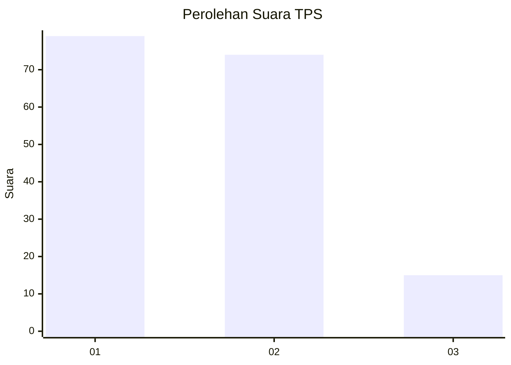
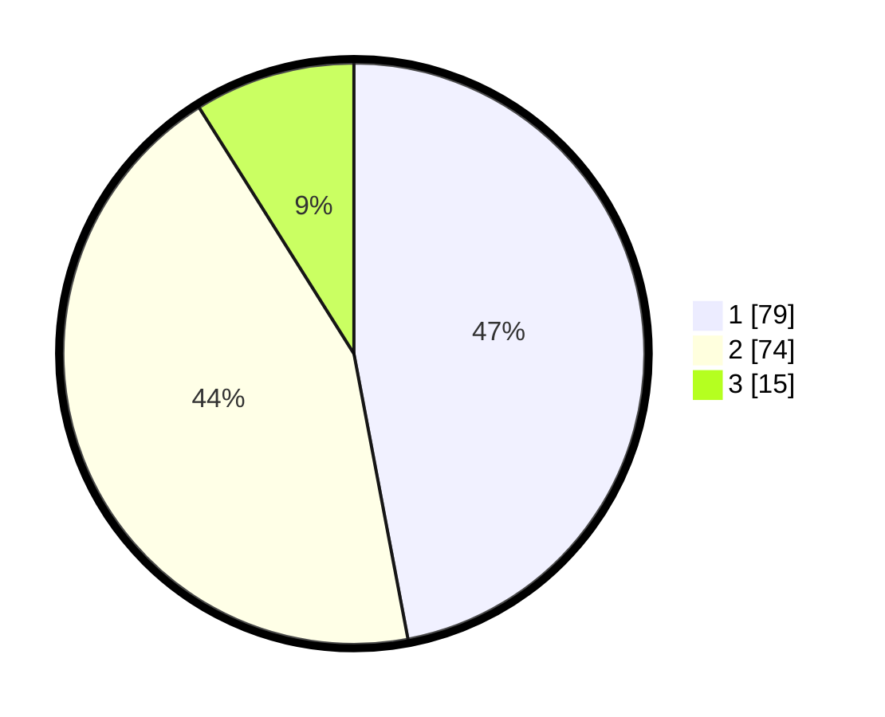

# Hasil

## Grafik

## Tabel

| No. | Nama Paslon    | Suara | Suara (raw) | Persentase |
|:--- |:-------------- | -----:| -----------:| ----------:|
| 1   | ANIES MUHAIMIN | 79    | [79][p-1]   | 47,02      |
| 2   | PRABOWO GIBRAN | 74    | [74][p-2]   | 44,05      |
| 3   | GANJAR MAHFUD  | 15    | [15][p-3]   | 8,93       |

[p-1]: https://github.com/gigit-pemilu/pemilu-2024-81-maluku/blob/main/pilpres/hitung-suara/sub/81-maluku/sub/02-maluku-tenggara/sub/01-kei-kecil/sub/1013-ohoijang-watdek/sub/023-tps/sub/paslon-1.txt
[p-2]: https://github.com/gigit-pemilu/pemilu-2024-81-maluku/blob/main/pilpres/hitung-suara/sub/81-maluku/sub/02-maluku-tenggara/sub/01-kei-kecil/sub/1013-ohoijang-watdek/sub/023-tps/sub/paslon-2.txt
[p-3]: https://github.com/gigit-pemilu/pemilu-2024-81-maluku/blob/main/pilpres/hitung-suara/sub/81-maluku/sub/02-maluku-tenggara/sub/01-kei-kecil/sub/1013-ohoijang-watdek/sub/023-tps/sub/paslon-3.txt

## Foto C Plano

https://sirekap-obj-formc.kpu.go.id/6b74/pemilu/ppwp/81/02/01/10/13/8102011013023-20240228-193648--60669010-0a3d-4a3b-ab91-403142166304.jpg

https://sirekap-obj-formc.kpu.go.id/6b74/pemilu/ppwp/81/02/01/10/13/8102011013023-20240214-232203--ecf75fcd-56ee-40e7-936e-a53cb59e376e.jpg

https://sirekap-obj-formc.kpu.go.id/6b74/pemilu/ppwp/81/02/01/10/13/8102011013023-20240214-232238--1015f029-5db9-4dc5-8e20-403ed057797b.jpg

## Metadata

| Key        | Value               |
| ---------- | ------------------- |
| Time Stamp | 2024-02-28 20:00:00 |

