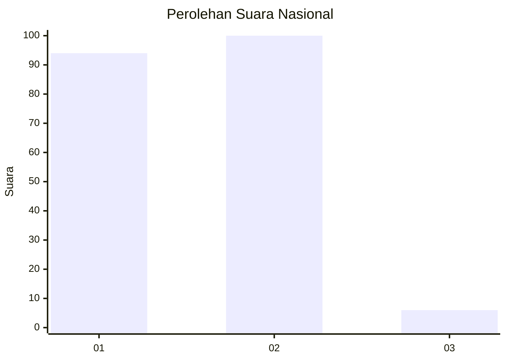
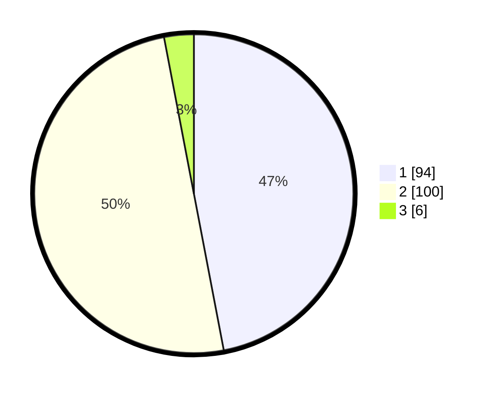

# Hasil

## Grafik

## Tabel

| No. | Nama Paslon    | Suara | Suara (raw) | Persentase |
|:--- |:-------------- | -----:| -----------:| ----------:|
| 1   | ANIES MUHAIMIN | 94    | [94][p-1]   | 47,00      |
| 2   | PRABOWO GIBRAN | 100   | [100][p-2]  | 50,00      |
| 3   | GANJAR MAHFUD  | 6     | [6][p-3]    | 3,00       |

[p-1]: https://github.com/gigit-pemilu/pemilu-2024/blob/main/pilpres/hitung-suara/sub/81-maluku/sub/02-maluku-tenggara/sub/03-kei-besar/sub/2006-elat/sub/004-tps/sub/paslon-1.txt
[p-2]: https://github.com/gigit-pemilu/pemilu-2024/blob/main/pilpres/hitung-suara/sub/81-maluku/sub/02-maluku-tenggara/sub/03-kei-besar/sub/2006-elat/sub/004-tps/sub/paslon-2.txt
[p-3]: https://github.com/gigit-pemilu/pemilu-2024/blob/main/pilpres/hitung-suara/sub/81-maluku/sub/02-maluku-tenggara/sub/03-kei-besar/sub/2006-elat/sub/004-tps/sub/paslon-3.txt

## Foto C Plano

https://sirekap-obj-formc.kpu.go.id/661e/pemilu/ppwp/81/02/03/20/06/8102032006004-20240215-182804--2096284f-82b4-442e-a786-08e06013ecfb.jpg

https://sirekap-obj-formc.kpu.go.id/661e/pemilu/ppwp/81/02/03/20/06/8102032006004-20240215-184726--afe30105-636e-468f-9abf-88712e31abaa.jpg

https://sirekap-obj-formc.kpu.go.id/661e/pemilu/ppwp/81/02/03/20/06/8102032006004-20240215-184854--928d0a09-e10c-4b06-a376-79055df10d2c.jpg

## Metadata

| Key        | Value               |
| ---------- | ------------------- |
| Time Stamp | 2024-02-16 16:25:10 |

