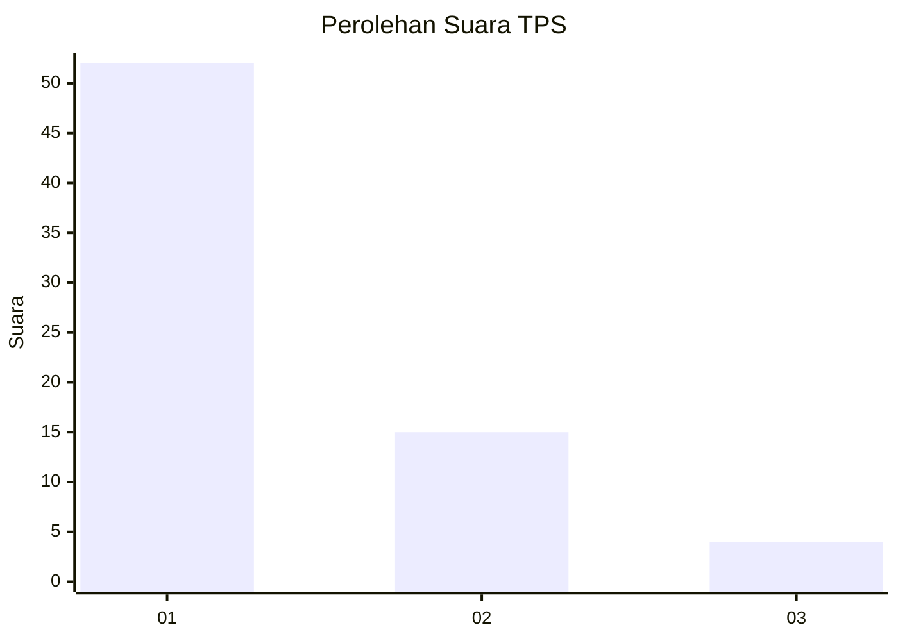
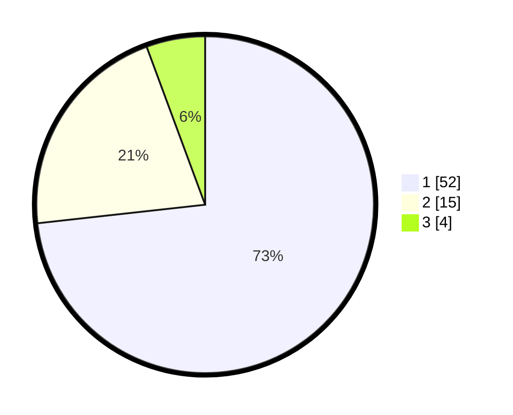

# Hasil

## Grafik

## Tabel

| No. | Nama Paslon    | Suara | Suara (raw) | Persentase |
|:--- |:-------------- | -----:| -----------:| ----------:|
| 1   | ANIES MUHAIMIN | 52    | [52][p-1]   | 73,24      |
| 2   | PRABOWO GIBRAN | 15    | [15][p-2]   | 21,13      |
| 3   | GANJAR MAHFUD  | 4     | [4][p-3]    | 5,63       |

[p-1]: https://github.com/gigit-pemilu/pemilu-2024-81-maluku/blob/main/pilpres/hitung-suara/sub/81-maluku/sub/02-maluku-tenggara/sub/03-kei-besar/sub/2028-karkarit/sub/001-tps/sub/paslon-1.txt
[p-2]: https://github.com/gigit-pemilu/pemilu-2024-81-maluku/blob/main/pilpres/hitung-suara/sub/81-maluku/sub/02-maluku-tenggara/sub/03-kei-besar/sub/2028-karkarit/sub/001-tps/sub/paslon-2.txt
[p-3]: https://github.com/gigit-pemilu/pemilu-2024-81-maluku/blob/main/pilpres/hitung-suara/sub/81-maluku/sub/02-maluku-tenggara/sub/03-kei-besar/sub/2028-karkarit/sub/001-tps/sub/paslon-3.txt

## Foto C Plano

https://sirekap-obj-formc.kpu.go.id/051b/pemilu/ppwp/81/02/03/20/28/8102032028001-20240215-102208--0fc4d69f-496a-4c92-a306-2f15d0015fb1.jpg

https://sirekap-obj-formc.kpu.go.id/051b/pemilu/ppwp/81/02/03/20/28/8102032028001-20240215-102533--17a77806-3cd0-49de-be5c-5dee7a889f73.jpg

https://sirekap-obj-formc.kpu.go.id/051b/pemilu/ppwp/81/02/03/20/28/8102032028001-20240215-102751--afc80349-1cab-446e-b709-a0a8d8add59b.jpg

## Metadata

| Key        | Value               |
| ---------- | ------------------- |
| Time Stamp | 2024-02-25 15:00:00 |

