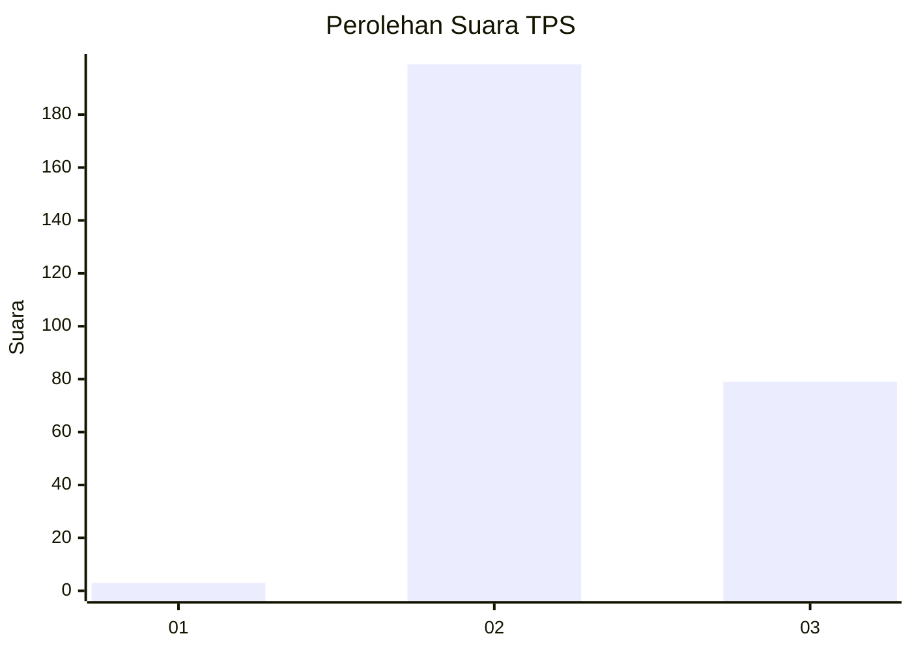
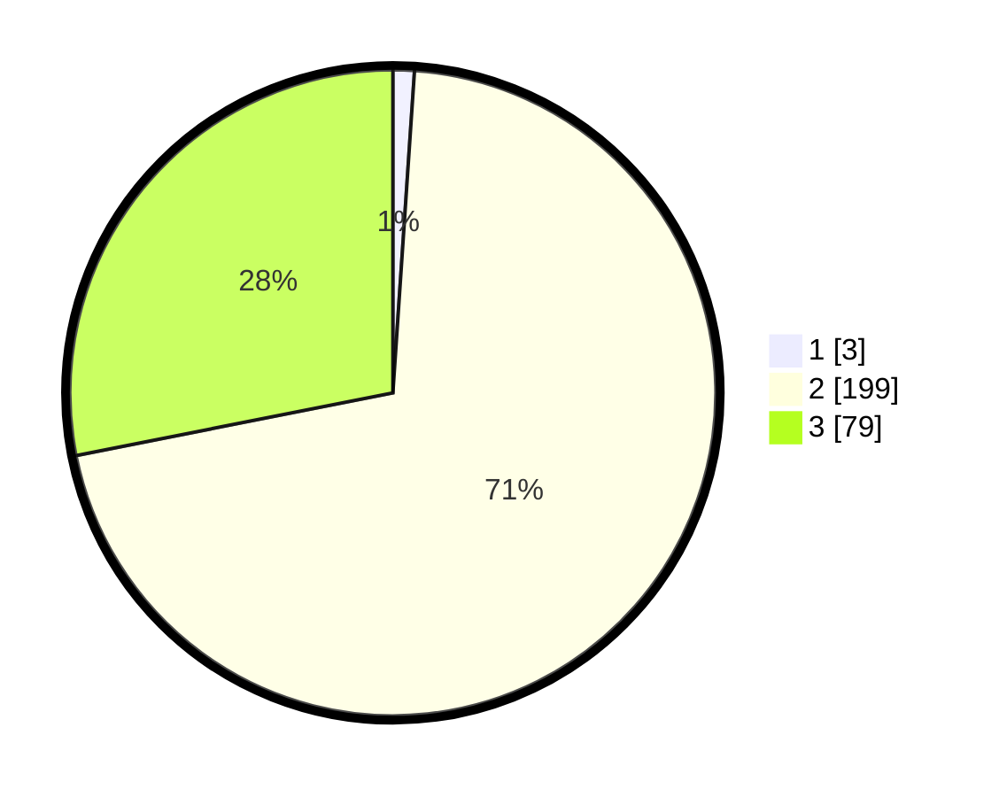

# Hasil

## Grafik

## Tabel

| No. | Nama Paslon    | Suara | Suara (raw) | Persentase |
|:--- |:-------------- | -----:| -----------:| ----------:|
| 1   | ANIES MUHAIMIN | 3     | [3][p-1]    | 1,07       |
| 2   | PRABOWO GIBRAN | 199   | [199][p-2]  | 70,82      |
| 3   | GANJAR MAHFUD  | 79    | [79][p-3]   | 28,11      |

[p-1]: https://github.com/gigit-pemilu/pemilu-2024-81-maluku/blob/main/pilpres/hitung-suara/sub/81-maluku/sub/02-maluku-tenggara/sub/03-kei-besar/sub/2036-watsin/sub/001-tps/sub/paslon-1.txt
[p-2]: https://github.com/gigit-pemilu/pemilu-2024-81-maluku/blob/main/pilpres/hitung-suara/sub/81-maluku/sub/02-maluku-tenggara/sub/03-kei-besar/sub/2036-watsin/sub/001-tps/sub/paslon-2.txt
[p-3]: https://github.com/gigit-pemilu/pemilu-2024-81-maluku/blob/main/pilpres/hitung-suara/sub/81-maluku/sub/02-maluku-tenggara/sub/03-kei-besar/sub/2036-watsin/sub/001-tps/sub/paslon-3.txt

## Foto C Plano

https://sirekap-obj-formc.kpu.go.id/b960/pemilu/ppwp/81/02/03/20/36/8102032036001-20240215-161507--35523c6f-b37d-421b-a1ae-655a1581c9f9.jpg

https://sirekap-obj-formc.kpu.go.id/b960/pemilu/ppwp/81/02/03/20/36/8102032036001-20240215-161734--64713fe3-c5ba-48e8-9f0b-385a1adde78e.jpg

https://sirekap-obj-formc.kpu.go.id/b960/pemilu/ppwp/81/02/03/20/36/8102032036001-20240215-162836--eead8b82-49c3-4b91-b651-d00ba774e992.jpg

## Metadata

| Key        | Value               |
| ---------- | ------------------- |
| Time Stamp | 2024-02-24 22:31:28 |

