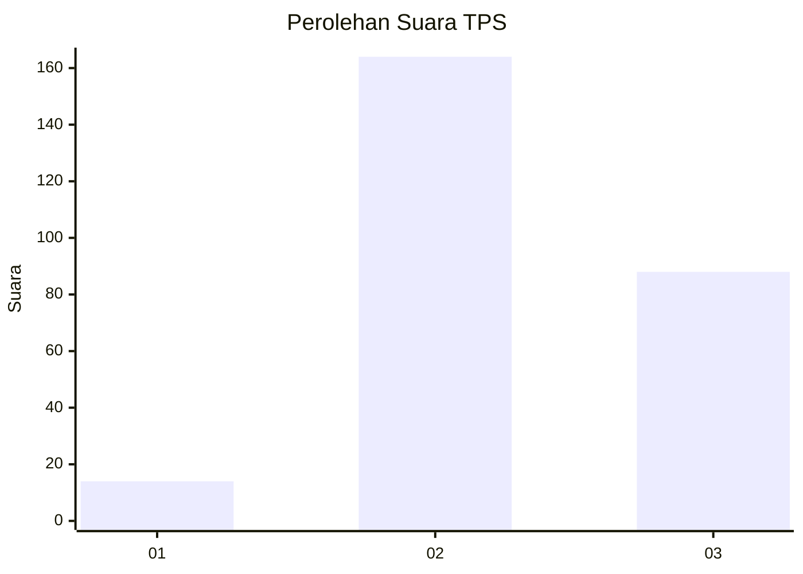
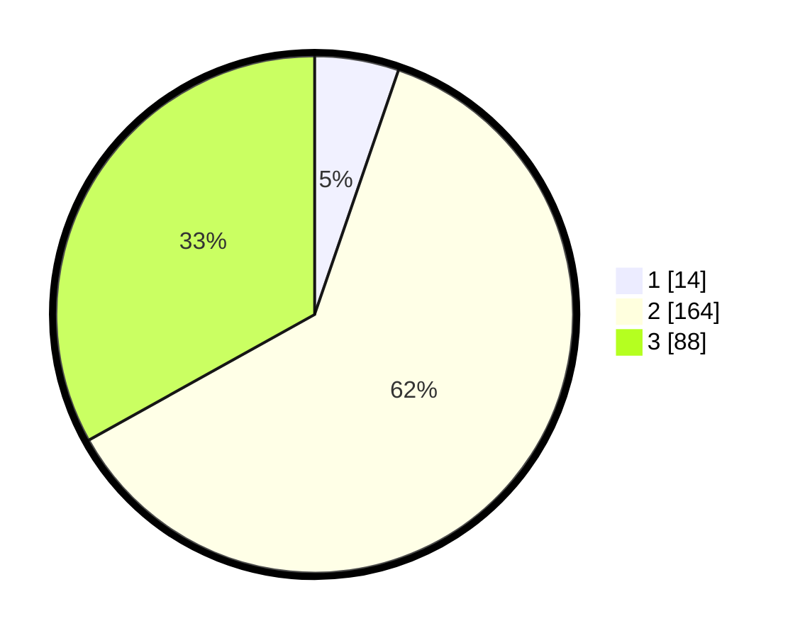

# Hasil

## Grafik

## Tabel

| No. | Nama Paslon    | Suara | Suara (raw) | Persentase |
|:--- |:-------------- | -----:| -----------:| ----------:|
| 1   | ANIES MUHAIMIN | 14    | [14][p-1]   | 5,26       |
| 2   | PRABOWO GIBRAN | 164   | [164][p-2]  | 61,65      |
| 3   | GANJAR MAHFUD  | 88    | [88][p-3]   | 33,08      |

[p-1]: https://github.com/gigit-pemilu/pemilu-2024-81-maluku/blob/main/pilpres/hitung-suara/sub/81-maluku/sub/02-maluku-tenggara/sub/03-kei-besar/sub/2036-watsin/sub/003-tps/sub/paslon-1.txt
[p-2]: https://github.com/gigit-pemilu/pemilu-2024-81-maluku/blob/main/pilpres/hitung-suara/sub/81-maluku/sub/02-maluku-tenggara/sub/03-kei-besar/sub/2036-watsin/sub/003-tps/sub/paslon-2.txt
[p-3]: https://github.com/gigit-pemilu/pemilu-2024-81-maluku/blob/main/pilpres/hitung-suara/sub/81-maluku/sub/02-maluku-tenggara/sub/03-kei-besar/sub/2036-watsin/sub/003-tps/sub/paslon-3.txt

## Foto C Plano

https://sirekap-obj-formc.kpu.go.id/927f/pemilu/ppwp/81/02/03/20/36/8102032036003-20240215-093121--e824453e-bf45-44f1-81f3-266943f8d3c0.jpg

https://sirekap-obj-formc.kpu.go.id/927f/pemilu/ppwp/81/02/03/20/36/8102032036003-20240215-093705--99c14157-0c26-48d6-afab-77e2e8dd5588.jpg

https://sirekap-obj-formc.kpu.go.id/927f/pemilu/ppwp/81/02/03/20/36/8102032036003-20240215-094100--0569566f-ebc5-42bf-b83b-53cec460ea76.jpg

## Metadata

| Key        | Value               |
| ---------- | ------------------- |
| Time Stamp | 2024-02-25 16:00:00 |

