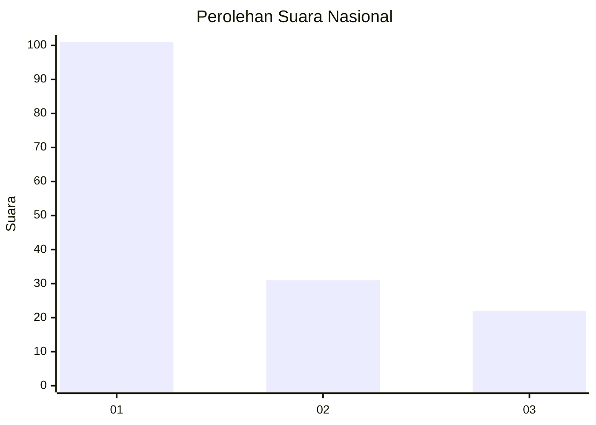
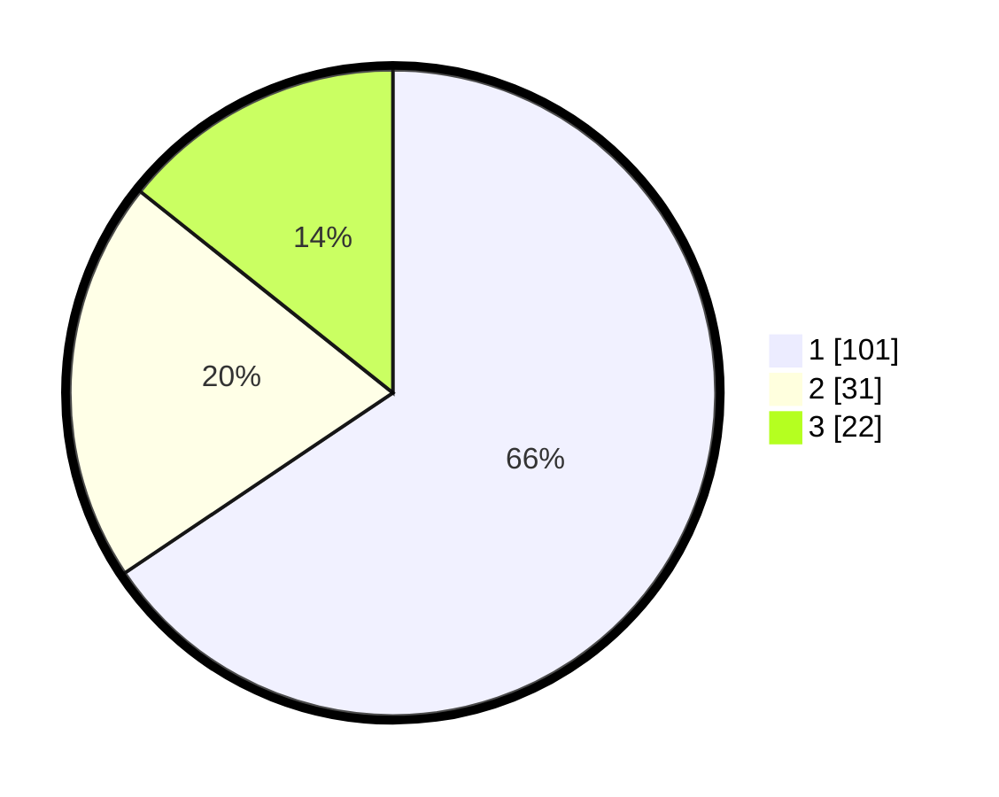

# Hasil

## Grafik

## Tabel

| No. | Nama Paslon    | Suara | Suara (raw) | Persentase |
|:--- |:-------------- | -----:| -----------:| ----------:|
| 1   | ANIES MUHAIMIN | 101   | [101][p-1]  | 65,58      |
| 2   | PRABOWO GIBRAN | 31    | [31][p-2]   | 20,13      |
| 3   | GANJAR MAHFUD  | 22    | [22][p-3]   | 14,29      |

[p-1]: https://github.com/gigit-pemilu/pemilu-2024/blob/main/pilpres/hitung-suara/sub/81-maluku/sub/02-maluku-tenggara/sub/03-kei-besar/sub/2042-mataholat/sub/002-tps/sub/paslon-1.txt
[p-2]: https://github.com/gigit-pemilu/pemilu-2024/blob/main/pilpres/hitung-suara/sub/81-maluku/sub/02-maluku-tenggara/sub/03-kei-besar/sub/2042-mataholat/sub/002-tps/sub/paslon-2.txt
[p-3]: https://github.com/gigit-pemilu/pemilu-2024/blob/main/pilpres/hitung-suara/sub/81-maluku/sub/02-maluku-tenggara/sub/03-kei-besar/sub/2042-mataholat/sub/002-tps/sub/paslon-3.txt

## Foto C Plano

https://sirekap-obj-formc.kpu.go.id/133c/pemilu/ppwp/81/02/03/20/42/8102032042002-20240216-153534--f4242046-ee7b-436d-96e0-38d68622cf99.jpg

https://sirekap-obj-formc.kpu.go.id/133c/pemilu/ppwp/81/02/03/20/42/8102032042002-20240215-140748--5d4f6784-23b9-4159-b2ea-6263489148e0.jpg

https://sirekap-obj-formc.kpu.go.id/133c/pemilu/ppwp/81/02/03/20/42/8102032042002-20240215-141034--ca216be0-f6f0-4aa2-a345-e7fc8b3b0dc7.jpg

## Metadata

| Key        | Value               |
| ---------- | ------------------- |
| Time Stamp | 2024-02-25 08:00:00 |

