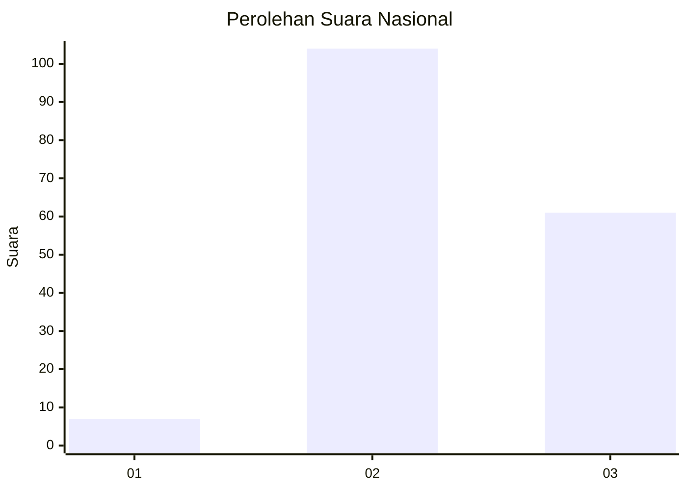
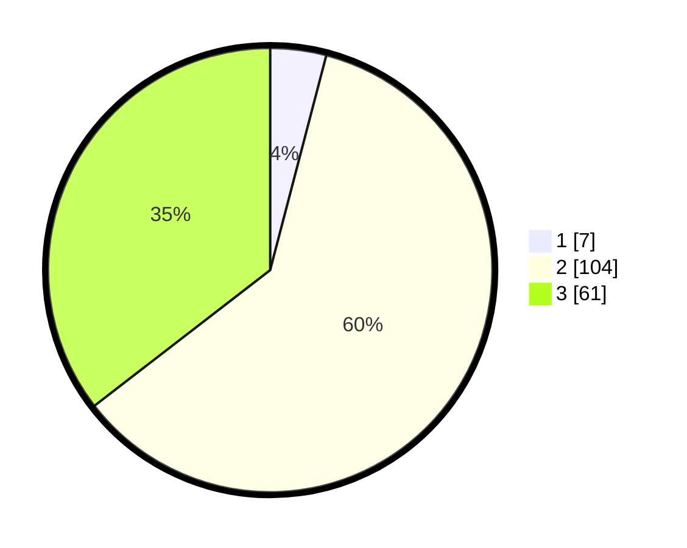

# Hasil

## Grafik

## Tabel

| No. | Nama Paslon    | Suara | Suara (raw) | Persentase |
|:--- |:-------------- | -----:| -----------:| ----------:|
| 1   | ANIES MUHAIMIN | 7     | [7][p-1]    | 4,07       |
| 2   | PRABOWO GIBRAN | 104   | [104][p-2]  | 60,47      |
| 3   | GANJAR MAHFUD  | 61    | [61][p-3]   | 35,47      |

[p-1]: https://github.com/gigit-pemilu/pemilu-2024/blob/main/pilpres/hitung-suara/sub/81-maluku/sub/02-maluku-tenggara/sub/04-kei-besar-selatan/sub/2001-weduar/sub/001-tps/sub/paslon-1.txt
[p-2]: https://github.com/gigit-pemilu/pemilu-2024/blob/main/pilpres/hitung-suara/sub/81-maluku/sub/02-maluku-tenggara/sub/04-kei-besar-selatan/sub/2001-weduar/sub/001-tps/sub/paslon-2.txt
[p-3]: https://github.com/gigit-pemilu/pemilu-2024/blob/main/pilpres/hitung-suara/sub/81-maluku/sub/02-maluku-tenggara/sub/04-kei-besar-selatan/sub/2001-weduar/sub/001-tps/sub/paslon-3.txt

## Foto C Plano

https://sirekap-obj-formc.kpu.go.id/440f/pemilu/ppwp/81/02/04/20/01/8102042001001-20240215-145051--a0b6c51b-317c-46ac-96a5-3d85e580763b.jpg

https://sirekap-obj-formc.kpu.go.id/440f/pemilu/ppwp/81/02/04/20/01/8102042001001-20240215-145421--c5d3a9b7-5ab7-4069-b8bf-be775ac2ff0b.jpg

https://sirekap-obj-formc.kpu.go.id/440f/pemilu/ppwp/81/02/04/20/01/8102042001001-20240215-145624--851b0f49-9f53-4b30-863a-fa42b7942d42.jpg

## Metadata

| Key        | Value               |
| ---------- | ------------------- |
| Time Stamp | 2024-02-15 16:30:25 |

