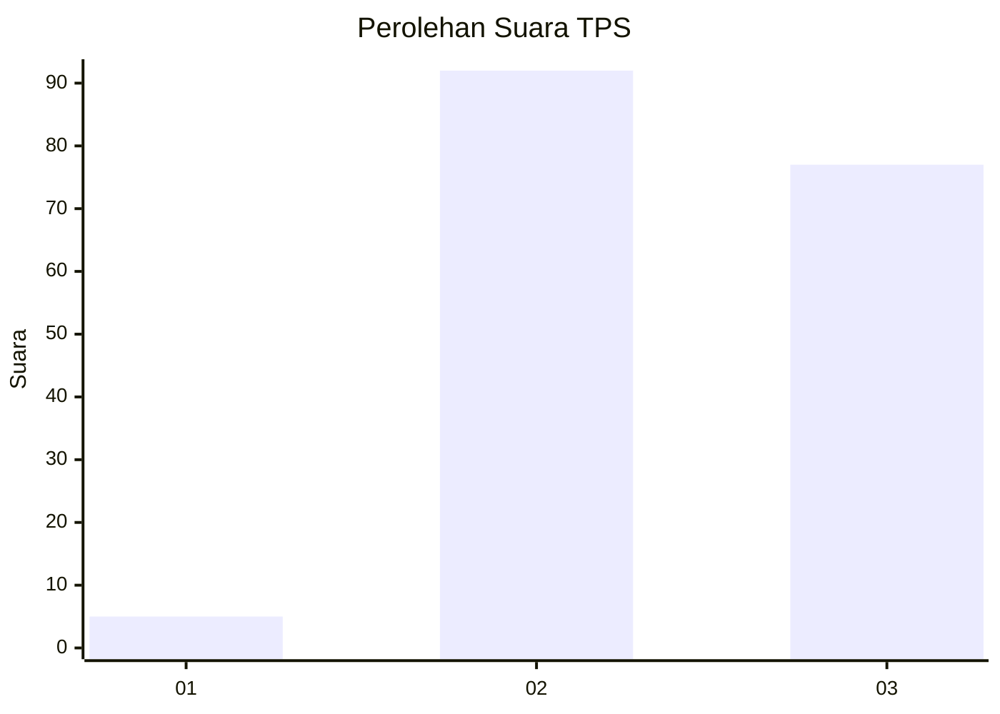
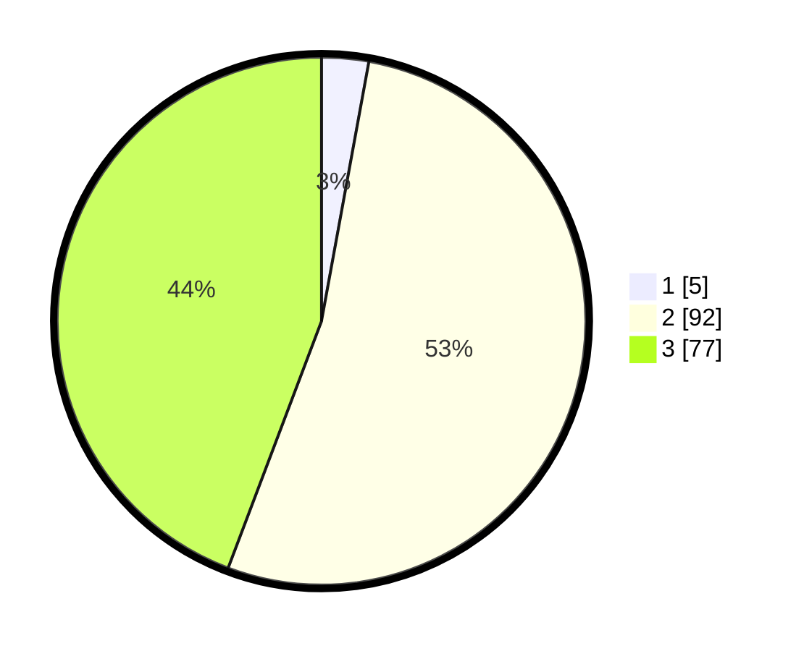

# Hasil

## Grafik

## Tabel

| No. | Nama Paslon    | Suara | Suara (raw) | Persentase |
|:--- |:-------------- | -----:| -----------:| ----------:|
| 1   | ANIES MUHAIMIN | 5     | [5][p-1]    | 2,87       |
| 2   | PRABOWO GIBRAN | 92    | [92][p-2]   | 52,87      |
| 3   | GANJAR MAHFUD  | 77    | [77][p-3]   | 44,25      |

[p-1]: https://github.com/gigit-pemilu/pemilu-2024-81-maluku/blob/main/pilpres/hitung-suara/sub/81-maluku/sub/02-maluku-tenggara/sub/04-kei-besar-selatan/sub/2001-weduar/sub/003-tps/sub/paslon-1.txt
[p-2]: https://github.com/gigit-pemilu/pemilu-2024-81-maluku/blob/main/pilpres/hitung-suara/sub/81-maluku/sub/02-maluku-tenggara/sub/04-kei-besar-selatan/sub/2001-weduar/sub/003-tps/sub/paslon-2.txt
[p-3]: https://github.com/gigit-pemilu/pemilu-2024-81-maluku/blob/main/pilpres/hitung-suara/sub/81-maluku/sub/02-maluku-tenggara/sub/04-kei-besar-selatan/sub/2001-weduar/sub/003-tps/sub/paslon-3.txt

## Foto C Plano

https://sirekap-obj-formc.kpu.go.id/5fd4/pemilu/ppwp/81/02/04/20/01/8102042001003-20240215-141616--da754c1c-4ed5-488d-a18e-a9ccc4f15bd2.jpg

https://sirekap-obj-formc.kpu.go.id/5fd4/pemilu/ppwp/81/02/04/20/01/8102042001003-20240215-141739--7f27b773-e9ac-40e8-bae3-65eeb86c0144.jpg

https://sirekap-obj-formc.kpu.go.id/5fd4/pemilu/ppwp/81/02/04/20/01/8102042001003-20240215-133957--8acb58a1-4ddc-4705-8d1e-819995da9e97.jpg

## Metadata

| Key        | Value               |
| ---------- | ------------------- |
| Time Stamp | 2024-02-24 22:31:28 |

