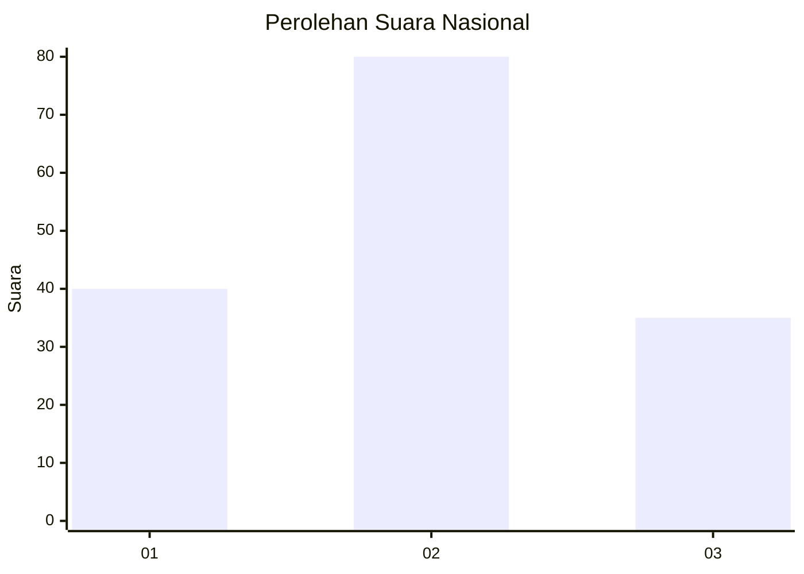
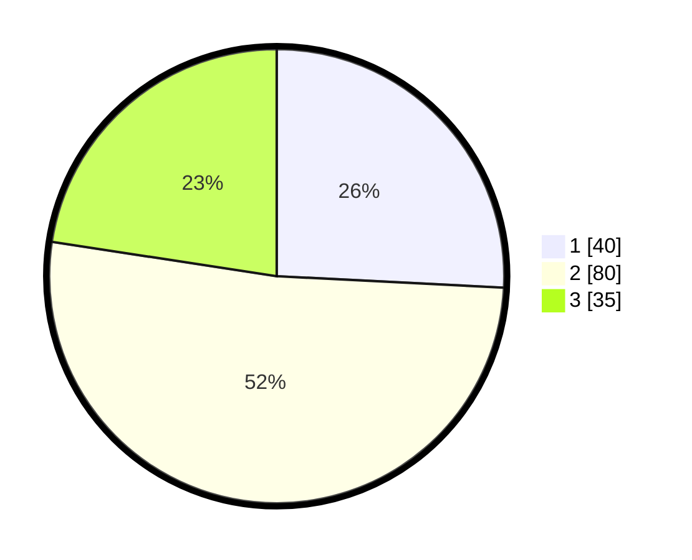

# Hasil

## Grafik

## Tabel

| No. | Nama Paslon    | Suara | Suara (raw) | Persentase |
|:--- |:-------------- | -----:| -----------:| ----------:|
| 1   | ANIES MUHAIMIN | 40    | [40][p-1]   | 25,81      |
| 2   | PRABOWO GIBRAN | 80    | [80][p-2]   | 51,61      |
| 3   | GANJAR MAHFUD  | 35    | [35][p-3]   | 22,58      |

[p-1]: https://github.com/gigit-pemilu/pemilu-2024/blob/main/pilpres/hitung-suara/sub/81-maluku/sub/02-maluku-tenggara/sub/04-kei-besar-selatan/sub/2003-nerong/sub/002-tps/sub/paslon-1.txt
[p-2]: https://github.com/gigit-pemilu/pemilu-2024/blob/main/pilpres/hitung-suara/sub/81-maluku/sub/02-maluku-tenggara/sub/04-kei-besar-selatan/sub/2003-nerong/sub/002-tps/sub/paslon-2.txt
[p-3]: https://github.com/gigit-pemilu/pemilu-2024/blob/main/pilpres/hitung-suara/sub/81-maluku/sub/02-maluku-tenggara/sub/04-kei-besar-selatan/sub/2003-nerong/sub/002-tps/sub/paslon-3.txt

## Foto C Plano

https://sirekap-obj-formc.kpu.go.id/9587/pemilu/ppwp/81/02/04/20/03/8102042003002-20240215-162743--75992333-78d1-4691-ac6a-a682337c3305.jpg

https://sirekap-obj-formc.kpu.go.id/9587/pemilu/ppwp/81/02/04/20/03/8102042003002-20240215-162854--2f095bcd-1307-4b2d-a2ba-2cf7358997d1.jpg

https://sirekap-obj-formc.kpu.go.id/9587/pemilu/ppwp/81/02/04/20/03/8102042003002-20240215-162950--0cde4f86-0ae0-4ed8-a205-ff9ea28fb7fe.jpg

## Metadata

| Key        | Value               |
| ---------- | ------------------- |
| Time Stamp | 2024-02-25 13:00:00 |

