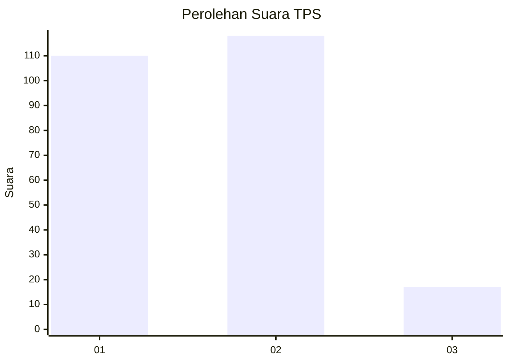
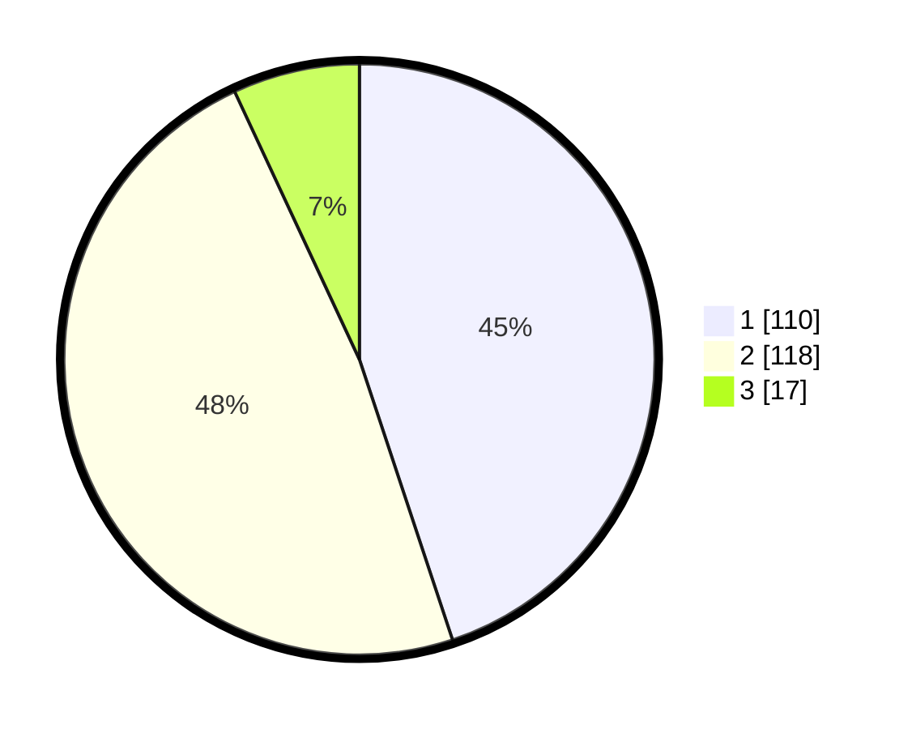

# Hasil

## Grafik

## Tabel

| No. | Nama Paslon    | Suara | Suara (raw) | Persentase |
|:--- |:-------------- | -----:| -----------:| ----------:|
| 1   | ANIES MUHAIMIN | 110   | [110][p-1]  | 44,90      |
| 2   | PRABOWO GIBRAN | 118   | [118][p-2]  | 48,16      |
| 3   | GANJAR MAHFUD  | 17    | [17][p-3]   | 6,94       |

[p-1]: https://github.com/gigit-pemilu/pemilu-2024-81-maluku/blob/main/pilpres/hitung-suara/sub/81-maluku/sub/02-maluku-tenggara/sub/04-kei-besar-selatan/sub/2004-larat/sub/001-tps/sub/paslon-1.txt
[p-2]: https://github.com/gigit-pemilu/pemilu-2024-81-maluku/blob/main/pilpres/hitung-suara/sub/81-maluku/sub/02-maluku-tenggara/sub/04-kei-besar-selatan/sub/2004-larat/sub/001-tps/sub/paslon-2.txt
[p-3]: https://github.com/gigit-pemilu/pemilu-2024-81-maluku/blob/main/pilpres/hitung-suara/sub/81-maluku/sub/02-maluku-tenggara/sub/04-kei-besar-selatan/sub/2004-larat/sub/001-tps/sub/paslon-3.txt

## Foto C Plano

https://sirekap-obj-formc.kpu.go.id/8cc4/pemilu/ppwp/81/02/04/20/04/8102042004001-20240215-084934--a0e8b646-9958-49f7-8dd2-b848c55cac49.jpg

https://sirekap-obj-formc.kpu.go.id/8cc4/pemilu/ppwp/81/02/04/20/04/8102042004001-20240215-085142--8174e51e-927e-48ac-a500-0da6246d3c04.jpg

https://sirekap-obj-formc.kpu.go.id/8cc4/pemilu/ppwp/81/02/04/20/04/8102042004001-20240215-085056--11a4e26b-5b4d-48fb-a48d-053d55791ea9.jpg

## Metadata

| Key        | Value               |
| ---------- | ------------------- |
| Time Stamp | 2024-02-25 11:00:00 |

