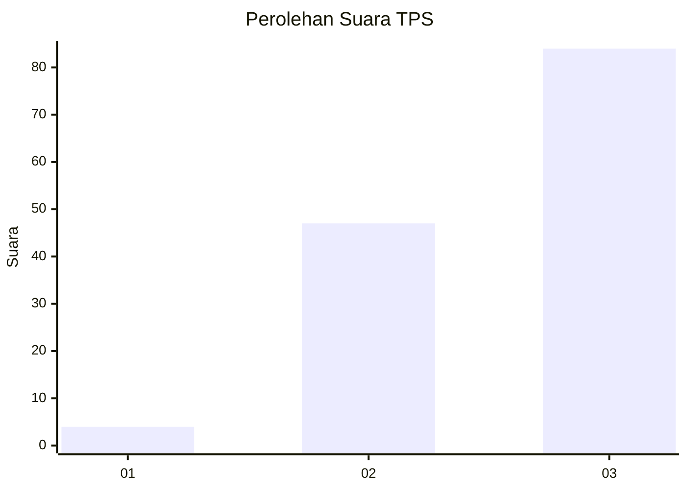
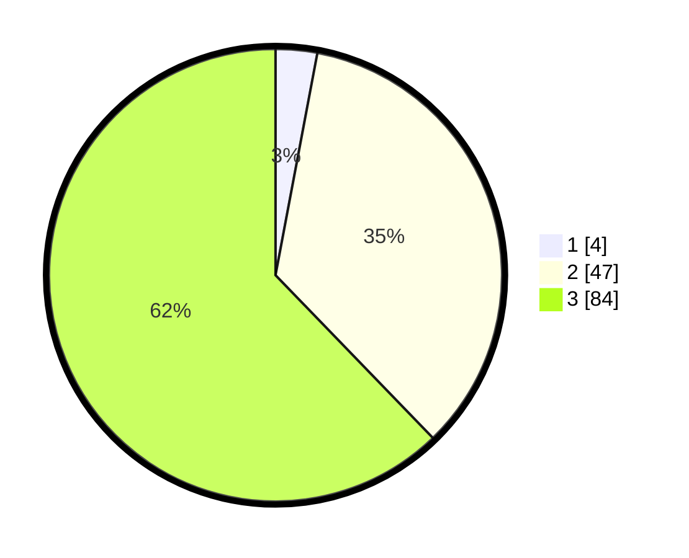

# Hasil

## Grafik

## Tabel

| No. | Nama Paslon    | Suara | Suara (raw) | Persentase |
|:--- |:-------------- | -----:| -----------:| ----------:|
| 1   | ANIES MUHAIMIN | 4     | [4][p-1]    | 2,96       |
| 2   | PRABOWO GIBRAN | 47    | [47][p-2]   | 34,81      |
| 3   | GANJAR MAHFUD  | 84    | [84][p-3]   | 62,22      |

[p-1]: https://github.com/gigit-pemilu/pemilu-2024-81-maluku/blob/main/pilpres/hitung-suara/sub/81-maluku/sub/02-maluku-tenggara/sub/04-kei-besar-selatan/sub/2012-kilwat/sub/001-tps/sub/paslon-1.txt
[p-2]: https://github.com/gigit-pemilu/pemilu-2024-81-maluku/blob/main/pilpres/hitung-suara/sub/81-maluku/sub/02-maluku-tenggara/sub/04-kei-besar-selatan/sub/2012-kilwat/sub/001-tps/sub/paslon-2.txt
[p-3]: https://github.com/gigit-pemilu/pemilu-2024-81-maluku/blob/main/pilpres/hitung-suara/sub/81-maluku/sub/02-maluku-tenggara/sub/04-kei-besar-selatan/sub/2012-kilwat/sub/001-tps/sub/paslon-3.txt

## Foto C Plano

https://sirekap-obj-formc.kpu.go.id/f567/pemilu/ppwp/81/02/04/20/12/8102042012001-20240215-074559--961f92a4-1718-420c-ab48-c43f095aef56.jpg

https://sirekap-obj-formc.kpu.go.id/f567/pemilu/ppwp/81/02/04/20/12/8102042012001-20240215-074848--4486b9b2-fd28-40bd-ad91-997ddb26bae6.jpg

https://sirekap-obj-formc.kpu.go.id/f567/pemilu/ppwp/81/02/04/20/12/8102042012001-20240215-075006--5a116ddd-7967-4ffe-a1a4-ec63795fa94b.jpg

## Metadata

| Key        | Value               |
| ---------- | ------------------- |
| Time Stamp | 2024-02-25 22:00:00 |

