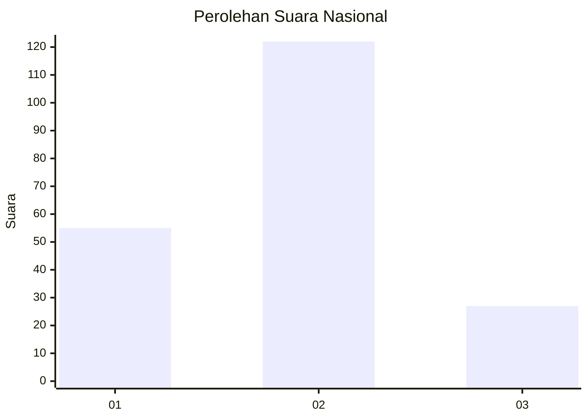
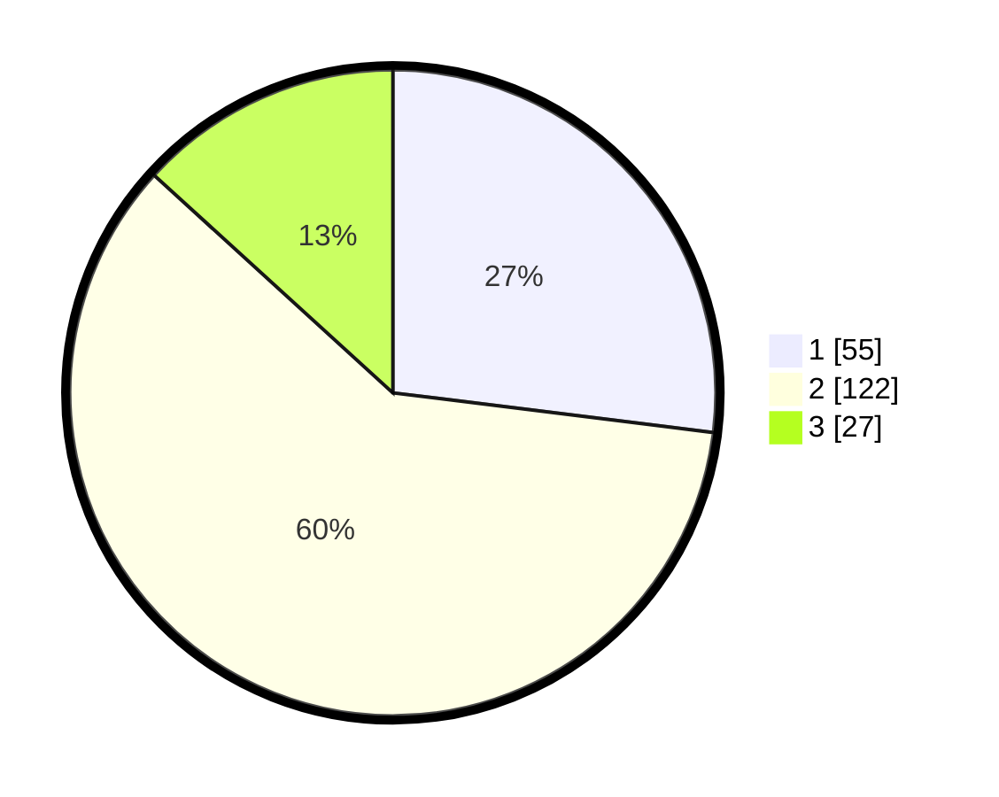

# Hasil

## Grafik

## Tabel

| No. | Nama Paslon    | Suara | Suara (raw) | Persentase |
|:--- |:-------------- | -----:| -----------:| ----------:|
| 1   | ANIES MUHAIMIN | 55    | [55][p-1]   | 26,96      |
| 2   | PRABOWO GIBRAN | 122   | [122][p-2]  | 59,80      |
| 3   | GANJAR MAHFUD  | 27    | [27][p-3]   | 13,24      |

[p-1]: https://github.com/gigit-pemilu/pemilu-2024/blob/main/pilpres/hitung-suara/sub/81-maluku/sub/02-maluku-tenggara/sub/13-kei-kecil-timur/sub/2001-wain/sub/001-tps/sub/paslon-1.txt
[p-2]: https://github.com/gigit-pemilu/pemilu-2024/blob/main/pilpres/hitung-suara/sub/81-maluku/sub/02-maluku-tenggara/sub/13-kei-kecil-timur/sub/2001-wain/sub/001-tps/sub/paslon-2.txt
[p-3]: https://github.com/gigit-pemilu/pemilu-2024/blob/main/pilpres/hitung-suara/sub/81-maluku/sub/02-maluku-tenggara/sub/13-kei-kecil-timur/sub/2001-wain/sub/001-tps/sub/paslon-3.txt

## Foto C Plano

https://sirekap-obj-formc.kpu.go.id/ad27/pemilu/ppwp/81/02/13/20/01/8102132001001-20240214-234617--9099157e-ed13-44f8-9f22-ec0c0d512141.jpg

https://sirekap-obj-formc.kpu.go.id/ad27/pemilu/ppwp/81/02/13/20/01/8102132001001-20240214-234504--28117458-ffdf-4695-9c0c-63b31fdfbf38.jpg

https://sirekap-obj-formc.kpu.go.id/ad27/pemilu/ppwp/81/02/13/20/01/8102132001001-20240214-234125--bbd90671-0c99-4a77-9dcb-de88b3e43ea1.jpg

## Metadata

| Key        | Value               |
| ---------- | ------------------- |
| Time Stamp | 2024-02-24 22:31:28 |

