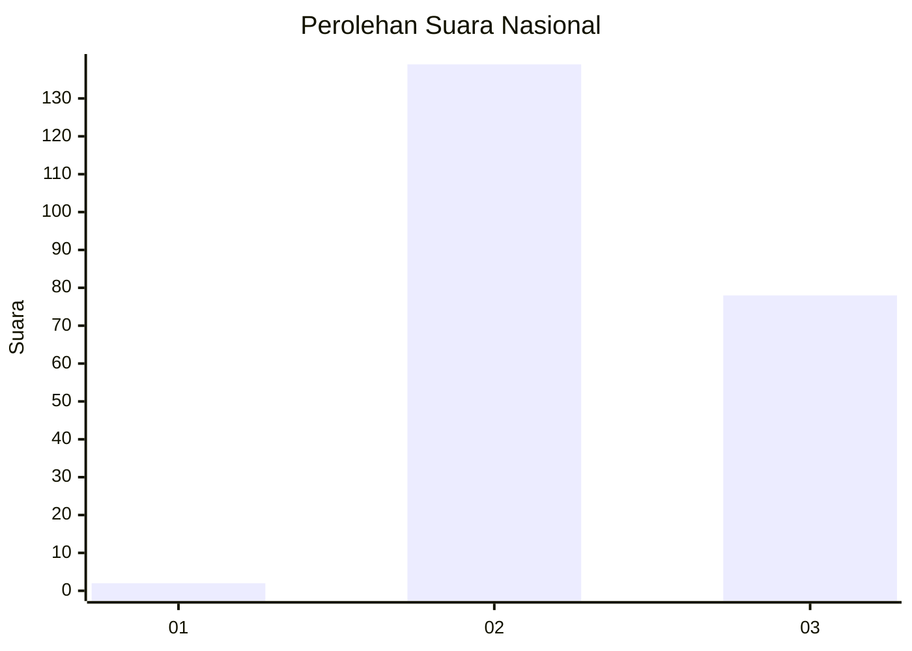
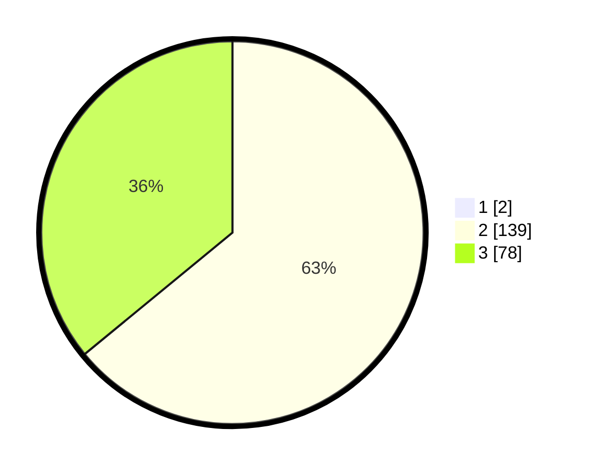

# Hasil

## Grafik

## Tabel

| No. | Nama Paslon    | Suara | Suara (raw) | Persentase |
|:--- |:-------------- | -----:| -----------:| ----------:|
| 1   | ANIES MUHAIMIN | 2     | [2][p-1]    | 0,91       |
| 2   | PRABOWO GIBRAN | 139   | [139][p-2]  | 63,47      |
| 3   | GANJAR MAHFUD  | 78    | [78][p-3]   | 35,62      |

[p-1]: https://github.com/gigit-pemilu/pemilu-2024/blob/main/pilpres/hitung-suara/sub/81-maluku/sub/02-maluku-tenggara/sub/13-kei-kecil-timur/sub/2002-rewav/sub/001-tps/sub/paslon-1.txt
[p-2]: https://github.com/gigit-pemilu/pemilu-2024/blob/main/pilpres/hitung-suara/sub/81-maluku/sub/02-maluku-tenggara/sub/13-kei-kecil-timur/sub/2002-rewav/sub/001-tps/sub/paslon-2.txt
[p-3]: https://github.com/gigit-pemilu/pemilu-2024/blob/main/pilpres/hitung-suara/sub/81-maluku/sub/02-maluku-tenggara/sub/13-kei-kecil-timur/sub/2002-rewav/sub/001-tps/sub/paslon-3.txt

## Foto C Plano

https://sirekap-obj-formc.kpu.go.id/e6a3/pemilu/ppwp/81/02/13/20/02/8102132002001-20240215-203704--c0218d17-0882-4afb-b247-416d2387c644.jpg

https://sirekap-obj-formc.kpu.go.id/e6a3/pemilu/ppwp/81/02/13/20/02/8102132002001-20240215-203756--98bc03ac-0c53-4d3d-a44b-aa4c461e89dc.jpg

https://sirekap-obj-formc.kpu.go.id/e6a3/pemilu/ppwp/81/02/13/20/02/8102132002001-20240215-203836--708a00db-148c-4658-8563-297216f4cb52.jpg

## Metadata

| Key        | Value               |
| ---------- | ------------------- |
| Time Stamp | 2024-02-24 22:31:28 |

