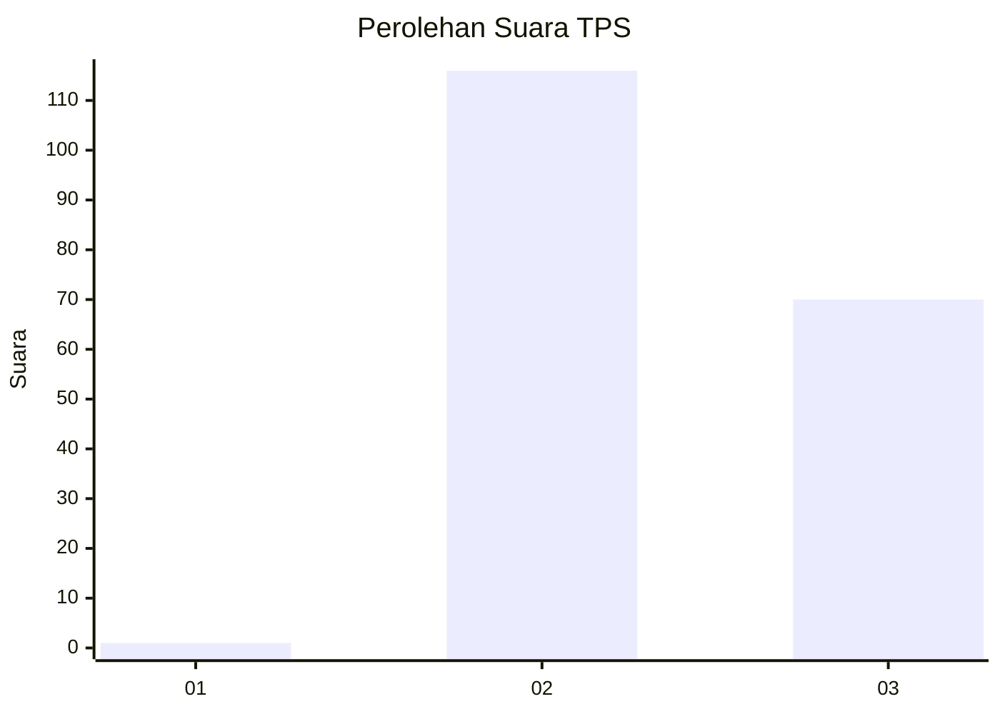
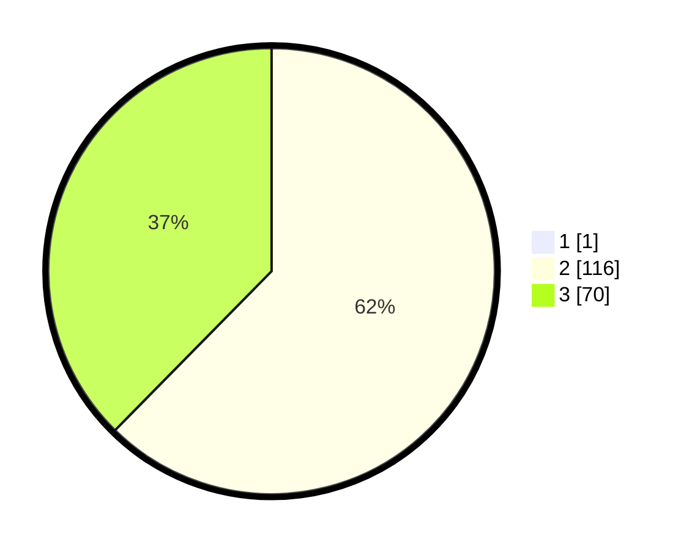

# Hasil

## Grafik

## Tabel

| No. | Nama Paslon    | Suara | Suara (raw) | Persentase |
|:--- |:-------------- | -----:| -----------:| ----------:|
| 1   | ANIES MUHAIMIN | 1     | [1][p-1]    | 0,53       |
| 2   | PRABOWO GIBRAN | 116   | [116][p-2]  | 62,03      |
| 3   | GANJAR MAHFUD  | 70    | [70][p-3]   | 37,43      |

[p-1]: https://github.com/gigit-pemilu/pemilu-2024-81-maluku/blob/main/pilpres/hitung-suara/sub/81-maluku/sub/02-maluku-tenggara/sub/13-kei-kecil-timur/sub/2002-rewav/sub/002-tps/sub/paslon-1.txt
[p-2]: https://github.com/gigit-pemilu/pemilu-2024-81-maluku/blob/main/pilpres/hitung-suara/sub/81-maluku/sub/02-maluku-tenggara/sub/13-kei-kecil-timur/sub/2002-rewav/sub/002-tps/sub/paslon-2.txt
[p-3]: https://github.com/gigit-pemilu/pemilu-2024-81-maluku/blob/main/pilpres/hitung-suara/sub/81-maluku/sub/02-maluku-tenggara/sub/13-kei-kecil-timur/sub/2002-rewav/sub/002-tps/sub/paslon-3.txt

## Foto C Plano

https://sirekap-obj-formc.kpu.go.id/beb0/pemilu/ppwp/81/02/13/20/02/8102132002002-20240215-102112--8eda59bb-6490-4e79-a308-dd098c67d805.jpg

https://sirekap-obj-formc.kpu.go.id/beb0/pemilu/ppwp/81/02/13/20/02/8102132002002-20240215-102406--bc41796c-5e93-4b6d-bb73-468aa3fc5840.jpg

https://sirekap-obj-formc.kpu.go.id/beb0/pemilu/ppwp/81/02/13/20/02/8102132002002-20240215-102647--fc98e0f5-5634-4597-868a-8783d8b594e8.jpg

## Metadata

| Key        | Value               |
| ---------- | ------------------- |
| Time Stamp | 2024-02-25 23:00:00 |

