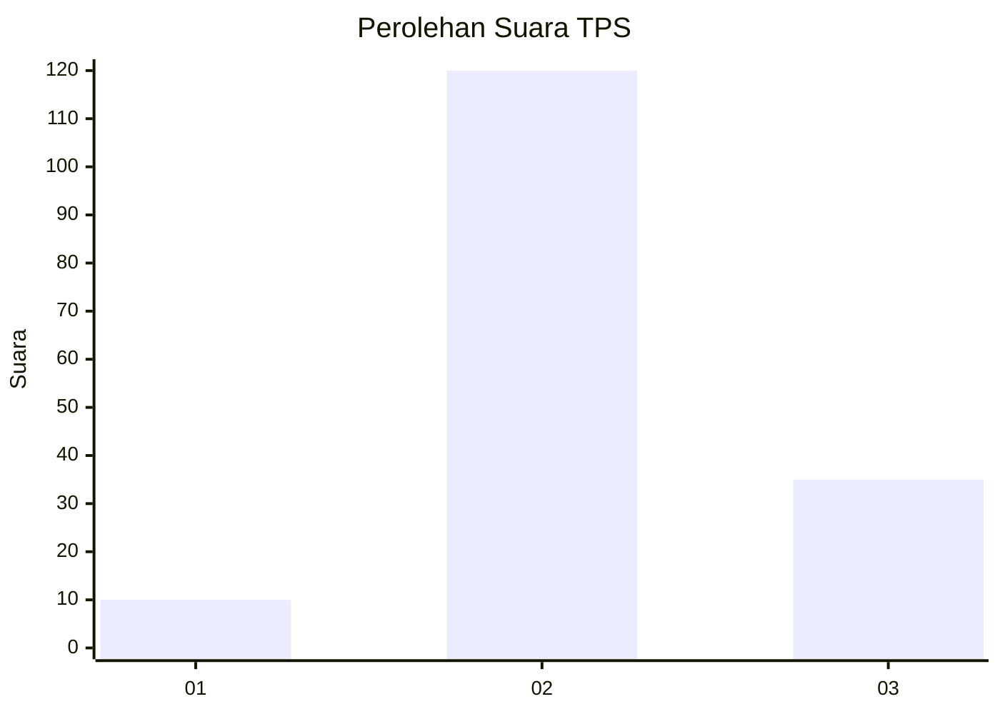

# Hasil

## Grafik

## Tabel

| No. | Nama Paslon    | Suara | Suara (raw) | Persentase |
|:--- |:-------------- | -----:| -----------:| ----------:|
| 1   | ANIES MUHAIMIN | 10    | [10][p-1]   | 6,06       |
| 2   | PRABOWO GIBRAN | 120   | [120][p-2]  | 72,73      |
| 3   | GANJAR MAHFUD  | 35    | [35][p-3]   | 21,21      |

[p-1]: https://github.com/gigit-pemilu/pemilu-2024-81-maluku/blob/main/pilpres/hitung-suara/sub/81-maluku/sub/02-maluku-tenggara/sub/13-kei-kecil-timur/sub/2003-rumaat/sub/002-tps/sub/paslon-1.txt
[p-2]: https://github.com/gigit-pemilu/pemilu-2024-81-maluku/blob/main/pilpres/hitung-suara/sub/81-maluku/sub/02-maluku-tenggara/sub/13-kei-kecil-timur/sub/2003-rumaat/sub/002-tps/sub/paslon-2.txt
[p-3]: https://github.com/gigit-pemilu/pemilu-2024-81-maluku/blob/main/pilpres/hitung-suara/sub/81-maluku/sub/02-maluku-tenggara/sub/13-kei-kecil-timur/sub/2003-rumaat/sub/002-tps/sub/paslon-3.txt

## Foto C Plano

https://sirekap-obj-formc.kpu.go.id/a7c7/pemilu/ppwp/81/02/13/20/03/8102132003002-20240220-100628--383afbf3-de0a-48d8-bd8e-31d6f2f7c2ee.jpg

https://sirekap-obj-formc.kpu.go.id/a7c7/pemilu/ppwp/81/02/13/20/03/8102132003002-20240220-100905--4b7ac3d2-13e3-4661-8d60-a9554d1f6fc4.jpg

https://sirekap-obj-formc.kpu.go.id/a7c7/pemilu/ppwp/81/02/13/20/03/8102132003002-20240220-101229--57b71b5f-f578-40e5-a4a8-565891ac3eea.jpg

## Metadata

| Key        | Value               |
| ---------- | ------------------- |
| Time Stamp | 2024-02-25 15:00:00 |

