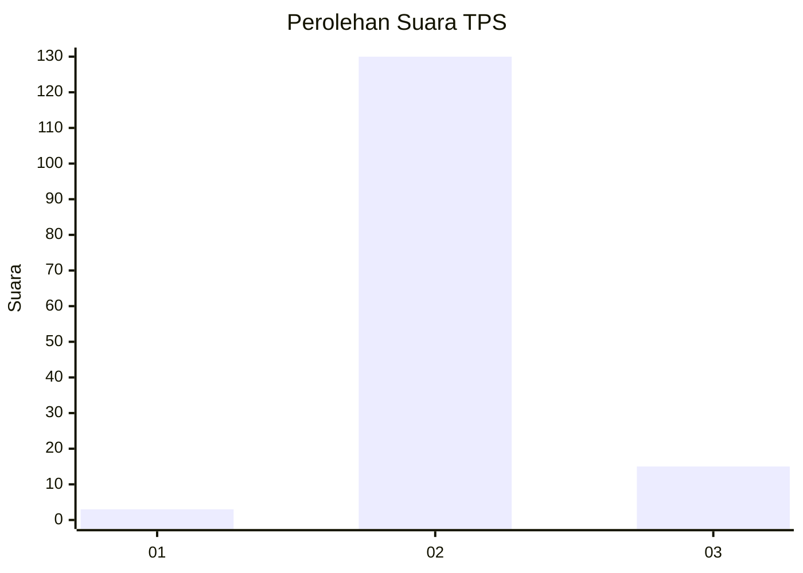
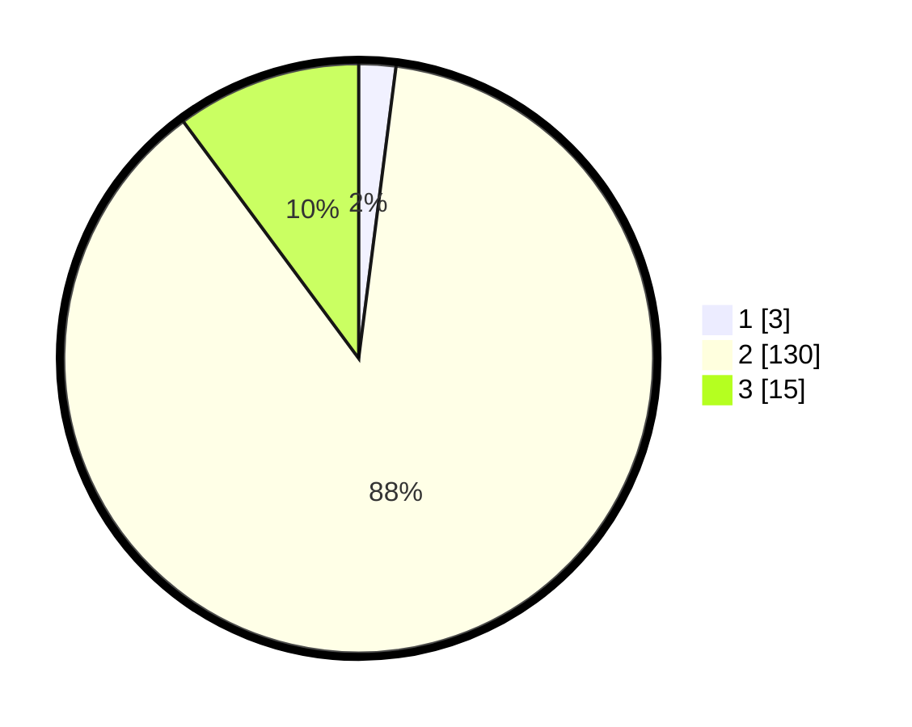

# Hasil

## Grafik

## Tabel

| No. | Nama Paslon    | Suara | Suara (raw) | Persentase |
|:--- |:-------------- | -----:| -----------:| ----------:|
| 1   | ANIES MUHAIMIN | 3     | [3][p-1]    | 2,03       |
| 2   | PRABOWO GIBRAN | 130   | [130][p-2]  | 87,84      |
| 3   | GANJAR MAHFUD  | 15    | [15][p-3]   | 10,14      |

[p-1]: https://github.com/gigit-pemilu/pemilu-2024-81-maluku/blob/main/pilpres/hitung-suara/sub/81-maluku/sub/02-maluku-tenggara/sub/13-kei-kecil-timur/sub/2003-rumaat/sub/003-tps/sub/paslon-1.txt
[p-2]: https://github.com/gigit-pemilu/pemilu-2024-81-maluku/blob/main/pilpres/hitung-suara/sub/81-maluku/sub/02-maluku-tenggara/sub/13-kei-kecil-timur/sub/2003-rumaat/sub/003-tps/sub/paslon-2.txt
[p-3]: https://github.com/gigit-pemilu/pemilu-2024-81-maluku/blob/main/pilpres/hitung-suara/sub/81-maluku/sub/02-maluku-tenggara/sub/13-kei-kecil-timur/sub/2003-rumaat/sub/003-tps/sub/paslon-3.txt

## Foto C Plano

https://sirekap-obj-formc.kpu.go.id/491a/pemilu/ppwp/81/02/13/20/03/8102132003003-20240220-122741--7c995695-aaac-4e02-952e-30456d3f6643.jpg

https://sirekap-obj-formc.kpu.go.id/491a/pemilu/ppwp/81/02/13/20/03/8102132003003-20240220-122903--b53777f5-4309-49d1-a02e-8d6b4c9804d5.jpg

https://sirekap-obj-formc.kpu.go.id/491a/pemilu/ppwp/81/02/13/20/03/8102132003003-20240220-123059--b927bacf-159e-4747-ab56-830b8514880f.jpg

## Metadata

| Key        | Value               |
| ---------- | ------------------- |
| Time Stamp | 2024-02-24 22:31:28 |

