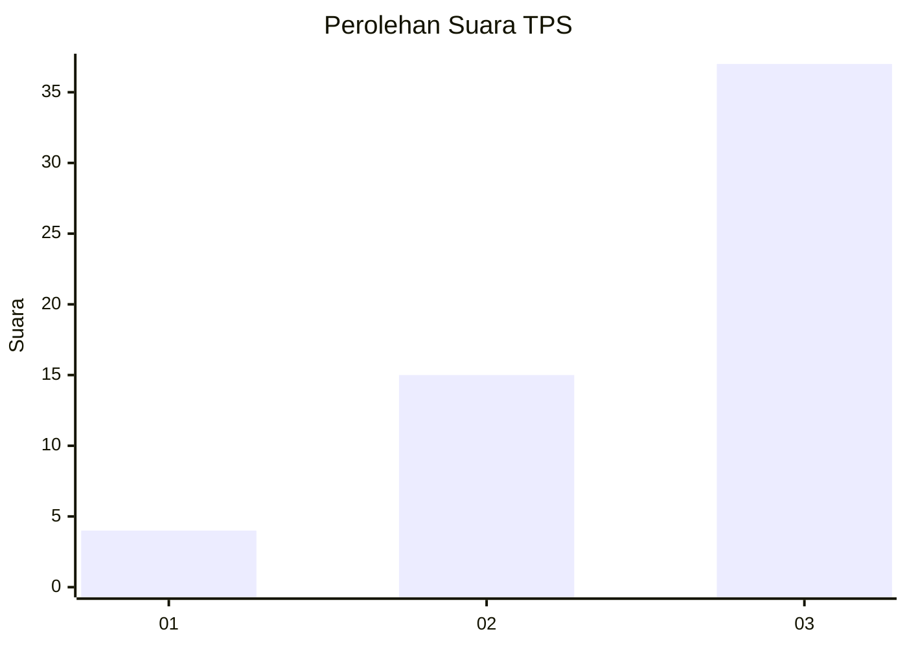
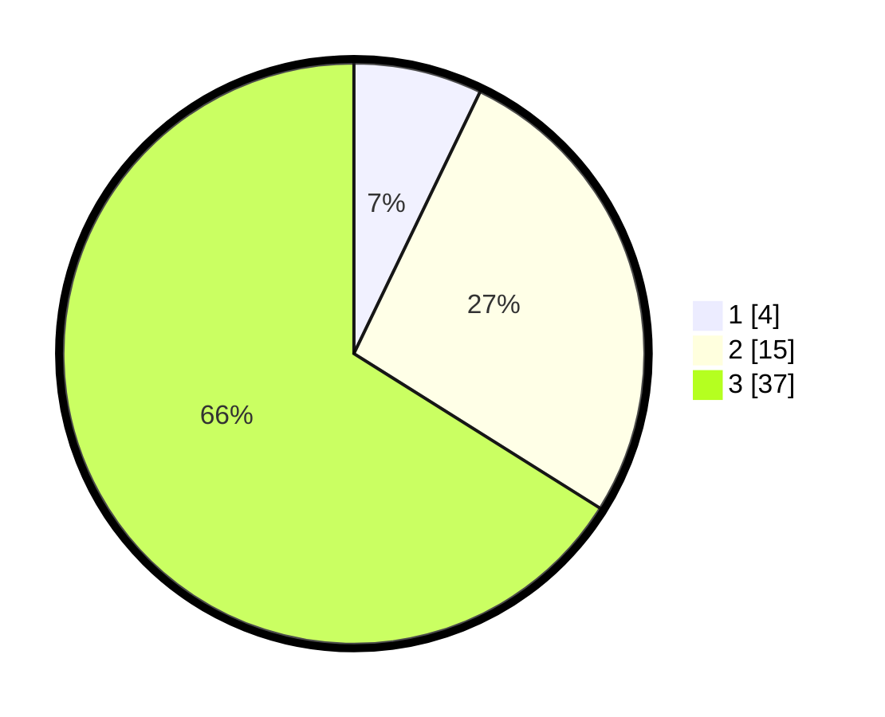

# Hasil

## Grafik

## Tabel

| No. | Nama Paslon    | Suara | Suara (raw) | Persentase |
|:--- |:-------------- | -----:| -----------:| ----------:|
| 1   | ANIES MUHAIMIN | 4     | [4][p-1]    | 7,14       |
| 2   | PRABOWO GIBRAN | 15    | [15][p-2]   | 26,79      |
| 3   | GANJAR MAHFUD  | 37    | [37][p-3]   | 66,07      |

[p-1]: https://github.com/gigit-pemilu/pemilu-2024-81-maluku/blob/main/pilpres/hitung-suara/sub/81-maluku/sub/02-maluku-tenggara/sub/14-kei-kecil-barat/sub/2006-warbal/sub/002-tps/sub/paslon-1.txt
[p-2]: https://github.com/gigit-pemilu/pemilu-2024-81-maluku/blob/main/pilpres/hitung-suara/sub/81-maluku/sub/02-maluku-tenggara/sub/14-kei-kecil-barat/sub/2006-warbal/sub/002-tps/sub/paslon-2.txt
[p-3]: https://github.com/gigit-pemilu/pemilu-2024-81-maluku/blob/main/pilpres/hitung-suara/sub/81-maluku/sub/02-maluku-tenggara/sub/14-kei-kecil-barat/sub/2006-warbal/sub/002-tps/sub/paslon-3.txt

## Foto C Plano

https://sirekap-obj-formc.kpu.go.id/e555/pemilu/ppwp/81/02/14/20/06/8102142006002-20240215-162909--2f7a7fae-c460-4b83-aa79-166bac1dc9b6.jpg

https://sirekap-obj-formc.kpu.go.id/e555/pemilu/ppwp/81/02/14/20/06/8102142006002-20240215-163253--0106133b-9d77-4caf-a6bc-dbfb135e9551.jpg

https://sirekap-obj-formc.kpu.go.id/e555/pemilu/ppwp/81/02/14/20/06/8102142006002-20240215-163033--b3081586-47d6-4717-8b1b-46770b3cb151.jpg

## Metadata

| Key        | Value               |
| ---------- | ------------------- |
| Time Stamp | 2024-02-25 21:00:00 |

