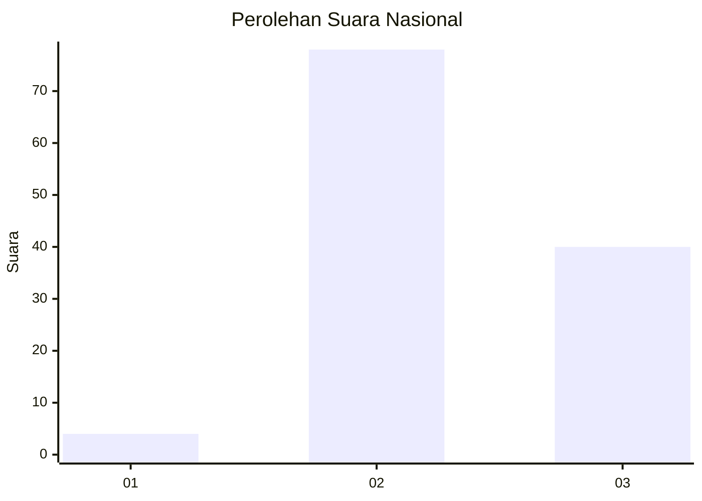
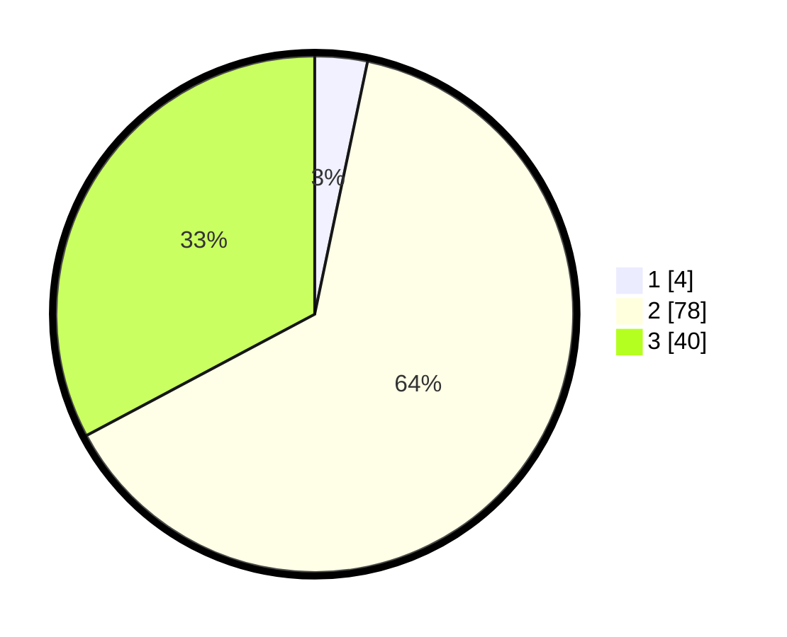

# Hasil

## Grafik

## Tabel

| No. | Nama Paslon    | Suara | Suara (raw) | Persentase |
|:--- |:-------------- | -----:| -----------:| ----------:|
| 1   | ANIES MUHAIMIN | 4     | [4][p-1]    | 3,28       |
| 2   | PRABOWO GIBRAN | 78    | [78][p-2]   | 63,93      |
| 3   | GANJAR MAHFUD  | 40    | [40][p-3]   | 32,79      |

[p-1]: https://github.com/gigit-pemilu/pemilu-2024/blob/main/pilpres/hitung-suara/sub/81-maluku/sub/02-maluku-tenggara/sub/15-manyeuw/sub/2001-rumadian/sub/001-tps/sub/paslon-1.txt
[p-2]: https://github.com/gigit-pemilu/pemilu-2024/blob/main/pilpres/hitung-suara/sub/81-maluku/sub/02-maluku-tenggara/sub/15-manyeuw/sub/2001-rumadian/sub/001-tps/sub/paslon-2.txt
[p-3]: https://github.com/gigit-pemilu/pemilu-2024/blob/main/pilpres/hitung-suara/sub/81-maluku/sub/02-maluku-tenggara/sub/15-manyeuw/sub/2001-rumadian/sub/001-tps/sub/paslon-3.txt

## Foto C Plano

https://sirekap-obj-formc.kpu.go.id/b174/pemilu/ppwp/81/02/15/20/01/8102152001001-20240215-080230--8959ec01-e96e-4509-abdd-05fa07c52f52.jpg

https://sirekap-obj-formc.kpu.go.id/b174/pemilu/ppwp/81/02/15/20/01/8102152001001-20240215-091114--5eaaf2aa-1688-4846-b19d-0eac2d0d8d6a.jpg

https://sirekap-obj-formc.kpu.go.id/b174/pemilu/ppwp/81/02/15/20/01/8102152001001-20240215-080530--16bef338-6272-4138-8597-128da4e9095a.jpg

## Metadata

| Key        | Value               |
| ---------- | ------------------- |
| Time Stamp | 2024-02-26 03:00:00 |

