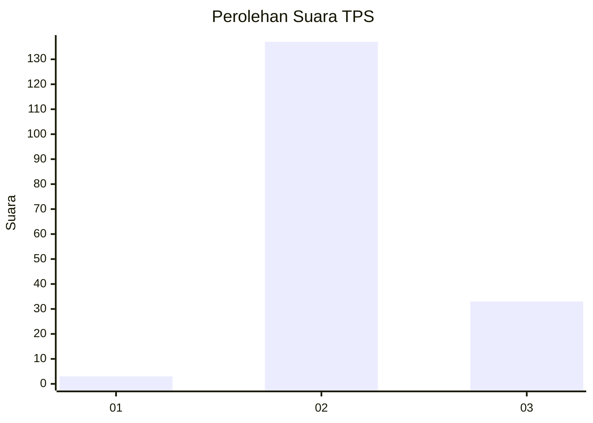
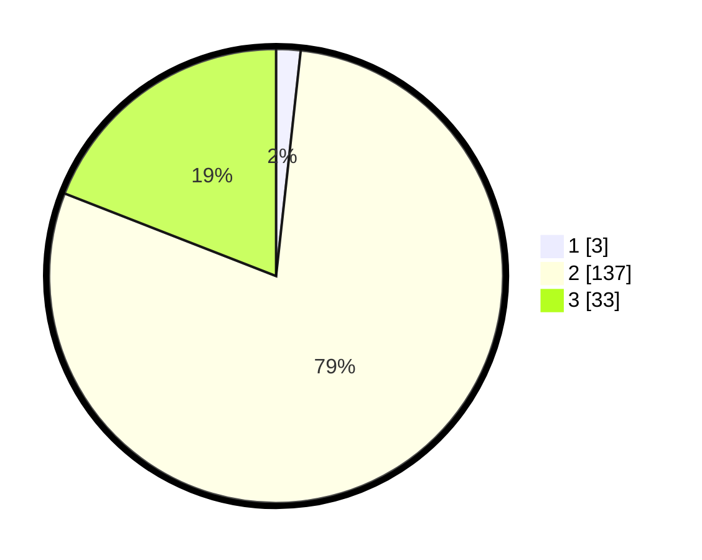

# Hasil

## Grafik

## Tabel

| No. | Nama Paslon    | Suara | Suara (raw) | Persentase |
|:--- |:-------------- | -----:| -----------:| ----------:|
| 1   | ANIES MUHAIMIN | 3     | [3][p-1]    | 1,73       |
| 2   | PRABOWO GIBRAN | 137   | [137][p-2]  | 79,19      |
| 3   | GANJAR MAHFUD  | 33    | [33][p-3]   | 19,08      |

[p-1]: https://github.com/gigit-pemilu/pemilu-2024-81-maluku/blob/main/pilpres/hitung-suara/sub/81-maluku/sub/02-maluku-tenggara/sub/15-manyeuw/sub/2004-ngilngof/sub/002-tps/sub/paslon-1.txt
[p-2]: https://github.com/gigit-pemilu/pemilu-2024-81-maluku/blob/main/pilpres/hitung-suara/sub/81-maluku/sub/02-maluku-tenggara/sub/15-manyeuw/sub/2004-ngilngof/sub/002-tps/sub/paslon-2.txt
[p-3]: https://github.com/gigit-pemilu/pemilu-2024-81-maluku/blob/main/pilpres/hitung-suara/sub/81-maluku/sub/02-maluku-tenggara/sub/15-manyeuw/sub/2004-ngilngof/sub/002-tps/sub/paslon-3.txt

## Foto C Plano

https://sirekap-obj-formc.kpu.go.id/6bc0/pemilu/ppwp/81/02/15/20/04/8102152004002-20240214-214627--3f3b0ea9-7541-4297-956d-6c1c5dec7886.jpg

https://sirekap-obj-formc.kpu.go.id/6bc0/pemilu/ppwp/81/02/15/20/04/8102152004002-20240214-214742--369a7fa5-551e-4793-b35e-fb937a912a4a.jpg

https://sirekap-obj-formc.kpu.go.id/6bc0/pemilu/ppwp/81/02/15/20/04/8102152004002-20240214-220043--c0845693-b68a-4342-8051-5da82f8c2d25.jpg

## Metadata

| Key        | Value               |
| ---------- | ------------------- |
| Time Stamp | 2024-02-24 22:31:28 |

