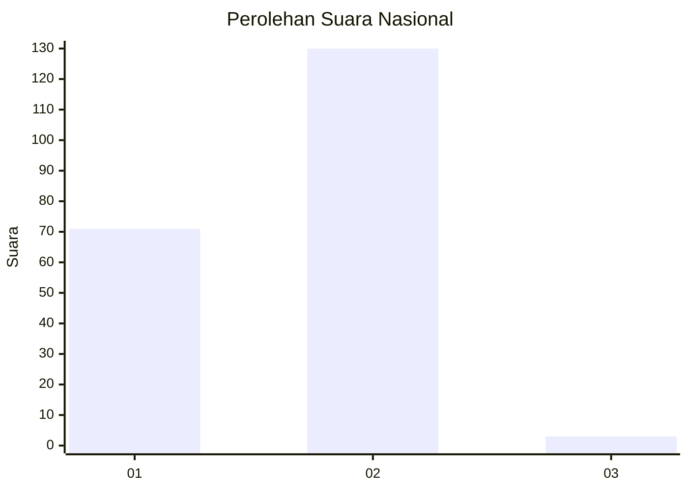
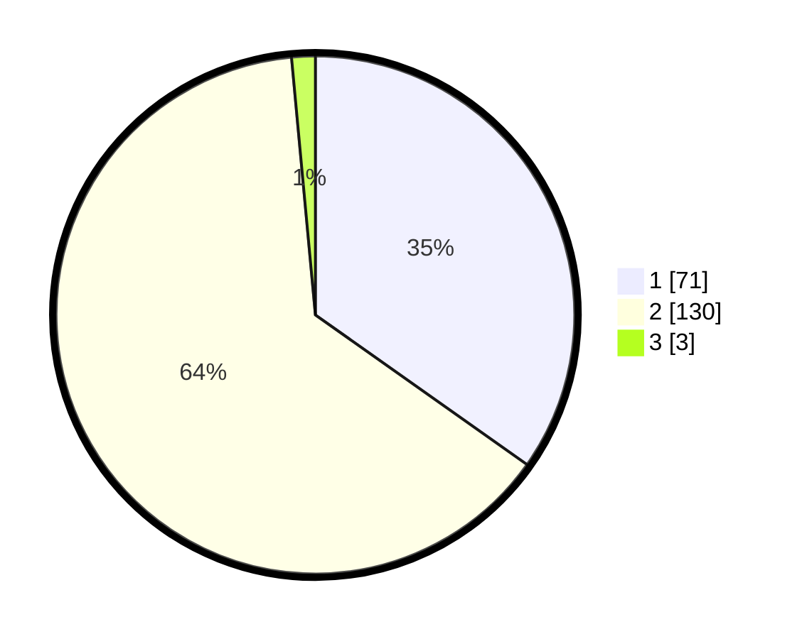

# Hasil

## Grafik

## Tabel

| No. | Nama Paslon    | Suara | Suara (raw) | Persentase |
|:--- |:-------------- | -----:| -----------:| ----------:|
| 1   | ANIES MUHAIMIN | 71    | [71][p-1]   | 34,80      |
| 2   | PRABOWO GIBRAN | 130   | [130][p-2]  | 63,73      |
| 3   | GANJAR MAHFUD  | 3     | [3][p-3]    | 1,47       |

[p-1]: https://github.com/gigit-pemilu/pemilu-2024/blob/main/pilpres/hitung-suara/sub/81-maluku/sub/02-maluku-tenggara/sub/15-manyeuw/sub/2005-selayar/sub/001-tps/sub/paslon-1.txt
[p-2]: https://github.com/gigit-pemilu/pemilu-2024/blob/main/pilpres/hitung-suara/sub/81-maluku/sub/02-maluku-tenggara/sub/15-manyeuw/sub/2005-selayar/sub/001-tps/sub/paslon-2.txt
[p-3]: https://github.com/gigit-pemilu/pemilu-2024/blob/main/pilpres/hitung-suara/sub/81-maluku/sub/02-maluku-tenggara/sub/15-manyeuw/sub/2005-selayar/sub/001-tps/sub/paslon-3.txt

## Foto C Plano

https://sirekap-obj-formc.kpu.go.id/eb00/pemilu/ppwp/81/02/15/20/05/8102152005001-20240214-185705--57aabfda-0d27-427e-b848-419078ea5089.jpg

https://sirekap-obj-formc.kpu.go.id/eb00/pemilu/ppwp/81/02/15/20/05/8102152005001-20240214-185853--acf578f6-51f1-4eb9-a4c5-b591f79f6e3c.jpg

https://sirekap-obj-formc.kpu.go.id/eb00/pemilu/ppwp/81/02/15/20/05/8102152005001-20240214-190755--615886dd-9e05-46a6-8f8f-05532ee5e2f1.jpg

## Metadata

| Key        | Value               |
| ---------- | ------------------- |
| Time Stamp | 2024-02-25 12:00:00 |

