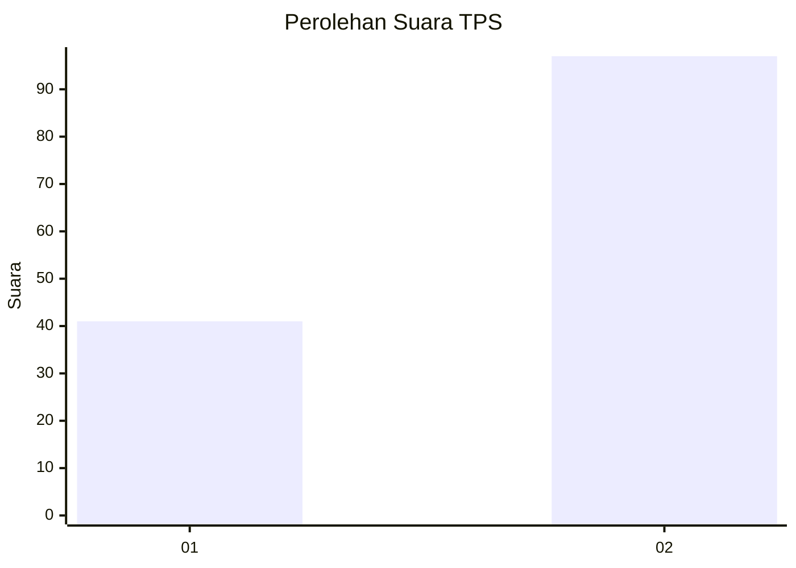
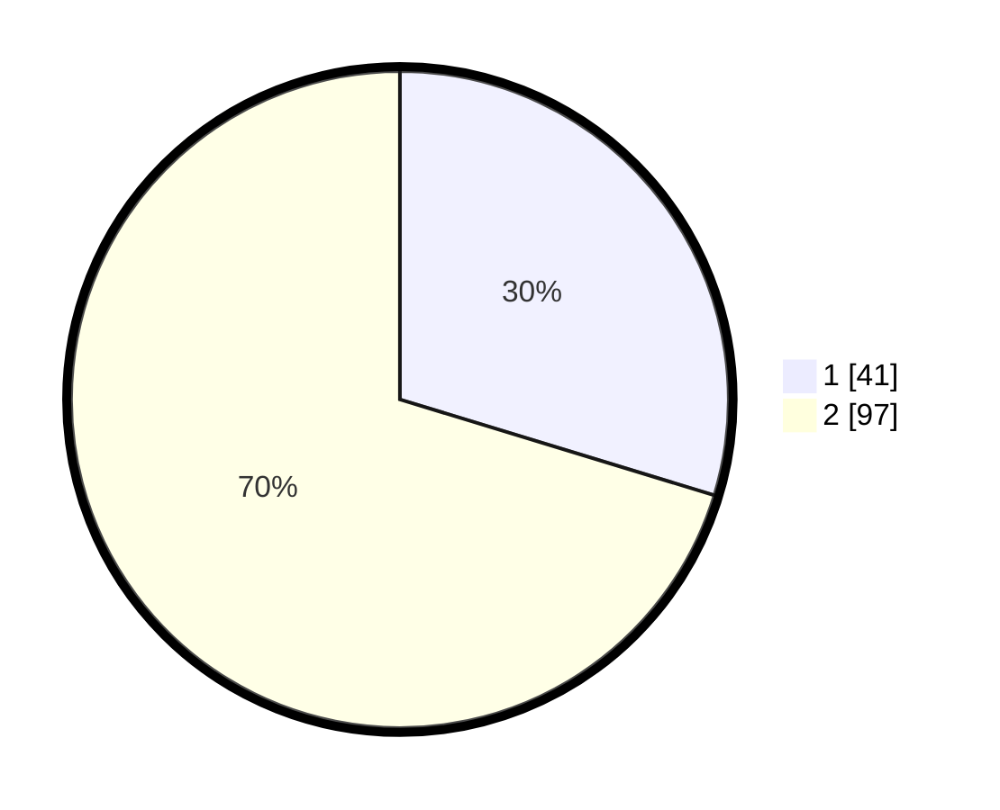

# Hasil

## Grafik

## Tabel

| No. | Nama Paslon    | Suara | Suara (raw) | Persentase |
|:--- |:-------------- | -----:| -----------:| ----------:|
| 1   | ANIES MUHAIMIN | 41    | [41][p-1]   | 29,71      |
| 2   | PRABOWO GIBRAN | 97    | [97][p-2]   | 70,29      |

[p-1]: https://github.com/gigit-pemilu/pemilu-2024-81-maluku/blob/main/pilpres/hitung-suara/sub/81-maluku/sub/02-maluku-tenggara/sub/16-hoat-sorbay/sub/2001-tetoat/sub/002-tps/sub/paslon-1.txt
[p-2]: https://github.com/gigit-pemilu/pemilu-2024-81-maluku/blob/main/pilpres/hitung-suara/sub/81-maluku/sub/02-maluku-tenggara/sub/16-hoat-sorbay/sub/2001-tetoat/sub/002-tps/sub/paslon-2.txt
[p-3]: https://github.com/gigit-pemilu/pemilu-2024-81-maluku/blob/main/pilpres/hitung-suara/sub/81-maluku/sub/02-maluku-tenggara/sub/16-hoat-sorbay/sub/2001-tetoat/sub/002-tps/sub/paslon-3.txt

## Foto C Plano

https://sirekap-obj-formc.kpu.go.id/a5d7/pemilu/ppwp/81/02/16/20/01/8102162001002-20240214-130055--b2109061-a8d4-4dd0-935c-c9d032521cd9.jpg

https://sirekap-obj-formc.kpu.go.id/a5d7/pemilu/ppwp/81/02/16/20/01/8102162001002-20240214-131929--5aed3439-5547-4e8b-8204-f7ae82fa41fe.jpg

https://sirekap-obj-formc.kpu.go.id/a5d7/pemilu/ppwp/81/02/16/20/01/8102162001002-20240214-130617--89aea472-9d87-4a5d-bb72-fb50ed5ddfab.jpg

## Metadata

| Key        | Value               |
| ---------- | ------------------- |
| Time Stamp | 2024-02-24 22:31:28 |

