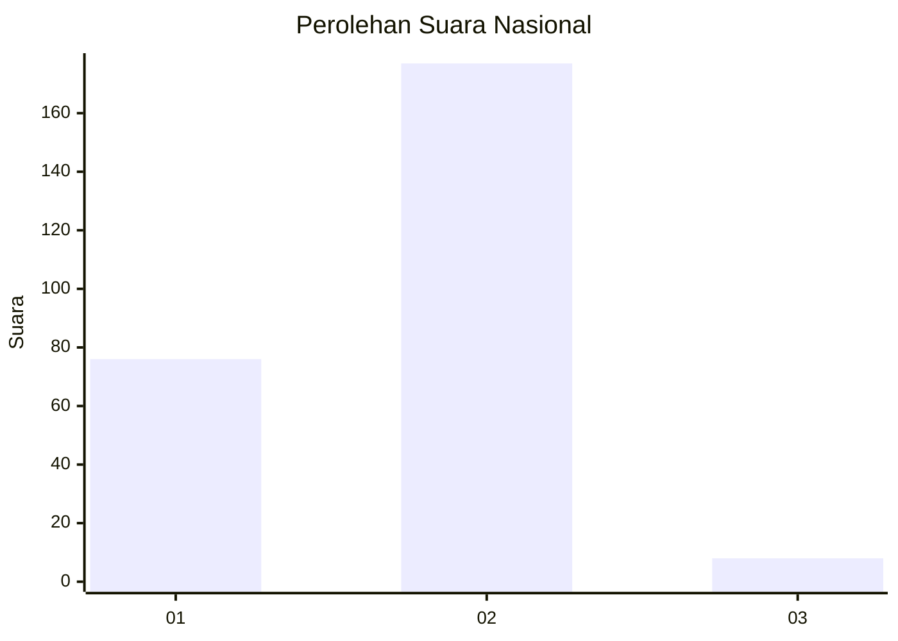
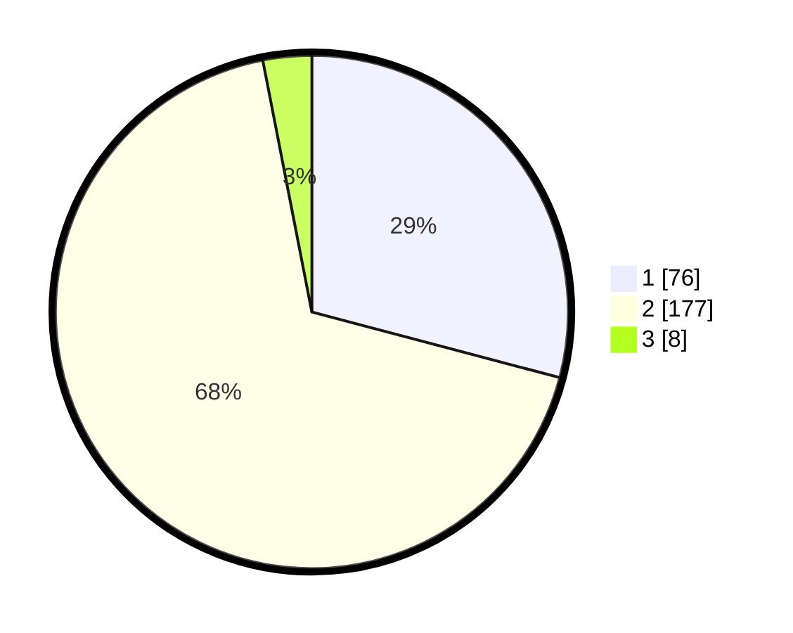

# Hasil

## Grafik

## Tabel

| No. | Nama Paslon    | Suara | Suara (raw) | Persentase |
|:--- |:-------------- | -----:| -----------:| ----------:|
| 1   | ANIES MUHAIMIN | 76    | [76][p-1]   | 29,12      |
| 2   | PRABOWO GIBRAN | 177   | [177][p-2]  | 67,82      |
| 3   | GANJAR MAHFUD  | 8     | [8][p-3]    | 3,07       |

[p-1]: https://github.com/gigit-pemilu/pemilu-2024/blob/main/pilpres/hitung-suara/sub/81-maluku/sub/02-maluku-tenggara/sub/16-hoat-sorbay/sub/2002-dian-pulau/sub/003-tps/sub/paslon-1.txt
[p-2]: https://github.com/gigit-pemilu/pemilu-2024/blob/main/pilpres/hitung-suara/sub/81-maluku/sub/02-maluku-tenggara/sub/16-hoat-sorbay/sub/2002-dian-pulau/sub/003-tps/sub/paslon-2.txt
[p-3]: https://github.com/gigit-pemilu/pemilu-2024/blob/main/pilpres/hitung-suara/sub/81-maluku/sub/02-maluku-tenggara/sub/16-hoat-sorbay/sub/2002-dian-pulau/sub/003-tps/sub/paslon-3.txt

## Foto C Plano

https://sirekap-obj-formc.kpu.go.id/4e74/pemilu/ppwp/81/02/16/20/02/8102162002003-20240214-213404--066ba4c2-b753-4405-9e44-c8ab4828b451.jpg

https://sirekap-obj-formc.kpu.go.id/4e74/pemilu/ppwp/81/02/16/20/02/8102162002003-20240214-213543--41337993-dec1-4bc6-b517-0efb2b1138fa.jpg

https://sirekap-obj-formc.kpu.go.id/4e74/pemilu/ppwp/81/02/16/20/02/8102162002003-20240214-213740--3901b4a3-cf71-452e-a8b7-3da1c1aa092d.jpg

## Metadata

| Key        | Value               |
| ---------- | ------------------- |
| Time Stamp | 2024-02-25 12:00:00 |

