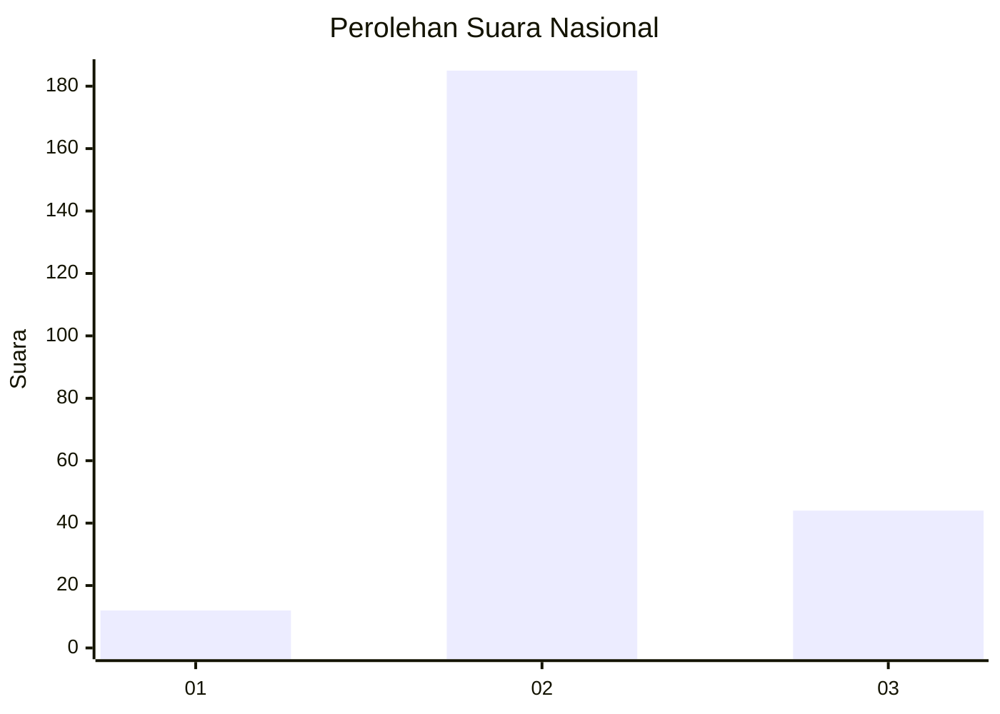

# Hasil

## Grafik

## Tabel

| No. | Nama Paslon    | Suara | Suara (raw) | Persentase |
|:--- |:-------------- | -----:| -----------:| ----------:|
| 1   | ANIES MUHAIMIN | 12    | [12][p-1]   | 4,98       |
| 2   | PRABOWO GIBRAN | 185   | [185][p-2]  | 76,76      |
| 3   | GANJAR MAHFUD  | 44    | [44][p-3]   | 18,26      |

[p-1]: https://github.com/gigit-pemilu/pemilu-2024/blob/main/pilpres/hitung-suara/sub/81-maluku/sub/02-maluku-tenggara/sub/16-hoat-sorbay/sub/2003-letvuan/sub/001-tps/sub/paslon-1.txt
[p-2]: https://github.com/gigit-pemilu/pemilu-2024/blob/main/pilpres/hitung-suara/sub/81-maluku/sub/02-maluku-tenggara/sub/16-hoat-sorbay/sub/2003-letvuan/sub/001-tps/sub/paslon-2.txt
[p-3]: https://github.com/gigit-pemilu/pemilu-2024/blob/main/pilpres/hitung-suara/sub/81-maluku/sub/02-maluku-tenggara/sub/16-hoat-sorbay/sub/2003-letvuan/sub/001-tps/sub/paslon-3.txt

## Foto C Plano

https://sirekap-obj-formc.kpu.go.id/f85a/pemilu/ppwp/81/02/16/20/03/8102162003001-20240214-214433--49944752-242d-48f3-9d55-1a6e6a859ade.jpg

https://sirekap-obj-formc.kpu.go.id/f85a/pemilu/ppwp/81/02/16/20/03/8102162003001-20240214-214613--0515a768-a2a4-407e-a899-c4ce11c8fd21.jpg

https://sirekap-obj-formc.kpu.go.id/f85a/pemilu/ppwp/81/02/16/20/03/8102162003001-20240214-214820--cd4a618d-32fd-4d65-b55c-e0827ed289cc.jpg

## Metadata

| Key        | Value               |
| ---------- | ------------------- |
| Time Stamp | 2024-02-25 16:00:00 |

