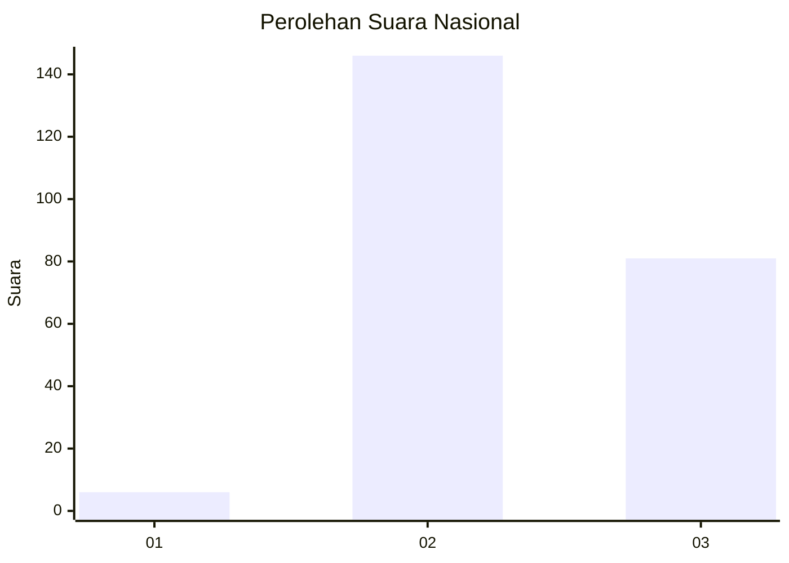
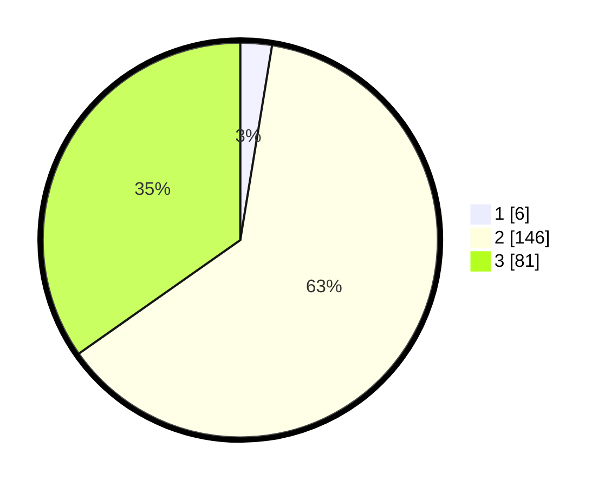

# Hasil

## Grafik

## Tabel

| No. | Nama Paslon    | Suara | Suara (raw) | Persentase |
|:--- |:-------------- | -----:| -----------:| ----------:|
| 1   | ANIES MUHAIMIN | 6     | [6][p-1]    | 2,58       |
| 2   | PRABOWO GIBRAN | 146   | [146][p-2]  | 62,66      |
| 3   | GANJAR MAHFUD  | 81    | [81][p-3]   | 34,76      |

[p-1]: https://github.com/gigit-pemilu/pemilu-2024/blob/main/pilpres/hitung-suara/sub/81-maluku/sub/02-maluku-tenggara/sub/16-hoat-sorbay/sub/2004-evu/sub/001-tps/sub/paslon-1.txt
[p-2]: https://github.com/gigit-pemilu/pemilu-2024/blob/main/pilpres/hitung-suara/sub/81-maluku/sub/02-maluku-tenggara/sub/16-hoat-sorbay/sub/2004-evu/sub/001-tps/sub/paslon-2.txt
[p-3]: https://github.com/gigit-pemilu/pemilu-2024/blob/main/pilpres/hitung-suara/sub/81-maluku/sub/02-maluku-tenggara/sub/16-hoat-sorbay/sub/2004-evu/sub/001-tps/sub/paslon-3.txt

## Foto C Plano

https://sirekap-obj-formc.kpu.go.id/efdc/pemilu/ppwp/81/02/16/20/04/8102162004001-20240215-000425--c17aa050-9127-4091-8a29-31e92e057a5e.jpg

https://sirekap-obj-formc.kpu.go.id/efdc/pemilu/ppwp/81/02/16/20/04/8102162004001-20240215-000642--92b7bb0a-4e42-42a8-aafb-c959790179de.jpg

https://sirekap-obj-formc.kpu.go.id/efdc/pemilu/ppwp/81/02/16/20/04/8102162004001-20240215-000744--4623ca8e-8c1e-4f2b-9828-75021e4fc1f6.jpg

## Metadata

| Key        | Value               |
| ---------- | ------------------- |
| Time Stamp | 2024-02-24 22:31:28 |

