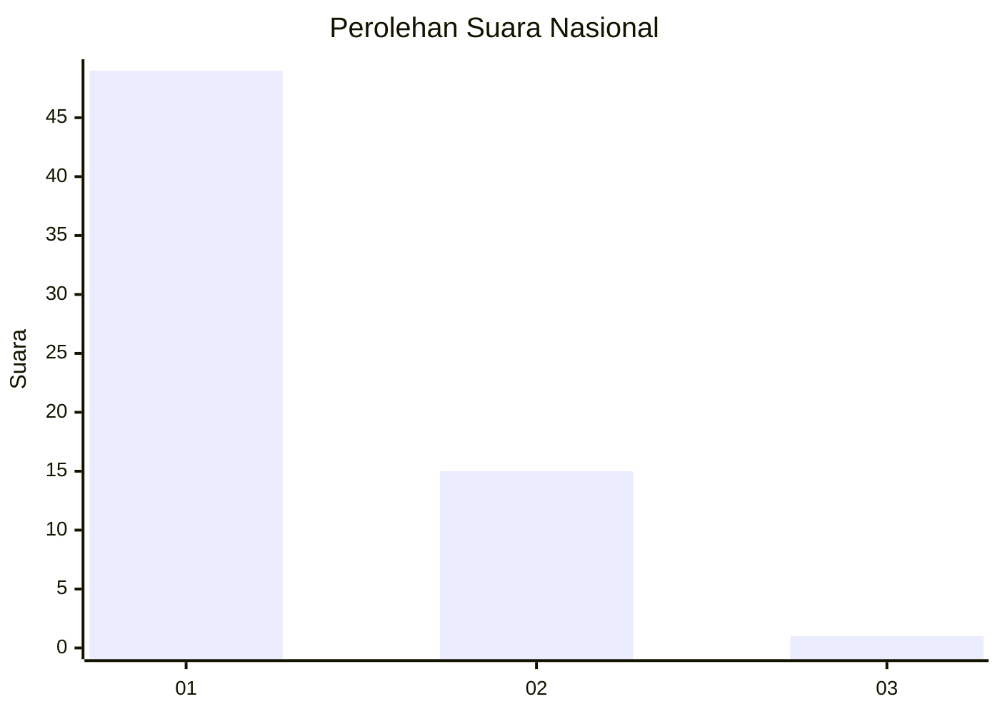
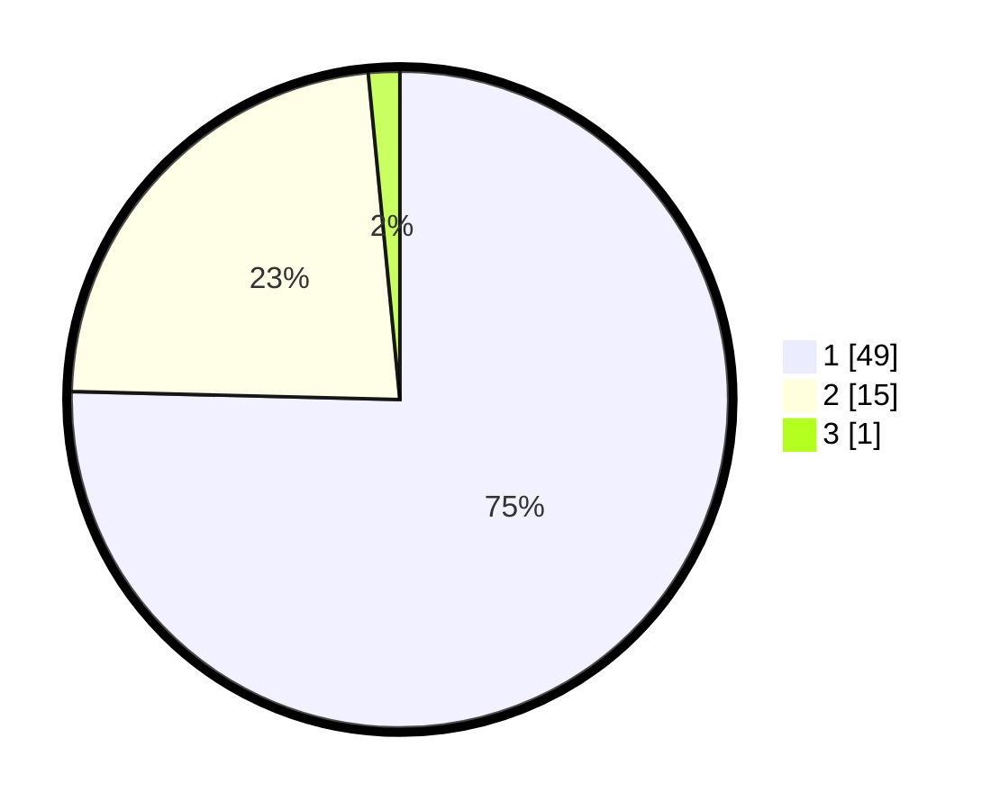

# Hasil

## Grafik

## Tabel

| No. | Nama Paslon    | Suara | Suara (raw) | Persentase |
|:--- |:-------------- | -----:| -----------:| ----------:|
| 1   | ANIES MUHAIMIN | 49    | [49][p-1]   | 75,38      |
| 2   | PRABOWO GIBRAN | 15    | [15][p-2]   | 23,08      |
| 3   | GANJAR MAHFUD  | 1     | [1][p-3]    | 1,54       |

[p-1]: https://github.com/gigit-pemilu/pemilu-2024/blob/main/pilpres/hitung-suara/sub/81-maluku/sub/02-maluku-tenggara/sub/18-kei-besar-selatan-barat/sub/2005-ngurko/sub/001-tps/sub/paslon-1.txt
[p-2]: https://github.com/gigit-pemilu/pemilu-2024/blob/main/pilpres/hitung-suara/sub/81-maluku/sub/02-maluku-tenggara/sub/18-kei-besar-selatan-barat/sub/2005-ngurko/sub/001-tps/sub/paslon-2.txt
[p-3]: https://github.com/gigit-pemilu/pemilu-2024/blob/main/pilpres/hitung-suara/sub/81-maluku/sub/02-maluku-tenggara/sub/18-kei-besar-selatan-barat/sub/2005-ngurko/sub/001-tps/sub/paslon-3.txt

## Foto C Plano

https://sirekap-obj-formc.kpu.go.id/8ebf/pemilu/ppwp/81/02/18/20/05/8102182005001-20240215-101720--91ffdfb0-22c9-4046-b48c-56bbd098f112.jpg

https://sirekap-obj-formc.kpu.go.id/8ebf/pemilu/ppwp/81/02/18/20/05/8102182005001-20240215-113005--d12397cb-297b-48dc-ab28-127f58a98420.jpg

https://sirekap-obj-formc.kpu.go.id/8ebf/pemilu/ppwp/81/02/18/20/05/8102182005001-20240215-011006--71e23082-bdc9-4bf8-af42-ac33de12d884.jpg

## Metadata

| Key        | Value               |
| ---------- | ------------------- |
| Time Stamp | 2024-02-25 08:00:00 |

