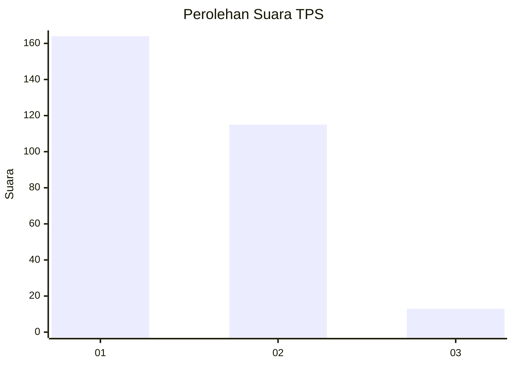
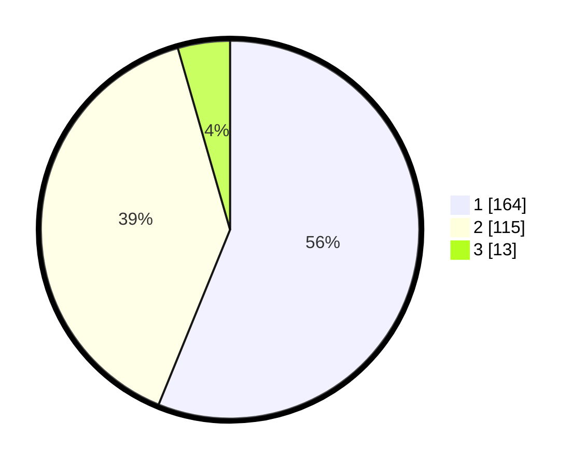

# Hasil

## Grafik

## Tabel

| No. | Nama Paslon    | Suara | Suara (raw) | Persentase |
|:--- |:-------------- | -----:| -----------:| ----------:|
| 1   | ANIES MUHAIMIN | 164   | [164][p-1]  | 56,16      |
| 2   | PRABOWO GIBRAN | 115   | [115][p-2]  | 39,38      |
| 3   | GANJAR MAHFUD  | 13    | [13][p-3]   | 4,45       |

[p-1]: https://github.com/gigit-pemilu/pemilu-2024-81-maluku/blob/main/pilpres/hitung-suara/sub/81-maluku/sub/02-maluku-tenggara/sub/19-kei-kecil-timur-selatan/sub/2002-danar-ternate/sub/002-tps/sub/paslon-1.txt
[p-2]: https://github.com/gigit-pemilu/pemilu-2024-81-maluku/blob/main/pilpres/hitung-suara/sub/81-maluku/sub/02-maluku-tenggara/sub/19-kei-kecil-timur-selatan/sub/2002-danar-ternate/sub/002-tps/sub/paslon-2.txt
[p-3]: https://github.com/gigit-pemilu/pemilu-2024-81-maluku/blob/main/pilpres/hitung-suara/sub/81-maluku/sub/02-maluku-tenggara/sub/19-kei-kecil-timur-selatan/sub/2002-danar-ternate/sub/002-tps/sub/paslon-3.txt

## Foto C Plano

https://sirekap-obj-formc.kpu.go.id/59cd/pemilu/ppwp/81/02/19/20/02/8102192002002-20240214-193225--86d7031d-8222-46bf-bb5d-3f2239882e6e.jpg

https://sirekap-obj-formc.kpu.go.id/59cd/pemilu/ppwp/81/02/19/20/02/8102192002002-20240214-192830--a2da7086-c6dc-43b7-a805-c31f1f808054.jpg

https://sirekap-obj-formc.kpu.go.id/59cd/pemilu/ppwp/81/02/19/20/02/8102192002002-20240214-193448--22107c88-f210-41d6-8926-87c49a9d2c2c.jpg

## Metadata

| Key        | Value               |
| ---------- | ------------------- |
| Time Stamp | 2024-02-24 22:31:28 |

