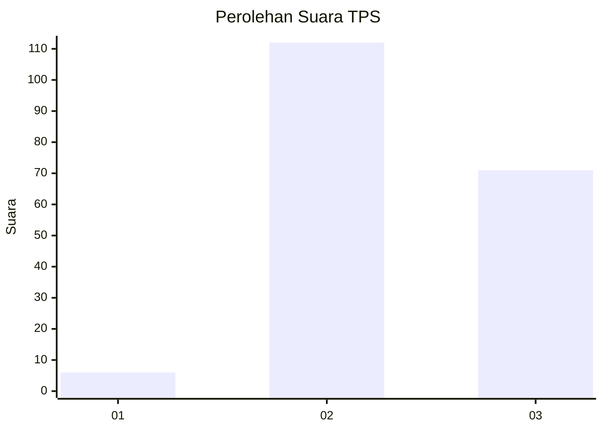
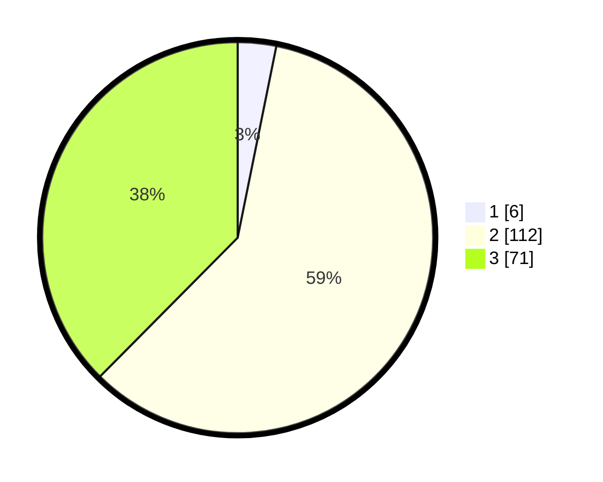

# Hasil

## Grafik

## Tabel

| No. | Nama Paslon    | Suara | Suara (raw) | Persentase |
|:--- |:-------------- | -----:| -----------:| ----------:|
| 1   | ANIES MUHAIMIN | 6     | [6][p-1]    | 3,17       |
| 2   | PRABOWO GIBRAN | 112   | [112][p-2]  | 59,26      |
| 3   | GANJAR MAHFUD  | 71    | [71][p-3]   | 37,57      |

[p-1]: https://github.com/gigit-pemilu/pemilu-2024-81-maluku/blob/main/pilpres/hitung-suara/sub/81-maluku/sub/02-maluku-tenggara/sub/19-kei-kecil-timur-selatan/sub/2005-elaar-lamagorang/sub/001-tps/sub/paslon-1.txt
[p-2]: https://github.com/gigit-pemilu/pemilu-2024-81-maluku/blob/main/pilpres/hitung-suara/sub/81-maluku/sub/02-maluku-tenggara/sub/19-kei-kecil-timur-selatan/sub/2005-elaar-lamagorang/sub/001-tps/sub/paslon-2.txt
[p-3]: https://github.com/gigit-pemilu/pemilu-2024-81-maluku/blob/main/pilpres/hitung-suara/sub/81-maluku/sub/02-maluku-tenggara/sub/19-kei-kecil-timur-selatan/sub/2005-elaar-lamagorang/sub/001-tps/sub/paslon-3.txt

## Foto C Plano

https://sirekap-obj-formc.kpu.go.id/861c/pemilu/ppwp/81/02/19/20/05/8102192005001-20240214-191937--4872b7cc-1609-435a-9bad-73c236fa3c8c.jpg

https://sirekap-obj-formc.kpu.go.id/861c/pemilu/ppwp/81/02/19/20/05/8102192005001-20240214-192128--7ac18659-44dc-4bdb-9ae1-6d7882f323f1.jpg

https://sirekap-obj-formc.kpu.go.id/861c/pemilu/ppwp/81/02/19/20/05/8102192005001-20240214-190244--951abeab-5d08-4086-be69-70ad773fe5eb.jpg

## Metadata

| Key        | Value               |
| ---------- | ------------------- |
| Time Stamp | 2024-02-24 22:31:28 |

