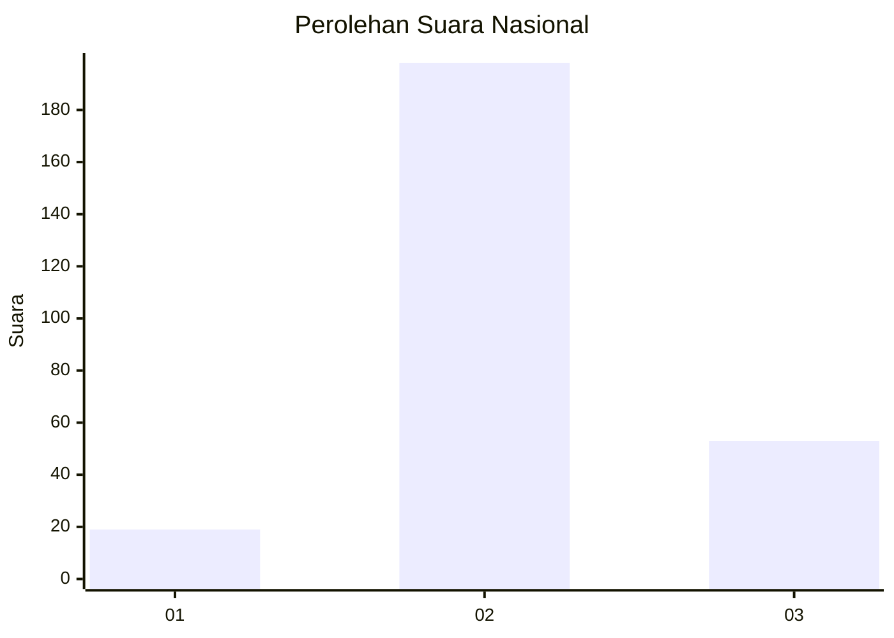
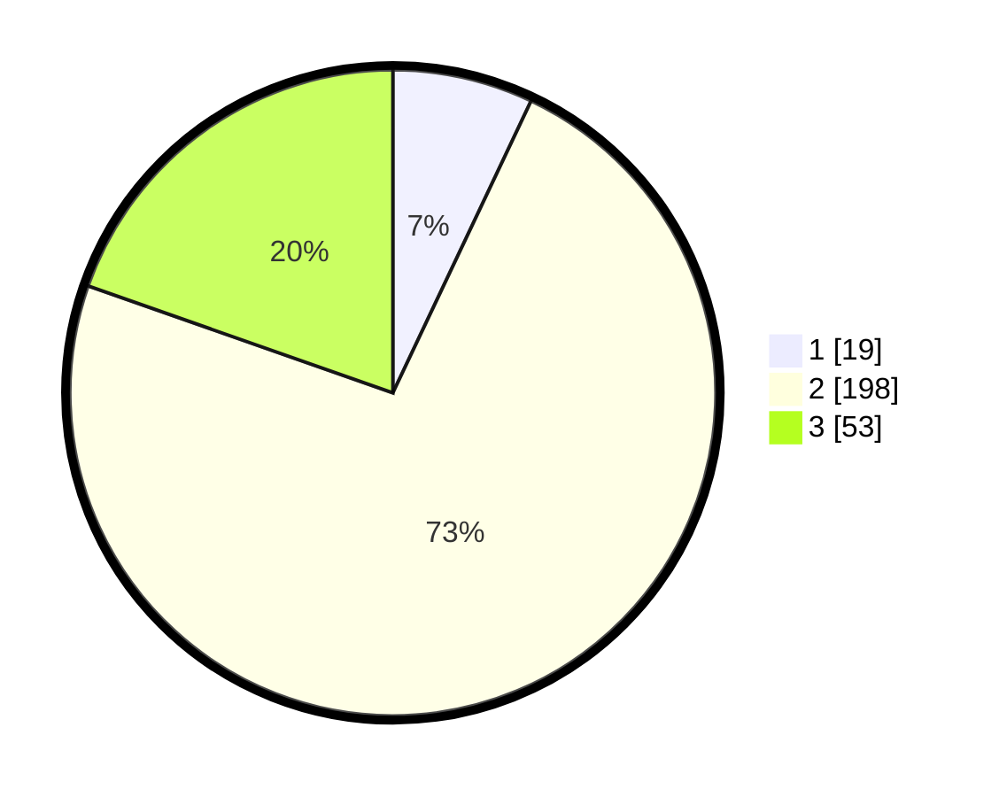

# Hasil

## Grafik

## Tabel

| No. | Nama Paslon    | Suara | Suara (raw) | Persentase |
|:--- |:-------------- | -----:| -----------:| ----------:|
| 1   | ANIES MUHAIMIN | 19    | [19][p-1]   | 7,04       |
| 2   | PRABOWO GIBRAN | 198   | [198][p-2]  | 73,33      |
| 3   | GANJAR MAHFUD  | 53    | [53][p-3]   | 19,63      |

[p-1]: https://github.com/gigit-pemilu/pemilu-2024/blob/main/pilpres/hitung-suara/sub/81-maluku/sub/03-kepulauan-tanimbar/sub/01-tanimbar-selatan/sub/2007-olilit-raya/sub/014-tps/sub/paslon-1.txt
[p-2]: https://github.com/gigit-pemilu/pemilu-2024/blob/main/pilpres/hitung-suara/sub/81-maluku/sub/03-kepulauan-tanimbar/sub/01-tanimbar-selatan/sub/2007-olilit-raya/sub/014-tps/sub/paslon-2.txt
[p-3]: https://github.com/gigit-pemilu/pemilu-2024/blob/main/pilpres/hitung-suara/sub/81-maluku/sub/03-kepulauan-tanimbar/sub/01-tanimbar-selatan/sub/2007-olilit-raya/sub/014-tps/sub/paslon-3.txt

## Foto C Plano

https://sirekap-obj-formc.kpu.go.id/acdd/pemilu/ppwp/81/03/01/20/07/8103012007014-20240217-095130--bcf6648a-6e25-47f0-abca-986f9a668a8a.jpg

https://sirekap-obj-formc.kpu.go.id/acdd/pemilu/ppwp/81/03/01/20/07/8103012007014-20240217-040115--2e126195-0032-40fa-a887-de83c9d1e57c.jpg

https://sirekap-obj-formc.kpu.go.id/acdd/pemilu/ppwp/81/03/01/20/07/8103012007014-20240217-040036--4ed902e7-171f-4443-a2af-41a2f213fbcf.jpg

## Metadata

| Key        | Value               |
| ---------- | ------------------- |
| Time Stamp | 2024-02-20 10:00:00 |

