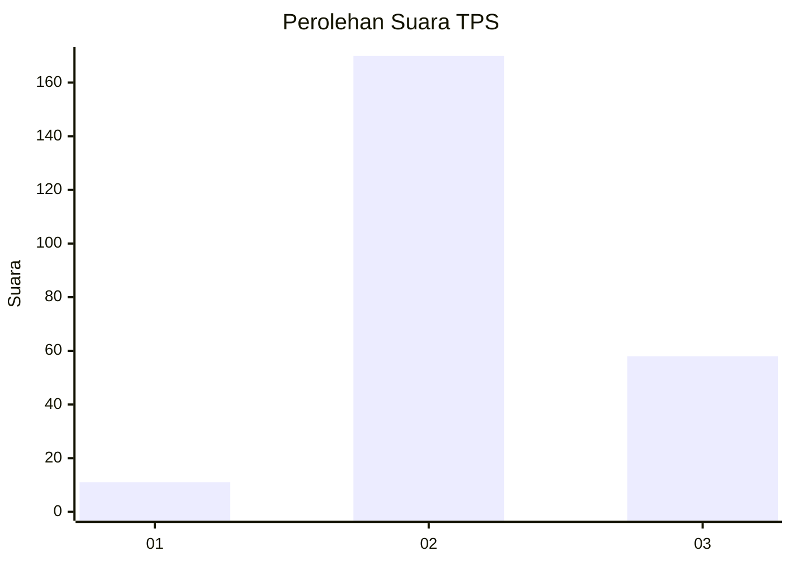
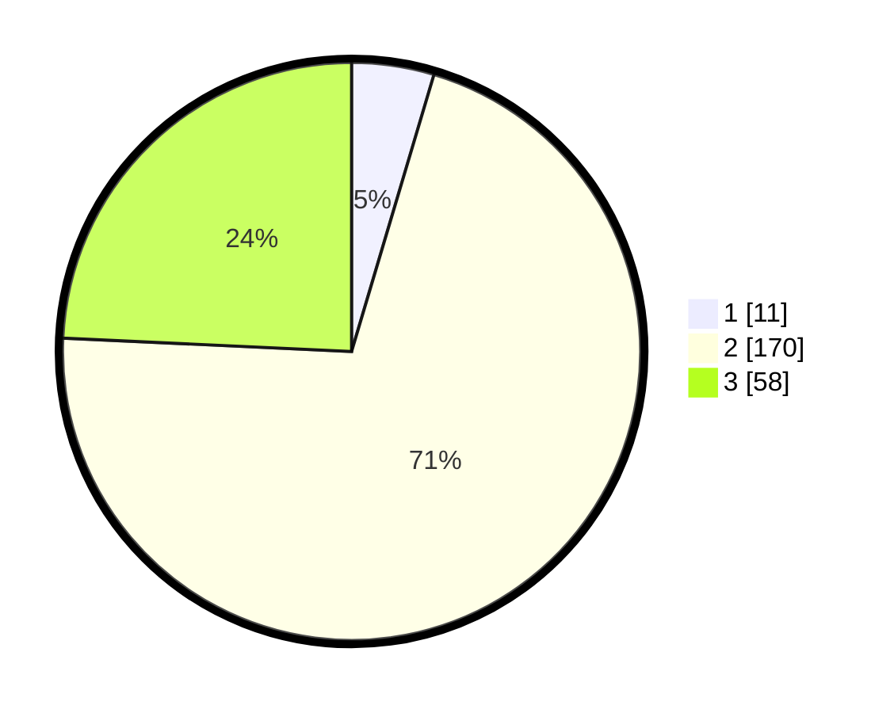

# Hasil

## Grafik

## Tabel

| No. | Nama Paslon    | Suara | Suara (raw) | Persentase |
|:--- |:-------------- | -----:| -----------:| ----------:|
| 1   | ANIES MUHAIMIN | 11    | [11][p-1]   | 4,60       |
| 2   | PRABOWO GIBRAN | 170   | [170][p-2]  | 71,13      |
| 3   | GANJAR MAHFUD  | 58    | [58][p-3]   | 24,27      |

[p-1]: https://github.com/gigit-pemilu/pemilu-2024-81-maluku/blob/main/pilpres/hitung-suara/sub/81-maluku/sub/03-kepulauan-tanimbar/sub/02-selaru/sub/2001-adaut/sub/001-tps/sub/paslon-1.txt
[p-2]: https://github.com/gigit-pemilu/pemilu-2024-81-maluku/blob/main/pilpres/hitung-suara/sub/81-maluku/sub/03-kepulauan-tanimbar/sub/02-selaru/sub/2001-adaut/sub/001-tps/sub/paslon-2.txt
[p-3]: https://github.com/gigit-pemilu/pemilu-2024-81-maluku/blob/main/pilpres/hitung-suara/sub/81-maluku/sub/03-kepulauan-tanimbar/sub/02-selaru/sub/2001-adaut/sub/001-tps/sub/paslon-3.txt

## Foto C Plano

https://sirekap-obj-formc.kpu.go.id/993c/pemilu/ppwp/81/03/02/20/01/8103022001001-20240215-224152--d8ba4900-bda6-45c3-9025-a87866edc8e3.jpg

https://sirekap-obj-formc.kpu.go.id/993c/pemilu/ppwp/81/03/02/20/01/8103022001001-20240215-224237--e746f2a2-4a71-4520-9e4d-bfb9e3c2a158.jpg

https://sirekap-obj-formc.kpu.go.id/993c/pemilu/ppwp/81/03/02/20/01/8103022001001-20240215-224653--193c80cb-9cfb-4eb7-bdbf-3ba18be4aa9c.jpg

## Metadata

| Key        | Value               |
| ---------- | ------------------- |
| Time Stamp | 2024-02-17 16:52:47 |

