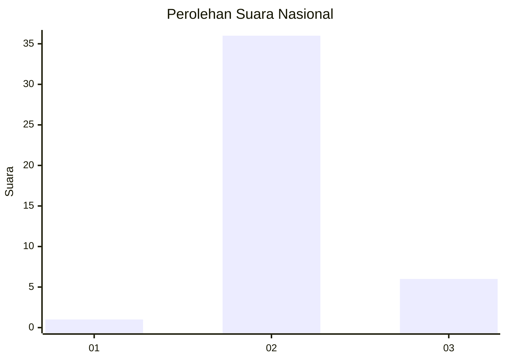
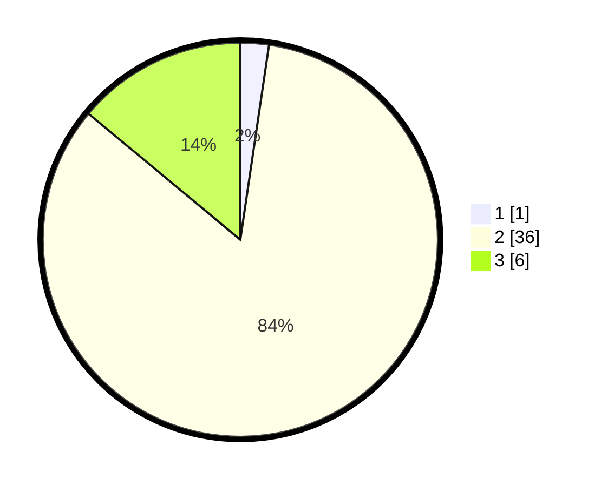

# Hasil

## Grafik

## Tabel

| No. | Nama Paslon    | Suara | Suara (raw) | Persentase |
|:--- |:-------------- | -----:| -----------:| ----------:|
| 1   | ANIES MUHAIMIN | 1     | [1][p-1]    | 2,33       |
| 2   | PRABOWO GIBRAN | 36    | [36][p-2]   | 83,72      |
| 3   | GANJAR MAHFUD  | 6     | [6][p-3]    | 13,95      |

[p-1]: https://github.com/gigit-pemilu/pemilu-2024/blob/main/pilpres/hitung-suara/sub/81-maluku/sub/03-kepulauan-tanimbar/sub/07-wuar-labobar/sub/2009-awear-rumngeur/sub/003-tps/sub/paslon-1.txt
[p-2]: https://github.com/gigit-pemilu/pemilu-2024/blob/main/pilpres/hitung-suara/sub/81-maluku/sub/03-kepulauan-tanimbar/sub/07-wuar-labobar/sub/2009-awear-rumngeur/sub/003-tps/sub/paslon-2.txt
[p-3]: https://github.com/gigit-pemilu/pemilu-2024/blob/main/pilpres/hitung-suara/sub/81-maluku/sub/03-kepulauan-tanimbar/sub/07-wuar-labobar/sub/2009-awear-rumngeur/sub/003-tps/sub/paslon-3.txt

## Foto C Plano

https://sirekap-obj-formc.kpu.go.id/5865/pemilu/ppwp/81/03/07/20/09/8103072009003-20240214-160057--b2f9af65-ec5e-4b36-bcc3-f64c2d3fbb16.jpg

https://sirekap-obj-formc.kpu.go.id/5865/pemilu/ppwp/81/03/07/20/09/8103072009003-20240217-132247--5be91963-c16d-4403-a03c-b3a11ce0d59c.jpg

https://sirekap-obj-formc.kpu.go.id/5865/pemilu/ppwp/81/03/07/20/09/8103072009003-20240217-172402--ec6ddccc-5945-4169-b755-e0a5ab35249d.jpg

## Metadata

| Key        | Value               |
| ---------- | ------------------- |
| Time Stamp | 2024-02-17 18:00:00 |

## DATA PEMILIH TETAP

Jumlah pemilih dalam DPT: **45**.
 * L: **23**.
 * P: **22**.

## DATA PENGGUNA HAK PILIH

Jumlah pengguna hak pilih dalam DPT: **38**.
 * L: **21**.
 * P: **17**.

Jumlah pengguna hak pilih dalam DPTb: **3**.
 * L: **3**.
 * P: **0**.

Jumlah pengguna hak pilih dalam DPK: **2**.
 * L: **2**.
 * P: **0**.

Jumlah pengguna hak pilih: **43**.
 * L: **26**.
 * P: **17**.

## JUMLAH SUARA SAH DAN TIDAK SAH

JUMLAH SELURUH SUARA SAH: **43**.

JUMLAH SUARA TIDAK SAH: **0**.

JUMLAH SELURUH SUARA SAH DAN SUARA TIDAK SAH: **43**.

