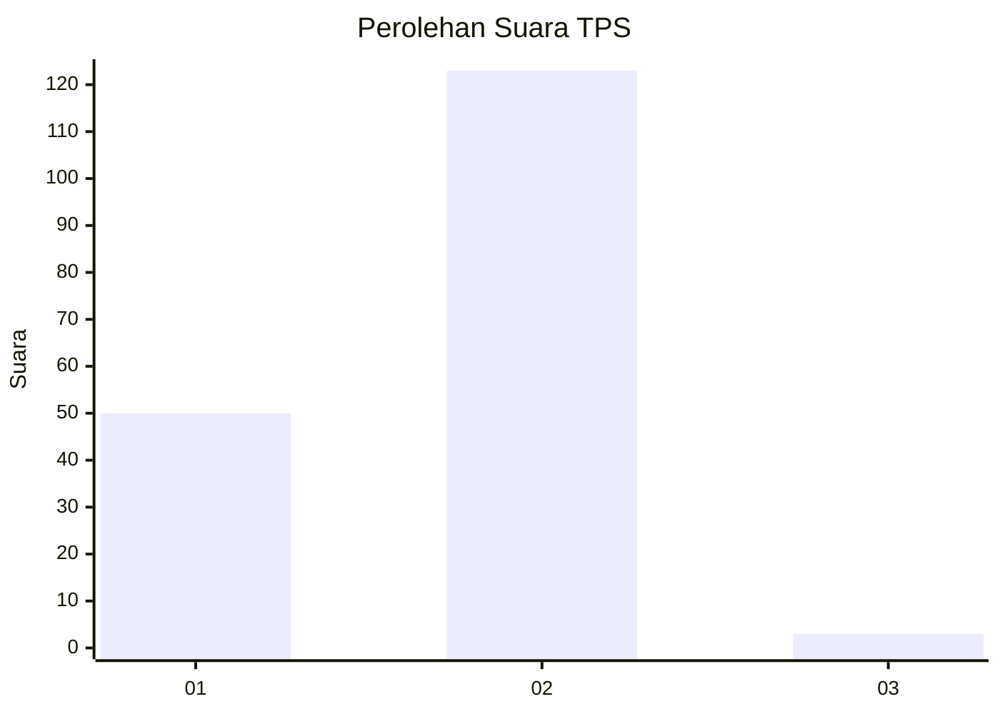
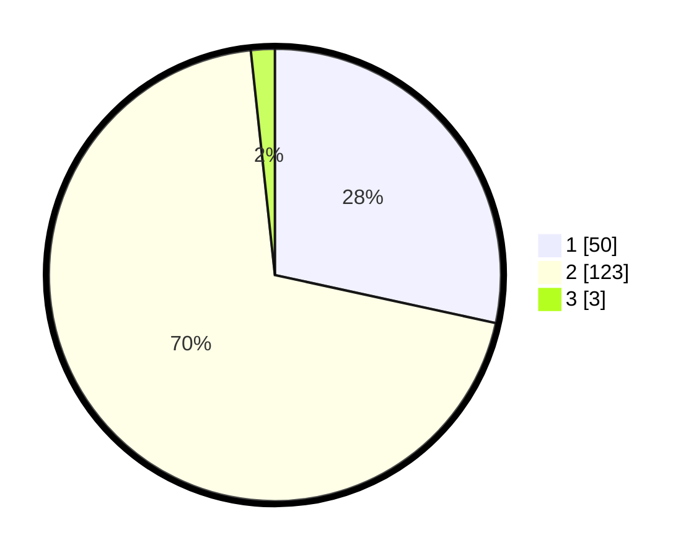

# Hasil

## Grafik

## Tabel

| No. | Nama Paslon    | Suara | Suara (raw) | Persentase |
|:--- |:-------------- | -----:| -----------:| ----------:|
| 1   | ANIES MUHAIMIN | 50    | [50][p-1]   | 28,41      |
| 2   | PRABOWO GIBRAN | 123   | [123][p-2]  | 69,89      |
| 3   | GANJAR MAHFUD  | 3     | [3][p-3]    | 1,70       |

[p-1]: https://github.com/gigit-pemilu/pemilu-2024-81-maluku/blob/main/pilpres/hitung-suara/sub/81-maluku/sub/04-buru/sub/01-namlea/sub/2001-namlea/sub/001-tps/sub/paslon-1.txt
[p-2]: https://github.com/gigit-pemilu/pemilu-2024-81-maluku/blob/main/pilpres/hitung-suara/sub/81-maluku/sub/04-buru/sub/01-namlea/sub/2001-namlea/sub/001-tps/sub/paslon-2.txt
[p-3]: https://github.com/gigit-pemilu/pemilu-2024-81-maluku/blob/main/pilpres/hitung-suara/sub/81-maluku/sub/04-buru/sub/01-namlea/sub/2001-namlea/sub/001-tps/sub/paslon-3.txt

## Foto C Plano

https://sirekap-obj-formc.kpu.go.id/925f/pemilu/ppwp/81/04/01/20/01/8104012001001-20240215-052212--a3b3dae9-d639-40c1-9c0c-e8544d7ba06f.jpg

https://sirekap-obj-formc.kpu.go.id/925f/pemilu/ppwp/81/04/01/20/01/8104012001001-20240215-111536--d3f67843-c28b-4f2f-9755-60e96701f16e.jpg

https://sirekap-obj-formc.kpu.go.id/925f/pemilu/ppwp/81/04/01/20/01/8104012001001-20240215-112047--573c3e95-9127-4acb-a768-a160b2a00e96.jpg

## Metadata

| Key        | Value               |
| ---------- | ------------------- |
| Time Stamp | 2024-02-15 17:00:25 |

