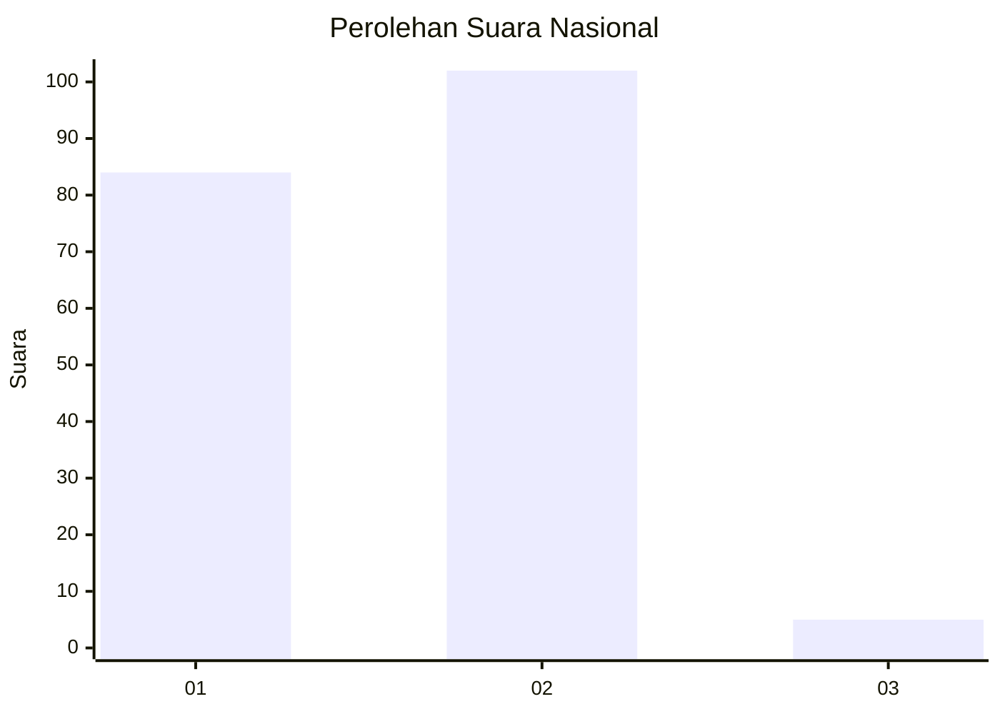
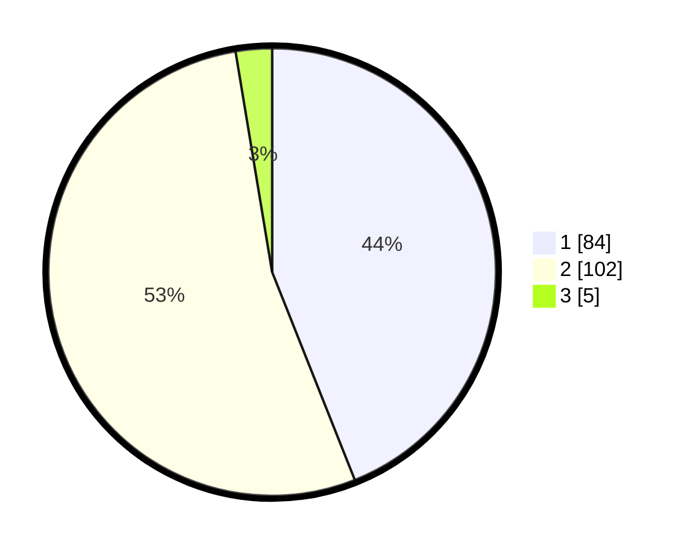

# Hasil

## Grafik

## Tabel

| No. | Nama Paslon    | Suara | Suara (raw) | Persentase |
|:--- |:-------------- | -----:| -----------:| ----------:|
| 1   | ANIES MUHAIMIN | 84    | [84][p-1]   | 43,98      |
| 2   | PRABOWO GIBRAN | 102   | [102][p-2]  | 53,40      |
| 3   | GANJAR MAHFUD  | 5     | [5][p-3]    | 2,62       |

[p-1]: https://github.com/gigit-pemilu/pemilu-2024/blob/main/pilpres/hitung-suara/sub/81-maluku/sub/04-buru/sub/01-namlea/sub/2001-namlea/sub/003-tps/sub/paslon-1.txt
[p-2]: https://github.com/gigit-pemilu/pemilu-2024/blob/main/pilpres/hitung-suara/sub/81-maluku/sub/04-buru/sub/01-namlea/sub/2001-namlea/sub/003-tps/sub/paslon-2.txt
[p-3]: https://github.com/gigit-pemilu/pemilu-2024/blob/main/pilpres/hitung-suara/sub/81-maluku/sub/04-buru/sub/01-namlea/sub/2001-namlea/sub/003-tps/sub/paslon-3.txt

## Foto C Plano

https://sirekap-obj-formc.kpu.go.id/57f1/pemilu/ppwp/81/04/01/20/01/8104012001003-20240215-115704--4950db72-c9cb-4cbc-bab9-99991feedf39.jpg

https://sirekap-obj-formc.kpu.go.id/57f1/pemilu/ppwp/81/04/01/20/01/8104012001003-20240216-113530--a5cdb3ca-3374-4a4f-9628-ae9351dcd1c1.jpg

https://sirekap-obj-formc.kpu.go.id/57f1/pemilu/ppwp/81/04/01/20/01/8104012001003-20240216-114202--a193b921-e487-4030-b603-f107f8865dec.jpg

## Metadata

| Key        | Value               |
| ---------- | ------------------- |
| Time Stamp | 2024-02-17 13:37:34 |

