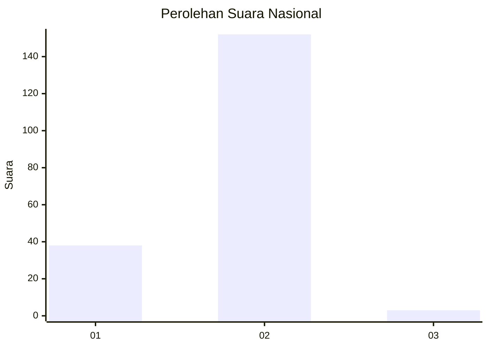
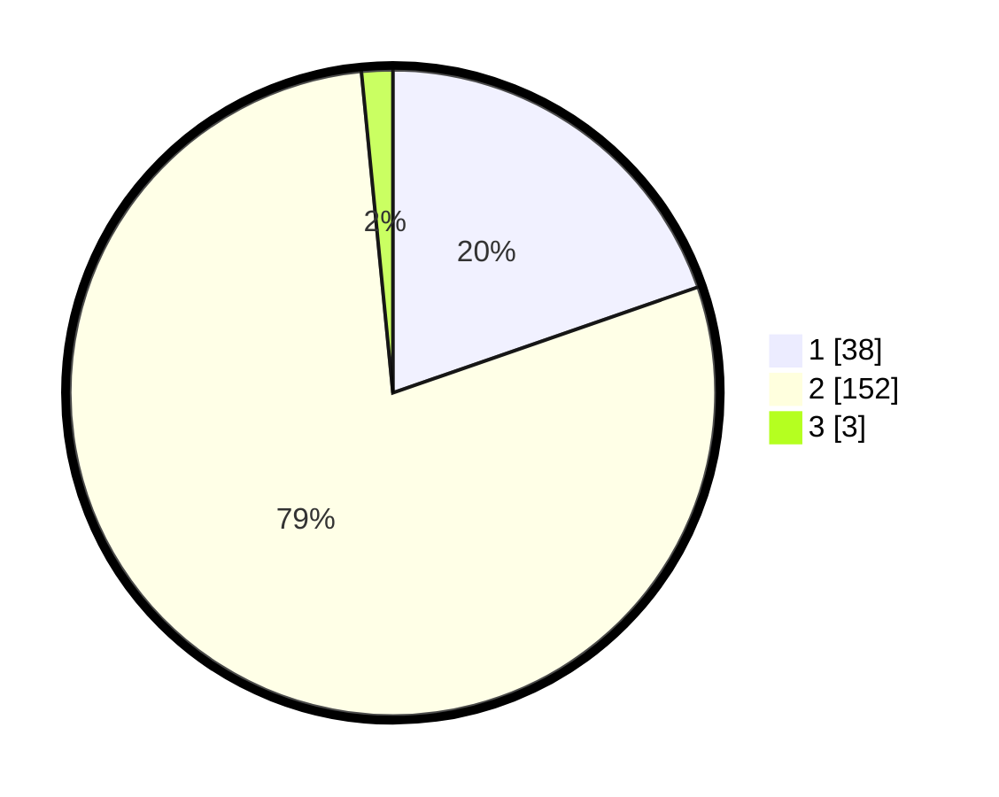

# Hasil

## Grafik

## Tabel

| No. | Nama Paslon    | Suara | Suara (raw) | Persentase |
|:--- |:-------------- | -----:| -----------:| ----------:|
| 1   | ANIES MUHAIMIN | 38    | [38][p-1]   | 19,69      |
| 2   | PRABOWO GIBRAN | 152   | [152][p-2]  | 78,76      |
| 3   | GANJAR MAHFUD  | 3     | [3][p-3]    | 1,55       |

[p-1]: https://github.com/gigit-pemilu/pemilu-2024/blob/main/pilpres/hitung-suara/sub/81-maluku/sub/04-buru/sub/01-namlea/sub/2001-namlea/sub/007-tps/sub/paslon-1.txt
[p-2]: https://github.com/gigit-pemilu/pemilu-2024/blob/main/pilpres/hitung-suara/sub/81-maluku/sub/04-buru/sub/01-namlea/sub/2001-namlea/sub/007-tps/sub/paslon-2.txt
[p-3]: https://github.com/gigit-pemilu/pemilu-2024/blob/main/pilpres/hitung-suara/sub/81-maluku/sub/04-buru/sub/01-namlea/sub/2001-namlea/sub/007-tps/sub/paslon-3.txt

## Foto C Plano

https://sirekap-obj-formc.kpu.go.id/0f1c/pemilu/ppwp/81/04/01/20/01/8104012001007-20240215-134916--eb25b9d3-ea91-4466-9776-f7e82b5b39fd.jpg

https://sirekap-obj-formc.kpu.go.id/0f1c/pemilu/ppwp/81/04/01/20/01/8104012001007-20240215-134337--bcc766ed-d4e0-4968-92e4-bdb7c8444f9b.jpg

https://sirekap-obj-formc.kpu.go.id/0f1c/pemilu/ppwp/81/04/01/20/01/8104012001007-20240215-124749--77c9f967-2754-4555-b882-9464350a8790.jpg

## Metadata

| Key        | Value               |
| ---------- | ------------------- |
| Time Stamp | 2024-02-15 16:30:25 |

