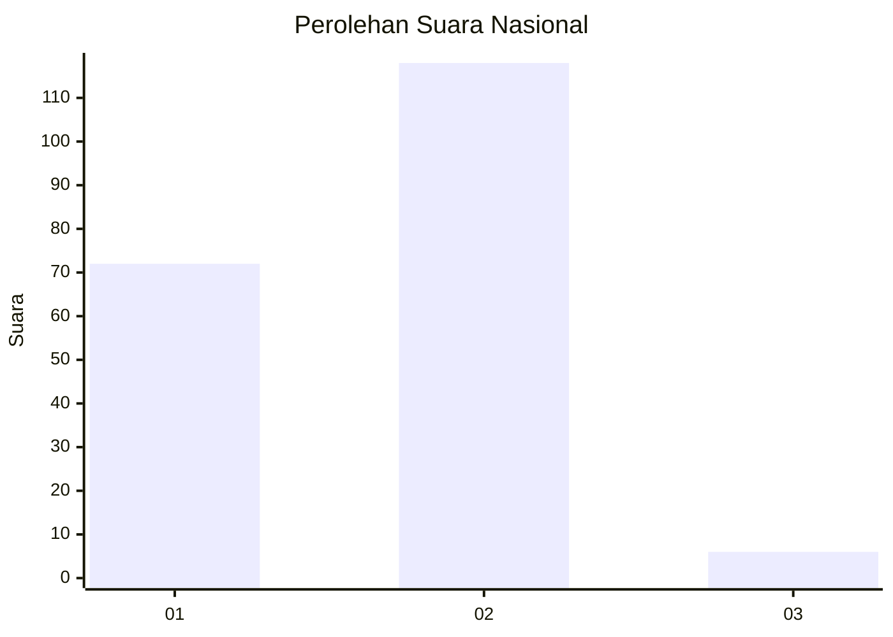
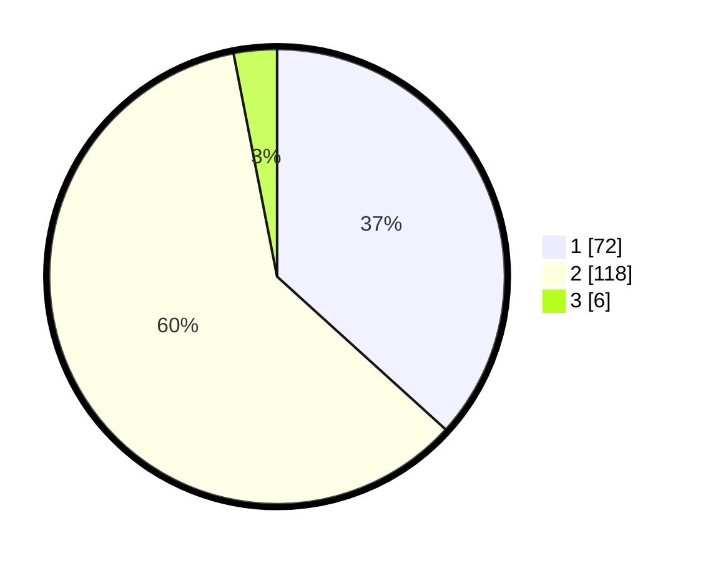

# Hasil

## Grafik

## Tabel

| No. | Nama Paslon    | Suara | Suara (raw) | Persentase |
|:--- |:-------------- | -----:| -----------:| ----------:|
| 1   | ANIES MUHAIMIN | 72    | [72][p-1]   | 36,73      |
| 2   | PRABOWO GIBRAN | 118   | [118][p-2]  | 60,20      |
| 3   | GANJAR MAHFUD  | 6     | [6][p-3]    | 3,06       |

[p-1]: https://github.com/gigit-pemilu/pemilu-2024/blob/main/pilpres/hitung-suara/sub/81-maluku/sub/04-buru/sub/01-namlea/sub/2001-namlea/sub/011-tps/sub/paslon-1.txt
[p-2]: https://github.com/gigit-pemilu/pemilu-2024/blob/main/pilpres/hitung-suara/sub/81-maluku/sub/04-buru/sub/01-namlea/sub/2001-namlea/sub/011-tps/sub/paslon-2.txt
[p-3]: https://github.com/gigit-pemilu/pemilu-2024/blob/main/pilpres/hitung-suara/sub/81-maluku/sub/04-buru/sub/01-namlea/sub/2001-namlea/sub/011-tps/sub/paslon-3.txt

## Foto C Plano

https://sirekap-obj-formc.kpu.go.id/2c13/pemilu/ppwp/81/04/01/20/01/8104012001011-20240216-092511--45d05f83-4775-42ea-b9bd-e28a6e93f8b1.jpg

https://sirekap-obj-formc.kpu.go.id/2c13/pemilu/ppwp/81/04/01/20/01/8104012001011-20240216-091028--99e81b95-08bb-46d0-bf70-bff7ce1803cb.jpg

https://sirekap-obj-formc.kpu.go.id/2c13/pemilu/ppwp/81/04/01/20/01/8104012001011-20240216-091929--99c3b01d-d290-464f-b0b8-f62972a7de18.jpg

## Metadata

| Key        | Value               |
| ---------- | ------------------- |
| Time Stamp | 2024-02-17 11:30:03 |

