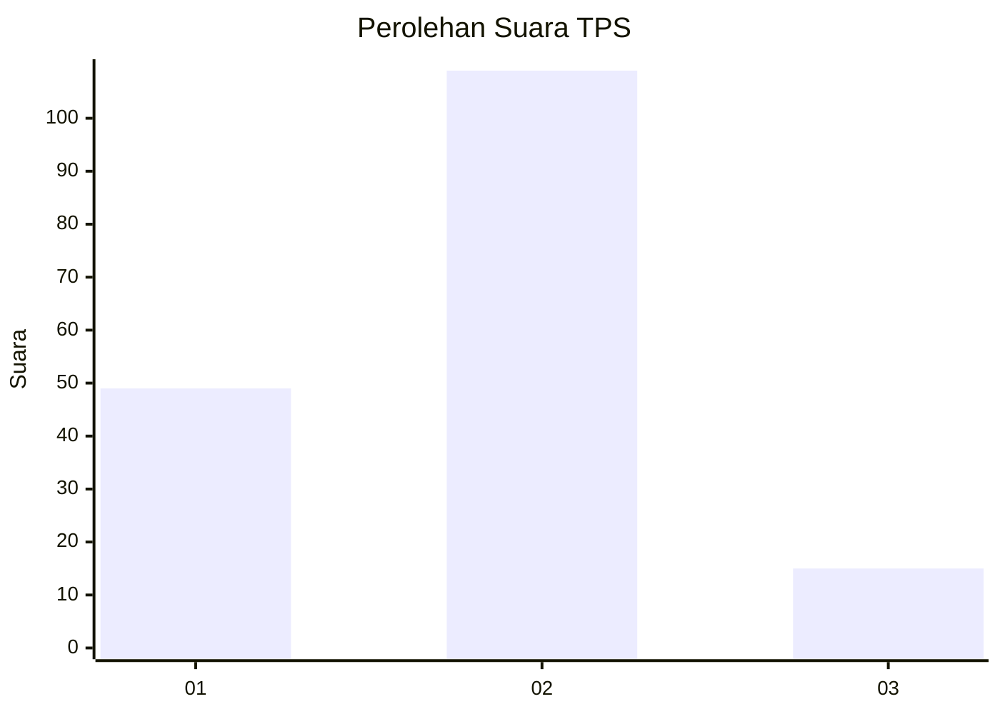
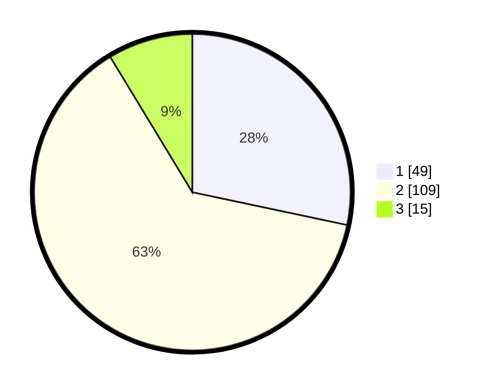

# Hasil

## Grafik

## Tabel

| No. | Nama Paslon    | Suara | Suara (raw) | Persentase |
|:--- |:-------------- | -----:| -----------:| ----------:|
| 1   | ANIES MUHAIMIN | 49    | [49][p-1]   | 28,32      |
| 2   | PRABOWO GIBRAN | 109   | [109][p-2]  | 63,01      |
| 3   | GANJAR MAHFUD  | 15    | [15][p-3]   | 8,67       |

[p-1]: https://github.com/gigit-pemilu/pemilu-2024-81-maluku/blob/main/pilpres/hitung-suara/sub/81-maluku/sub/04-buru/sub/01-namlea/sub/2001-namlea/sub/012-tps/sub/paslon-1.txt
[p-2]: https://github.com/gigit-pemilu/pemilu-2024-81-maluku/blob/main/pilpres/hitung-suara/sub/81-maluku/sub/04-buru/sub/01-namlea/sub/2001-namlea/sub/012-tps/sub/paslon-2.txt
[p-3]: https://github.com/gigit-pemilu/pemilu-2024-81-maluku/blob/main/pilpres/hitung-suara/sub/81-maluku/sub/04-buru/sub/01-namlea/sub/2001-namlea/sub/012-tps/sub/paslon-3.txt

## Foto C Plano

https://sirekap-obj-formc.kpu.go.id/b73d/pemilu/ppwp/81/04/01/20/01/8104012001012-20240216-132233--cb8fd0cd-7086-41a7-9429-374935530778.jpg

https://sirekap-obj-formc.kpu.go.id/b73d/pemilu/ppwp/81/04/01/20/01/8104012001012-20240216-132251--9a3d7db8-edd6-4f05-808d-fd2f24c41b0c.jpg

https://sirekap-obj-formc.kpu.go.id/b73d/pemilu/ppwp/81/04/01/20/01/8104012001012-20240215-091522--e6672aba-2e36-4b6f-96a3-24c4239aa0a8.jpg

## Metadata

| Key        | Value               |
| ---------- | ------------------- |
| Time Stamp | 2024-02-17 11:30:03 |

