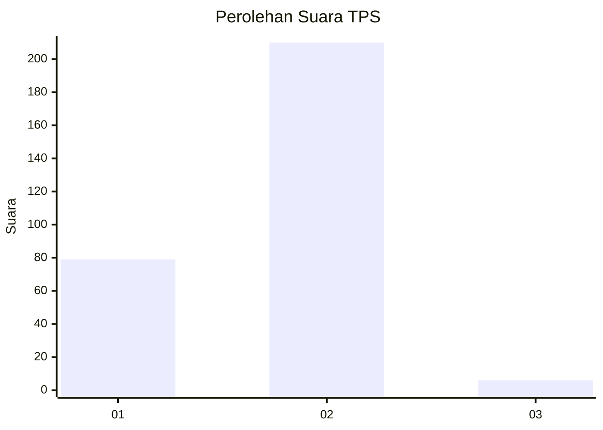
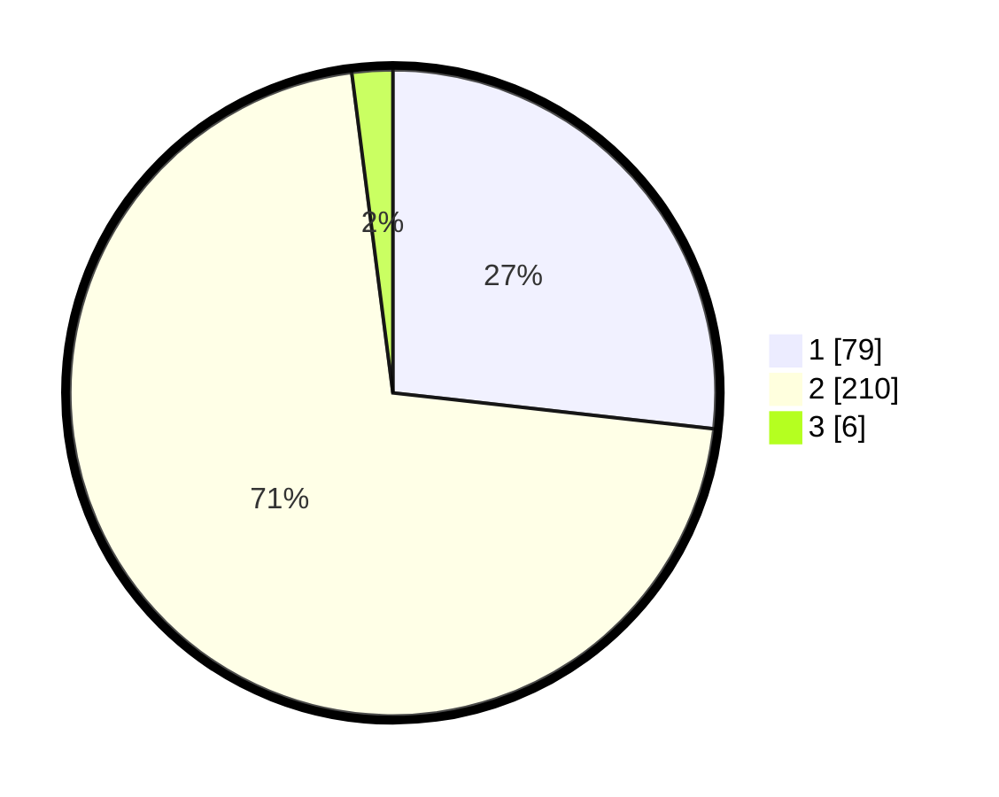

# Hasil

## Grafik

## Tabel

| No. | Nama Paslon    | Suara | Suara (raw) | Persentase |
|:--- |:-------------- | -----:| -----------:| ----------:|
| 1   | ANIES MUHAIMIN | 79    | [79][p-1]   | 26,78      |
| 2   | PRABOWO GIBRAN | 210   | [210][p-2]  | 71,19      |
| 3   | GANJAR MAHFUD  | 6     | [6][p-3]    | 2,03       |

[p-1]: https://github.com/gigit-pemilu/pemilu-2024-81-maluku/blob/main/pilpres/hitung-suara/sub/81-maluku/sub/04-buru/sub/01-namlea/sub/2001-namlea/sub/030-tps/sub/paslon-1.txt
[p-2]: https://github.com/gigit-pemilu/pemilu-2024-81-maluku/blob/main/pilpres/hitung-suara/sub/81-maluku/sub/04-buru/sub/01-namlea/sub/2001-namlea/sub/030-tps/sub/paslon-2.txt
[p-3]: https://github.com/gigit-pemilu/pemilu-2024-81-maluku/blob/main/pilpres/hitung-suara/sub/81-maluku/sub/04-buru/sub/01-namlea/sub/2001-namlea/sub/030-tps/sub/paslon-3.txt

## Foto C Plano

https://sirekap-obj-formc.kpu.go.id/3d0f/pemilu/ppwp/81/04/01/20/01/8104012001030-20240214-193032--3bca4596-b03a-412a-bf30-af927bd7e353.jpg

https://sirekap-obj-formc.kpu.go.id/3d0f/pemilu/ppwp/81/04/01/20/01/8104012001030-20240214-193849--be0fd7f3-0f15-4416-add5-9fff6afaccfa.jpg

https://sirekap-obj-formc.kpu.go.id/3d0f/pemilu/ppwp/81/04/01/20/01/8104012001030-20240214-193740--32b3a738-af6e-4784-ae18-d498b3d253fa.jpg

## Metadata

| Key        | Value               |
| ---------- | ------------------- |
| Time Stamp | 2024-02-17 12:00:00 |

