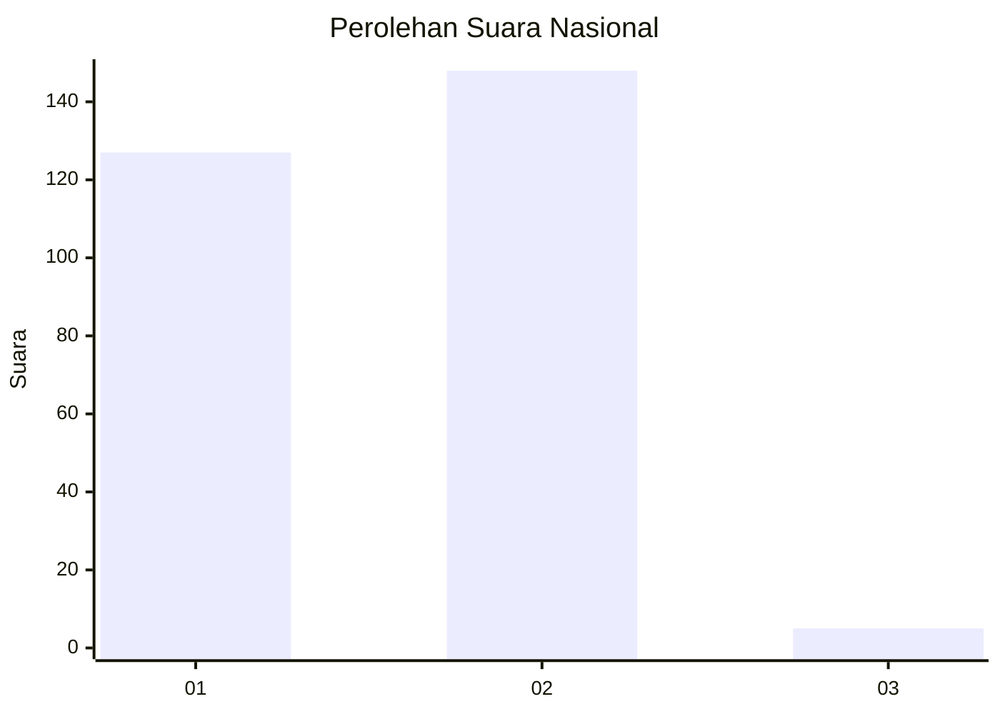
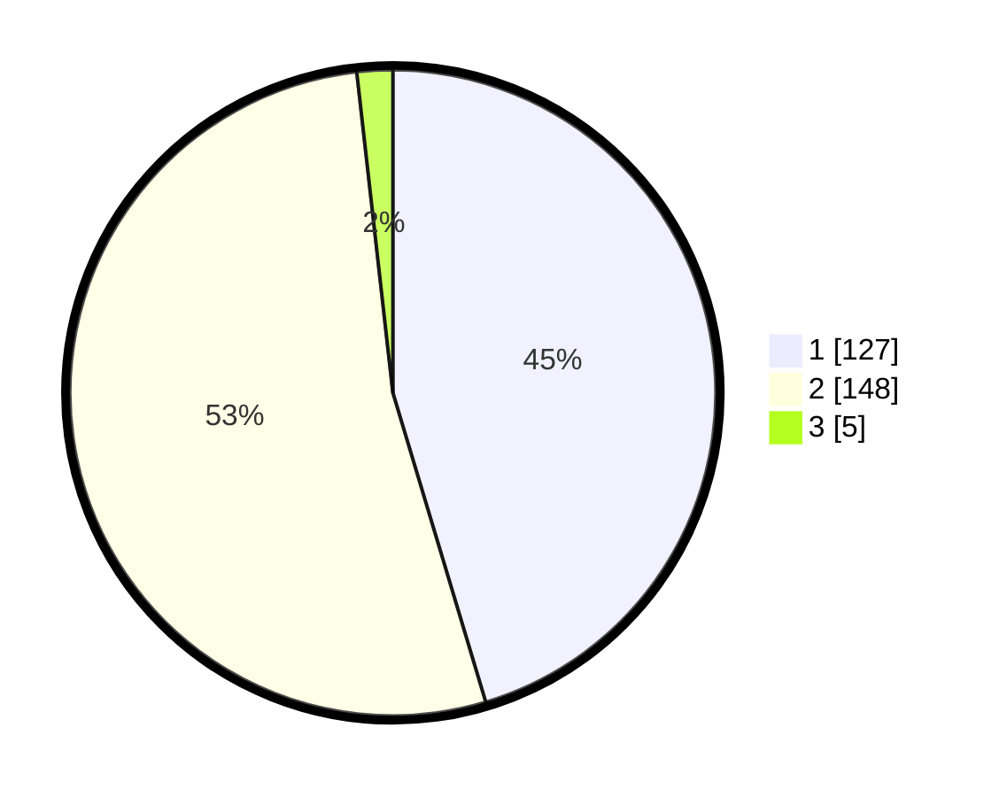

# Hasil

## Grafik

## Tabel

| No. | Nama Paslon    | Suara | Suara (raw) | Persentase |
|:--- |:-------------- | -----:| -----------:| ----------:|
| 1   | ANIES MUHAIMIN | 127   | [127][p-1]  | 45,36      |
| 2   | PRABOWO GIBRAN | 148   | [148][p-2]  | 52,86      |
| 3   | GANJAR MAHFUD  | 5     | [5][p-3]    | 1,79       |

[p-1]: https://github.com/gigit-pemilu/pemilu-2024/blob/main/pilpres/hitung-suara/sub/81-maluku/sub/04-buru/sub/01-namlea/sub/2001-namlea/sub/063-tps/sub/paslon-1.txt
[p-2]: https://github.com/gigit-pemilu/pemilu-2024/blob/main/pilpres/hitung-suara/sub/81-maluku/sub/04-buru/sub/01-namlea/sub/2001-namlea/sub/063-tps/sub/paslon-2.txt
[p-3]: https://github.com/gigit-pemilu/pemilu-2024/blob/main/pilpres/hitung-suara/sub/81-maluku/sub/04-buru/sub/01-namlea/sub/2001-namlea/sub/063-tps/sub/paslon-3.txt

## Foto C Plano

https://sirekap-obj-formc.kpu.go.id/5f2e/pemilu/ppwp/81/04/01/20/01/8104012001063-20240215-114805--c3410d6b-4024-47c4-b18c-720817c90fa6.jpg

https://sirekap-obj-formc.kpu.go.id/5f2e/pemilu/ppwp/81/04/01/20/01/8104012001063-20240215-115117--758cc205-140c-4cb7-8776-a8225f8476f0.jpg

https://sirekap-obj-formc.kpu.go.id/5f2e/pemilu/ppwp/81/04/01/20/01/8104012001063-20240215-112359--6e932bc2-3c2a-4893-915e-349db7433013.jpg

## Metadata

| Key        | Value               |
| ---------- | ------------------- |
| Time Stamp | 2024-02-15 18:00:26 |

