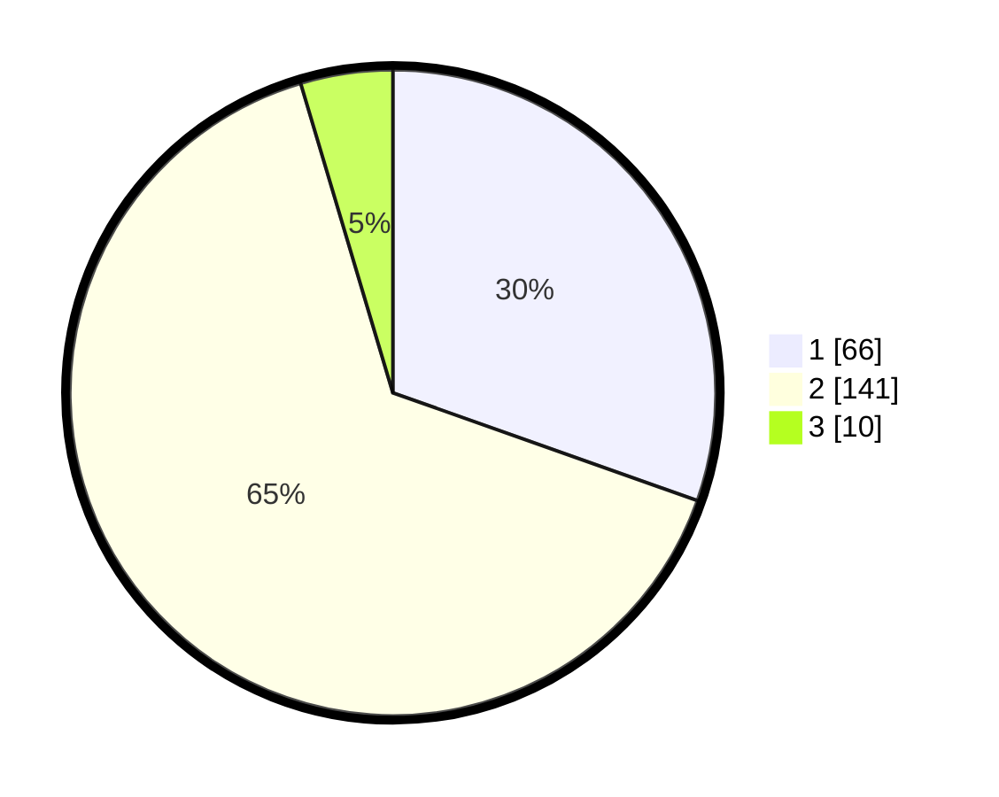

# Hasil

## Grafik

## Tabel

| No. | Nama Paslon    | Suara | Suara (raw) | Persentase |
|:--- |:-------------- | -----:| -----------:| ----------:|
| 1   | ANIES MUHAIMIN | 66    | [66][p-1]   | 30,41      |
| 2   | PRABOWO GIBRAN | 141   | [141][p-2]  | 64,98      |
| 3   | GANJAR MAHFUD  | 10    | [10][p-3]   | 4,61       |

[p-1]: https://github.com/gigit-pemilu/pemilu-2024-81-maluku/blob/main/pilpres/hitung-suara/sub/81-maluku/sub/04-buru/sub/02-air-buaya/sub/2005-waemangit/sub/001-tps/sub/paslon-1.txt
[p-2]: https://github.com/gigit-pemilu/pemilu-2024-81-maluku/blob/main/pilpres/hitung-suara/sub/81-maluku/sub/04-buru/sub/02-air-buaya/sub/2005-waemangit/sub/001-tps/sub/paslon-2.txt
[p-3]: https://github.com/gigit-pemilu/pemilu-2024-81-maluku/blob/main/pilpres/hitung-suara/sub/81-maluku/sub/04-buru/sub/02-air-buaya/sub/2005-waemangit/sub/001-tps/sub/paslon-3.txt

## Foto C Plano

https://sirekap-obj-formc.kpu.go.id/fdfa/pemilu/ppwp/81/04/02/20/05/8104022005001-20240215-095716--df913af2-f554-4297-b658-e45f59e9ec23.jpg

https://sirekap-obj-formc.kpu.go.id/fdfa/pemilu/ppwp/81/04/02/20/05/8104022005001-20240215-100203--a7e8cba0-146a-4971-ab50-70da30fa7864.jpg

https://sirekap-obj-formc.kpu.go.id/fdfa/pemilu/ppwp/81/04/02/20/05/8104022005001-20240216-145822--0c867ac7-ee11-4c27-aeb4-fdace6b277f0.jpg

## Metadata

| Key        | Value               |
| ---------- | ------------------- |
| Time Stamp | 2024-02-16 16:25:10 |

