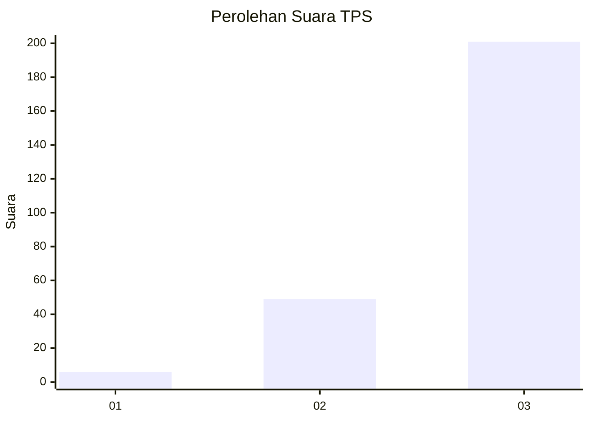
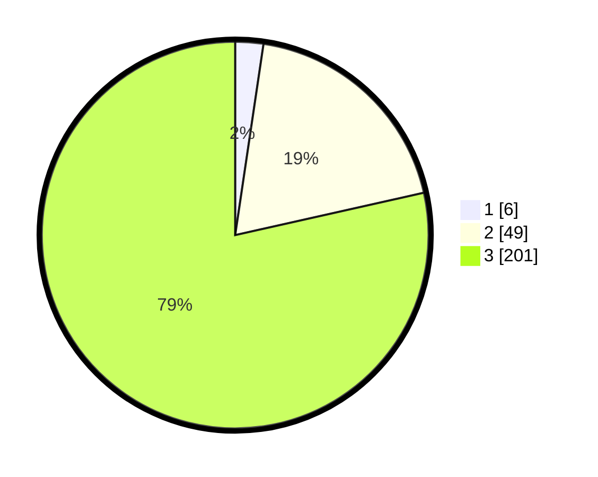

# Hasil

## Grafik

## Tabel

| No. | Nama Paslon    | Suara | Suara (raw) | Persentase |
|:--- |:-------------- | -----:| -----------:| ----------:|
| 1   | ANIES MUHAIMIN | 6     | [6][p-1]    | 2,34       |
| 2   | PRABOWO GIBRAN | 49    | [49][p-2]   | 19,14      |
| 3   | GANJAR MAHFUD  | 201   | [201][p-3]  | 78,52      |

[p-1]: https://github.com/gigit-pemilu/pemilu-2024-81-maluku/blob/main/pilpres/hitung-suara/sub/81-maluku/sub/04-buru/sub/02-air-buaya/sub/2020-batlale/sub/001-tps/sub/paslon-1.txt
[p-2]: https://github.com/gigit-pemilu/pemilu-2024-81-maluku/blob/main/pilpres/hitung-suara/sub/81-maluku/sub/04-buru/sub/02-air-buaya/sub/2020-batlale/sub/001-tps/sub/paslon-2.txt
[p-3]: https://github.com/gigit-pemilu/pemilu-2024-81-maluku/blob/main/pilpres/hitung-suara/sub/81-maluku/sub/04-buru/sub/02-air-buaya/sub/2020-batlale/sub/001-tps/sub/paslon-3.txt

## Foto C Plano

https://sirekap-obj-formc.kpu.go.id/1edd/pemilu/ppwp/81/04/02/20/20/8104022020001-20240215-101643--37730bd2-0de4-4118-b713-31d799d03588.jpg

https://sirekap-obj-formc.kpu.go.id/1edd/pemilu/ppwp/81/04/02/20/20/8104022020001-20240215-140843--0b3151a7-a008-4c7d-b0b8-84125eb843a1.jpg

https://sirekap-obj-formc.kpu.go.id/1edd/pemilu/ppwp/81/04/02/20/20/8104022020001-20240215-101954--2888661e-8fc5-4431-b492-28544a0caca1.jpg

## Metadata

| Key        | Value               |
| ---------- | ------------------- |
| Time Stamp | 2024-02-17 12:00:00 |

