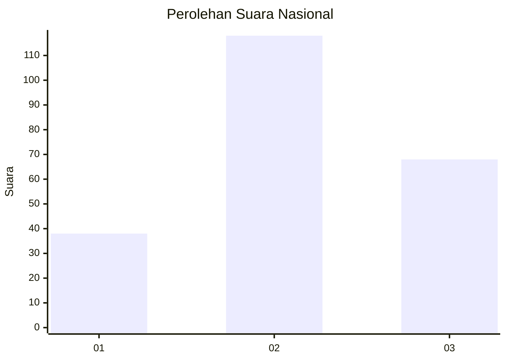
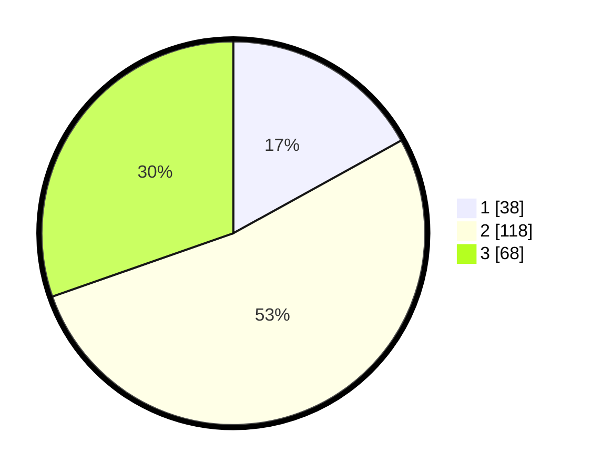

# Hasil

## Grafik

## Tabel

| No. | Nama Paslon    | Suara | Suara (raw) | Persentase |
|:--- |:-------------- | -----:| -----------:| ----------:|
| 1   | ANIES MUHAIMIN | 38    | [38][p-1]   | 16,96      |
| 2   | PRABOWO GIBRAN | 118   | [118][p-2]  | 52,68      |
| 3   | GANJAR MAHFUD  | 68    | [68][p-3]   | 30,36      |

[p-1]: https://github.com/gigit-pemilu/pemilu-2024/blob/main/pilpres/hitung-suara/sub/81-maluku/sub/04-buru/sub/03-waeapo/sub/2001-savana-jaya/sub/002-tps/sub/paslon-1.txt
[p-2]: https://github.com/gigit-pemilu/pemilu-2024/blob/main/pilpres/hitung-suara/sub/81-maluku/sub/04-buru/sub/03-waeapo/sub/2001-savana-jaya/sub/002-tps/sub/paslon-2.txt
[p-3]: https://github.com/gigit-pemilu/pemilu-2024/blob/main/pilpres/hitung-suara/sub/81-maluku/sub/04-buru/sub/03-waeapo/sub/2001-savana-jaya/sub/002-tps/sub/paslon-3.txt

## Foto C Plano

https://sirekap-obj-formc.kpu.go.id/d740/pemilu/ppwp/81/04/03/20/01/8104032001002-20240215-042814--d2c375de-8c34-438f-8010-4f3f3b1eb1fa.jpg

https://sirekap-obj-formc.kpu.go.id/d740/pemilu/ppwp/81/04/03/20/01/8104032001002-20240215-042934--ccf05559-7dc8-4b50-955d-f6a6645e9655.jpg

https://sirekap-obj-formc.kpu.go.id/d740/pemilu/ppwp/81/04/03/20/01/8104032001002-20240215-043038--b5f414e2-1d09-4ce7-81cd-bf9d4d3a2f57.jpg

## Metadata

| Key        | Value               |
| ---------- | ------------------- |
| Time Stamp | 2024-02-16 10:30:29 |

