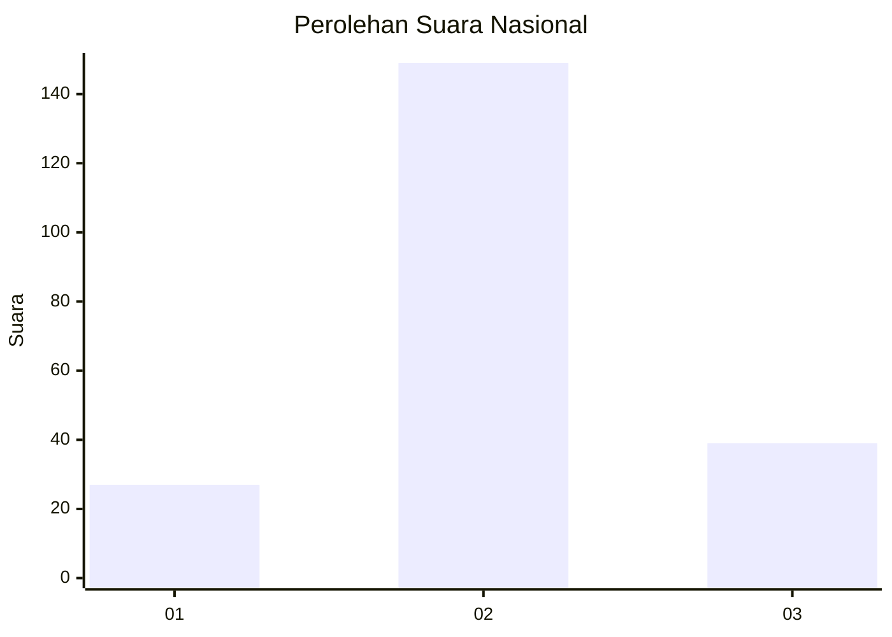
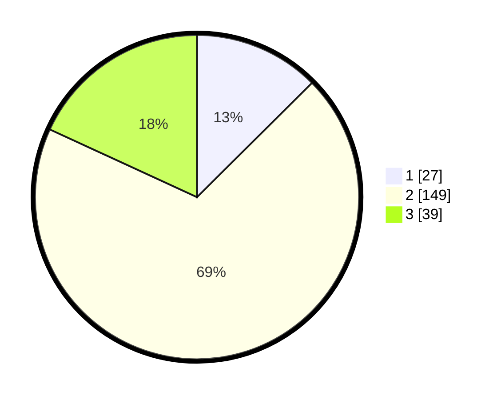

# Hasil

## Grafik

## Tabel

| No. | Nama Paslon    | Suara | Suara (raw) | Persentase |
|:--- |:-------------- | -----:| -----------:| ----------:|
| 1   | ANIES MUHAIMIN | 27    | [27][p-1]   | 12,56      |
| 2   | PRABOWO GIBRAN | 149   | [149][p-2]  | 69,30      |
| 3   | GANJAR MAHFUD  | 39    | [39][p-3]   | 18,14      |

[p-1]: https://github.com/gigit-pemilu/pemilu-2024/blob/main/pilpres/hitung-suara/sub/81-maluku/sub/04-buru/sub/03-waeapo/sub/2001-savana-jaya/sub/004-tps/sub/paslon-1.txt
[p-2]: https://github.com/gigit-pemilu/pemilu-2024/blob/main/pilpres/hitung-suara/sub/81-maluku/sub/04-buru/sub/03-waeapo/sub/2001-savana-jaya/sub/004-tps/sub/paslon-2.txt
[p-3]: https://github.com/gigit-pemilu/pemilu-2024/blob/main/pilpres/hitung-suara/sub/81-maluku/sub/04-buru/sub/03-waeapo/sub/2001-savana-jaya/sub/004-tps/sub/paslon-3.txt

## Foto C Plano

https://sirekap-obj-formc.kpu.go.id/7812/pemilu/ppwp/81/04/03/20/01/8104032001004-20240214-155140--21025283-c0c6-41b0-af46-2728eda349a3.jpg

https://sirekap-obj-formc.kpu.go.id/7812/pemilu/ppwp/81/04/03/20/01/8104032001004-20240214-155209--24412301-280c-477d-8f30-c476672dec52.jpg

https://sirekap-obj-formc.kpu.go.id/7812/pemilu/ppwp/81/04/03/20/01/8104032001004-20240214-155342--5c765a75-c23b-4a47-8a13-146f22643a4e.jpg

## Metadata

| Key        | Value               |
| ---------- | ------------------- |
| Time Stamp | 2024-02-14 21:46:01 |

