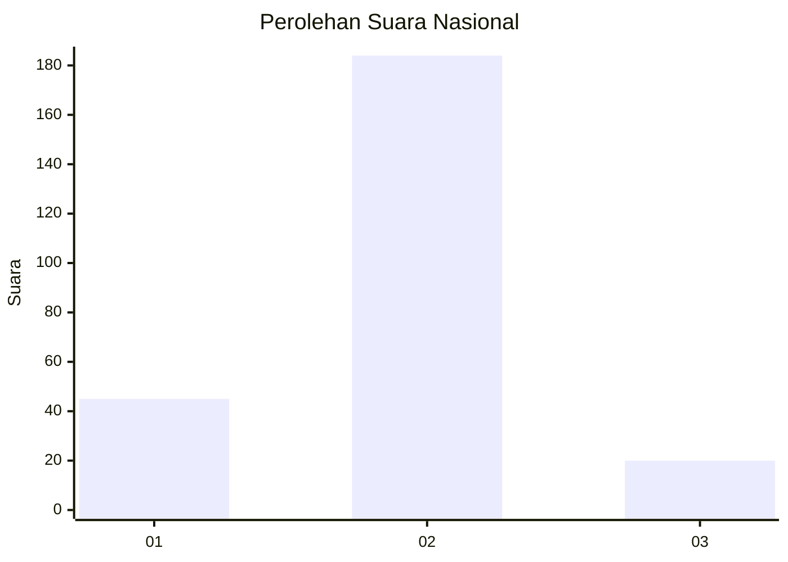
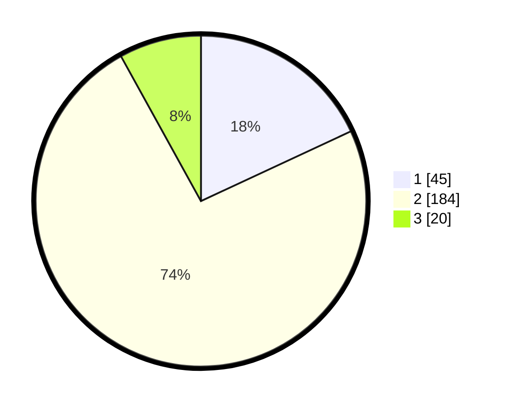

# Hasil

## Grafik

## Tabel

| No. | Nama Paslon    | Suara | Suara (raw) | Persentase |
|:--- |:-------------- | -----:| -----------:| ----------:|
| 1   | ANIES MUHAIMIN | 45    | [45][p-1]   | 18,07      |
| 2   | PRABOWO GIBRAN | 184   | [184][p-2]  | 73,90      |
| 3   | GANJAR MAHFUD  | 20    | [20][p-3]   | 8,03       |

[p-1]: https://github.com/gigit-pemilu/pemilu-2024/blob/main/pilpres/hitung-suara/sub/81-maluku/sub/04-buru/sub/03-waeapo/sub/2002-waetele/sub/003-tps/sub/paslon-1.txt
[p-2]: https://github.com/gigit-pemilu/pemilu-2024/blob/main/pilpres/hitung-suara/sub/81-maluku/sub/04-buru/sub/03-waeapo/sub/2002-waetele/sub/003-tps/sub/paslon-2.txt
[p-3]: https://github.com/gigit-pemilu/pemilu-2024/blob/main/pilpres/hitung-suara/sub/81-maluku/sub/04-buru/sub/03-waeapo/sub/2002-waetele/sub/003-tps/sub/paslon-3.txt

## Foto C Plano

https://sirekap-obj-formc.kpu.go.id/09da/pemilu/ppwp/81/04/03/20/02/8104032002003-20240219-200206--388de7fa-6106-4be1-bfa1-2fae0fefb20d.jpg

https://sirekap-obj-formc.kpu.go.id/09da/pemilu/ppwp/81/04/03/20/02/8104032002003-20240219-200759--d2ab7b38-595c-457d-a3b5-69409216d83a.jpg

https://sirekap-obj-formc.kpu.go.id/09da/pemilu/ppwp/81/04/03/20/02/8104032002003-20240215-081511--fbdc2649-57b2-45f1-8deb-69cb9b9b7603.jpg

## Metadata

| Key        | Value               |
| ---------- | ------------------- |
| Time Stamp | 2024-02-21 11:00:00 |

