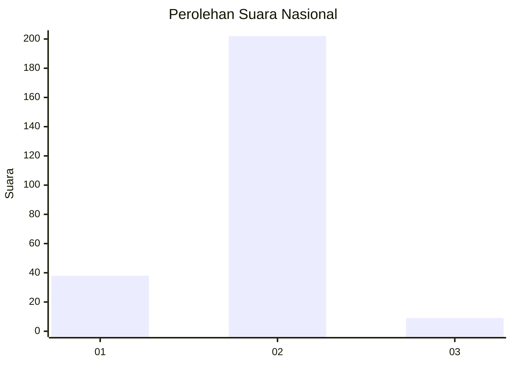
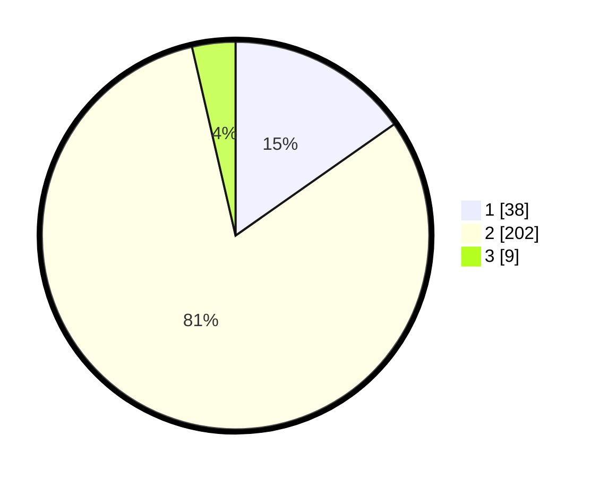

# Hasil

## Grafik

## Tabel

| No. | Nama Paslon    | Suara | Suara (raw) | Persentase |
|:--- |:-------------- | -----:| -----------:| ----------:|
| 1   | ANIES MUHAIMIN | 38    | [38][p-1]   | 15,26      |
| 2   | PRABOWO GIBRAN | 202   | [202][p-2]  | 81,12      |
| 3   | GANJAR MAHFUD  | 9     | [9][p-3]    | 3,61       |

[p-1]: https://github.com/gigit-pemilu/pemilu-2024/blob/main/pilpres/hitung-suara/sub/81-maluku/sub/04-buru/sub/06-waplau/sub/2001-lamahang/sub/002-tps/sub/paslon-1.txt
[p-2]: https://github.com/gigit-pemilu/pemilu-2024/blob/main/pilpres/hitung-suara/sub/81-maluku/sub/04-buru/sub/06-waplau/sub/2001-lamahang/sub/002-tps/sub/paslon-2.txt
[p-3]: https://github.com/gigit-pemilu/pemilu-2024/blob/main/pilpres/hitung-suara/sub/81-maluku/sub/04-buru/sub/06-waplau/sub/2001-lamahang/sub/002-tps/sub/paslon-3.txt

## Foto C Plano

https://sirekap-obj-formc.kpu.go.id/01bf/pemilu/ppwp/81/04/06/20/01/8104062001002-20240215-185711--9c62650e-90b6-43ee-8120-6970fa4f394b.jpg

https://sirekap-obj-formc.kpu.go.id/01bf/pemilu/ppwp/81/04/06/20/01/8104062001002-20240215-193301--3e9604d0-f08b-4419-b3b4-01b51a9d330d.jpg

https://sirekap-obj-formc.kpu.go.id/01bf/pemilu/ppwp/81/04/06/20/01/8104062001002-20240215-193508--feabc975-acce-47d3-8060-2f4855f1dcaa.jpg

## Metadata

| Key        | Value               |
| ---------- | ------------------- |
| Time Stamp | 2024-02-16 10:00:28 |

