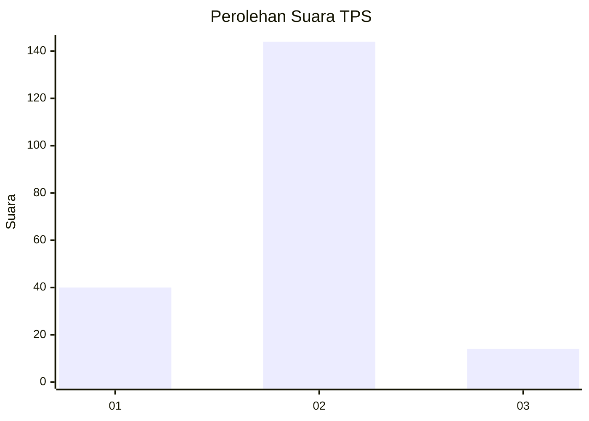
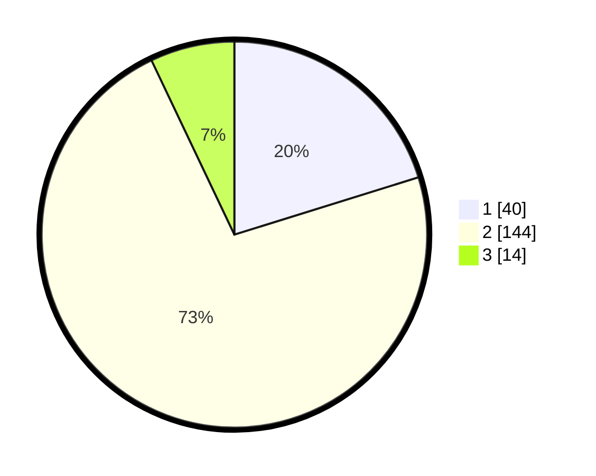

# Hasil

## Grafik

## Tabel

| No. | Nama Paslon    | Suara | Suara (raw) | Persentase |
|:--- |:-------------- | -----:| -----------:| ----------:|
| 1   | ANIES MUHAIMIN | 40    | [40][p-1]   | 20,20      |
| 2   | PRABOWO GIBRAN | 144   | [144][p-2]  | 72,73      |
| 3   | GANJAR MAHFUD  | 14    | [14][p-3]   | 7,07       |

[p-1]: https://github.com/gigit-pemilu/pemilu-2024-81-maluku/blob/main/pilpres/hitung-suara/sub/81-maluku/sub/04-buru/sub/06-waplau/sub/2001-lamahang/sub/005-tps/sub/paslon-1.txt
[p-2]: https://github.com/gigit-pemilu/pemilu-2024-81-maluku/blob/main/pilpres/hitung-suara/sub/81-maluku/sub/04-buru/sub/06-waplau/sub/2001-lamahang/sub/005-tps/sub/paslon-2.txt
[p-3]: https://github.com/gigit-pemilu/pemilu-2024-81-maluku/blob/main/pilpres/hitung-suara/sub/81-maluku/sub/04-buru/sub/06-waplau/sub/2001-lamahang/sub/005-tps/sub/paslon-3.txt

## Foto C Plano

https://sirekap-obj-formc.kpu.go.id/47ae/pemilu/ppwp/81/04/06/20/01/8104062001005-20240215-124841--0dd6fdc8-2a66-4886-bc5d-9d7e642df208.jpg

https://sirekap-obj-formc.kpu.go.id/47ae/pemilu/ppwp/81/04/06/20/01/8104062001005-20240215-125029--4cc4a1bb-1e87-477e-ac3e-1e6eb1d84bec.jpg

https://sirekap-obj-formc.kpu.go.id/47ae/pemilu/ppwp/81/04/06/20/01/8104062001005-20240215-132940--80b1f561-f036-4930-aa17-2a75099e4904.jpg

## Metadata

| Key        | Value               |
| ---------- | ------------------- |
| Time Stamp | 2024-02-17 13:37:34 |

