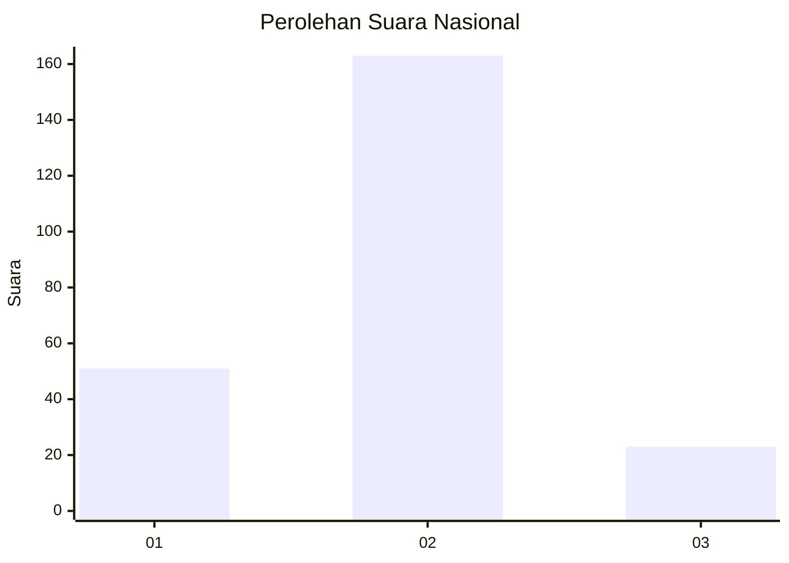

# Hasil

## Grafik

## Tabel

| No. | Nama Paslon    | Suara | Suara (raw) | Persentase |
|:--- |:-------------- | -----:| -----------:| ----------:|
| 1   | ANIES MUHAIMIN | 51    | [51][p-1]   | 21,52      |
| 2   | PRABOWO GIBRAN | 163   | [163][p-2]  | 68,78      |
| 3   | GANJAR MAHFUD  | 23    | [23][p-3]   | 9,70       |

[p-1]: https://github.com/gigit-pemilu/pemilu-2024/blob/main/pilpres/hitung-suara/sub/81-maluku/sub/04-buru/sub/06-waplau/sub/2002-waplau/sub/001-tps/sub/paslon-1.txt
[p-2]: https://github.com/gigit-pemilu/pemilu-2024/blob/main/pilpres/hitung-suara/sub/81-maluku/sub/04-buru/sub/06-waplau/sub/2002-waplau/sub/001-tps/sub/paslon-2.txt
[p-3]: https://github.com/gigit-pemilu/pemilu-2024/blob/main/pilpres/hitung-suara/sub/81-maluku/sub/04-buru/sub/06-waplau/sub/2002-waplau/sub/001-tps/sub/paslon-3.txt

## Foto C Plano

https://sirekap-obj-formc.kpu.go.id/080b/pemilu/ppwp/81/04/06/20/02/8104062002001-20240215-141254--79937c7d-bb43-44d5-827e-1e9558cd4227.jpg

https://sirekap-obj-formc.kpu.go.id/080b/pemilu/ppwp/81/04/06/20/02/8104062002001-20240215-141438--f18189aa-fad8-4761-a8ce-708b3ab3a8d6.jpg

https://sirekap-obj-formc.kpu.go.id/080b/pemilu/ppwp/81/04/06/20/02/8104062002001-20240215-141628--7586c510-4448-498a-9a08-8cc0d2e0429f.jpg

## Metadata

| Key        | Value               |
| ---------- | ------------------- |
| Time Stamp | 2024-02-15 19:00:26 |

