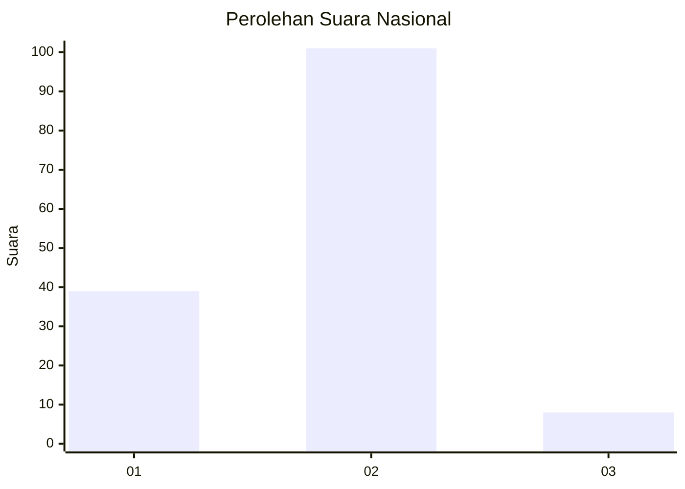
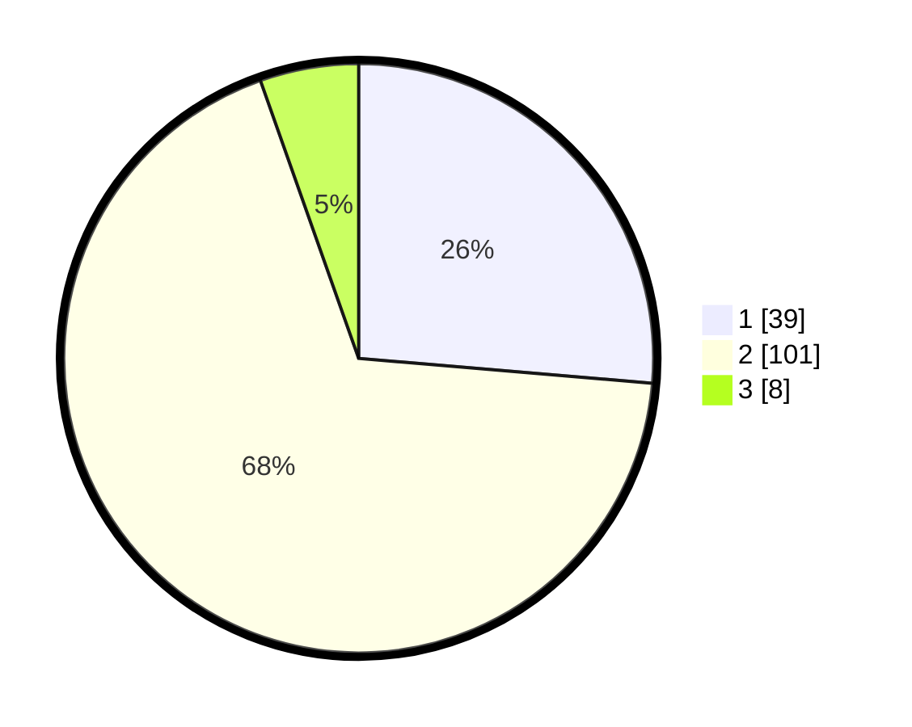

# Hasil

## Grafik

## Tabel

| No. | Nama Paslon    | Suara | Suara (raw) | Persentase |
|:--- |:-------------- | -----:| -----------:| ----------:|
| 1   | ANIES MUHAIMIN | 39    | [39][p-1]   | 26,35      |
| 2   | PRABOWO GIBRAN | 101   | [101][p-2]  | 68,24      |
| 3   | GANJAR MAHFUD  | 8     | [8][p-3]    | 5,41       |

[p-1]: https://github.com/gigit-pemilu/pemilu-2024/blob/main/pilpres/hitung-suara/sub/81-maluku/sub/04-buru/sub/10-batabual/sub/2001-ilath/sub/004-tps/sub/paslon-1.txt
[p-2]: https://github.com/gigit-pemilu/pemilu-2024/blob/main/pilpres/hitung-suara/sub/81-maluku/sub/04-buru/sub/10-batabual/sub/2001-ilath/sub/004-tps/sub/paslon-2.txt
[p-3]: https://github.com/gigit-pemilu/pemilu-2024/blob/main/pilpres/hitung-suara/sub/81-maluku/sub/04-buru/sub/10-batabual/sub/2001-ilath/sub/004-tps/sub/paslon-3.txt

## Foto C Plano

https://sirekap-obj-formc.kpu.go.id/6c7f/pemilu/ppwp/81/04/10/20/01/8104102001004-20240214-185243--74dfc2f7-3949-4780-b49c-765f4840ee34.jpg

https://sirekap-obj-formc.kpu.go.id/6c7f/pemilu/ppwp/81/04/10/20/01/8104102001004-20240214-185218--9cd9b3d9-a6e6-4eb6-a416-29a63e1e3931.jpg

https://sirekap-obj-formc.kpu.go.id/6c7f/pemilu/ppwp/81/04/10/20/01/8104102001004-20240214-185416--d4057a39-2118-48e3-8b28-b31bb7ac5750.jpg

## Metadata

| Key        | Value               |
| ---------- | ------------------- |
| Time Stamp | 2024-02-15 19:30:26 |

