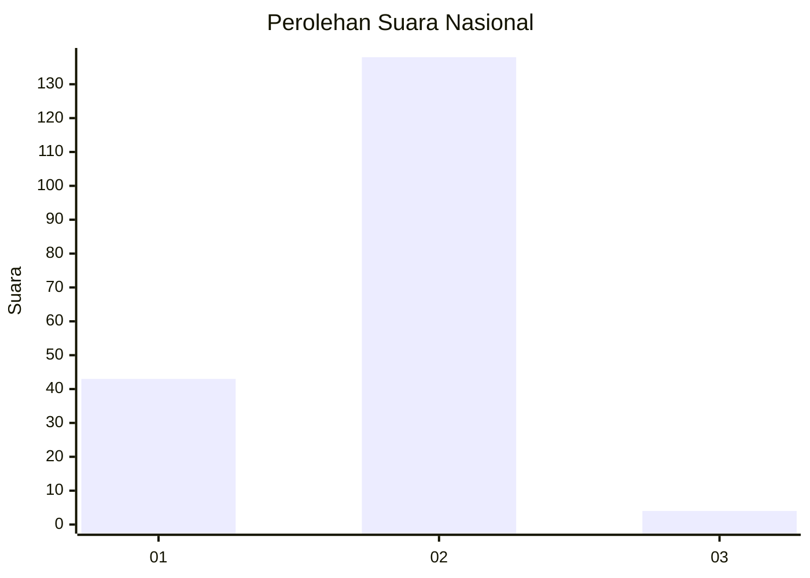
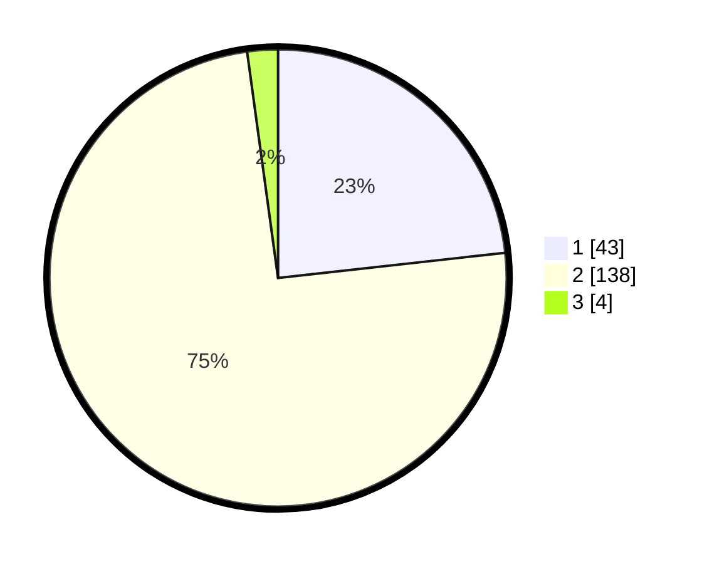

# Hasil

## Grafik

## Tabel

| No. | Nama Paslon    | Suara | Suara (raw) | Persentase |
|:--- |:-------------- | -----:| -----------:| ----------:|
| 1   | ANIES MUHAIMIN | 43    | [43][p-1]   | 23,24      |
| 2   | PRABOWO GIBRAN | 138   | [138][p-2]  | 74,59      |
| 3   | GANJAR MAHFUD  | 4     | [4][p-3]    | 2,16       |

[p-1]: https://github.com/gigit-pemilu/pemilu-2024/blob/main/pilpres/hitung-suara/sub/81-maluku/sub/04-buru/sub/10-batabual/sub/2001-ilath/sub/006-tps/sub/paslon-1.txt
[p-2]: https://github.com/gigit-pemilu/pemilu-2024/blob/main/pilpres/hitung-suara/sub/81-maluku/sub/04-buru/sub/10-batabual/sub/2001-ilath/sub/006-tps/sub/paslon-2.txt
[p-3]: https://github.com/gigit-pemilu/pemilu-2024/blob/main/pilpres/hitung-suara/sub/81-maluku/sub/04-buru/sub/10-batabual/sub/2001-ilath/sub/006-tps/sub/paslon-3.txt

## Foto C Plano

https://sirekap-obj-formc.kpu.go.id/c411/pemilu/ppwp/81/04/10/20/01/8104102001006-20240215-001937--7820c1b6-d21d-4a53-af92-410a20d92afd.jpg

https://sirekap-obj-formc.kpu.go.id/c411/pemilu/ppwp/81/04/10/20/01/8104102001006-20240215-002021--80894a02-438a-48fe-93ca-f7adb31a2b80.jpg

https://sirekap-obj-formc.kpu.go.id/c411/pemilu/ppwp/81/04/10/20/01/8104102001006-20240215-002046--8a9ebb80-7212-4ad9-aa61-236db7807a67.jpg

## Metadata

| Key        | Value               |
| ---------- | ------------------- |
| Time Stamp | 2024-02-17 13:37:34 |

