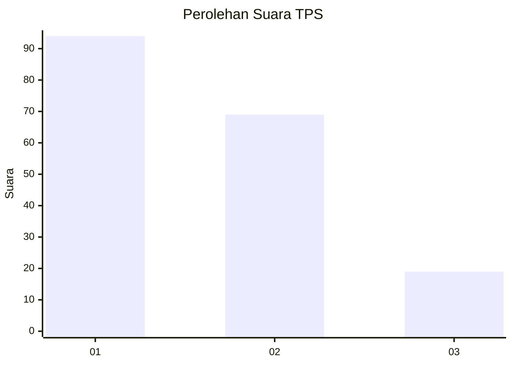
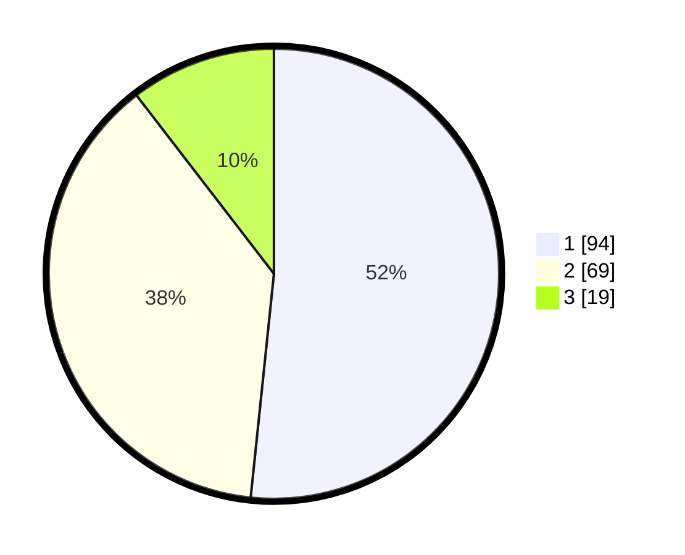

# Hasil

## Grafik

## Tabel

| No. | Nama Paslon    | Suara | Suara (raw) | Persentase |
|:--- |:-------------- | -----:| -----------:| ----------:|
| 1   | ANIES MUHAIMIN | 94    | [94][p-1]   | 51,65      |
| 2   | PRABOWO GIBRAN | 69    | [69][p-2]   | 37,91      |
| 3   | GANJAR MAHFUD  | 19    | [19][p-3]   | 10,44      |

[p-1]: https://github.com/gigit-pemilu/pemilu-2024-81-maluku/blob/main/pilpres/hitung-suara/sub/81-maluku/sub/04-buru/sub/10-batabual/sub/2002-batu-jungku/sub/002-tps/sub/paslon-1.txt
[p-2]: https://github.com/gigit-pemilu/pemilu-2024-81-maluku/blob/main/pilpres/hitung-suara/sub/81-maluku/sub/04-buru/sub/10-batabual/sub/2002-batu-jungku/sub/002-tps/sub/paslon-2.txt
[p-3]: https://github.com/gigit-pemilu/pemilu-2024-81-maluku/blob/main/pilpres/hitung-suara/sub/81-maluku/sub/04-buru/sub/10-batabual/sub/2002-batu-jungku/sub/002-tps/sub/paslon-3.txt

## Foto C Plano

https://sirekap-obj-formc.kpu.go.id/f81d/pemilu/ppwp/81/04/10/20/02/8104102002002-20240217-151702--e83c2216-f477-499e-903c-bb20f6a776b3.jpg

https://sirekap-obj-formc.kpu.go.id/f81d/pemilu/ppwp/81/04/10/20/02/8104102002002-20240217-153859--da1c7213-d855-4805-9e21-a678e99425db.jpg

https://sirekap-obj-formc.kpu.go.id/f81d/pemilu/ppwp/81/04/10/20/02/8104102002002-20240217-152741--9e491569-d86c-47b4-ad25-e1fa71c88c80.jpg

## Metadata

| Key        | Value               |
| ---------- | ------------------- |
| Time Stamp | 2024-02-17 16:36:25 |

