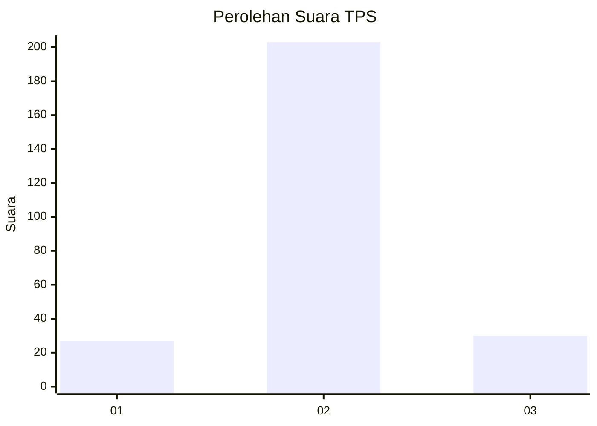
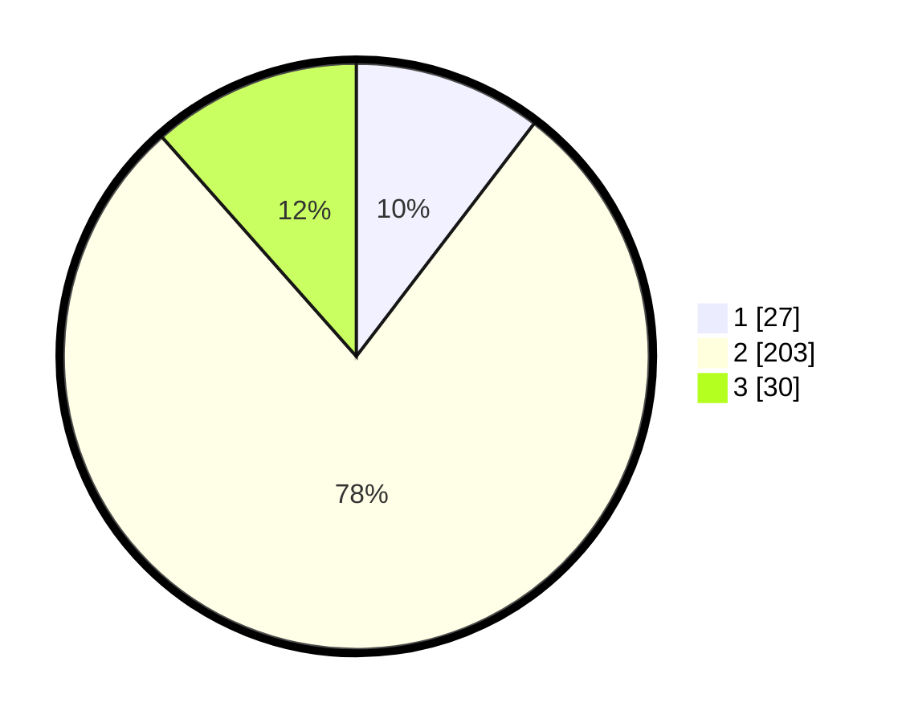

# Hasil

## Grafik

## Tabel

| No. | Nama Paslon    | Suara | Suara (raw) | Persentase |
|:--- |:-------------- | -----:| -----------:| ----------:|
| 1   | ANIES MUHAIMIN | 27    | [27][p-1]   | 10,38      |
| 2   | PRABOWO GIBRAN | 203   | [203][p-2]  | 78,08      |
| 3   | GANJAR MAHFUD  | 30    | [30][p-3]   | 11,54      |

[p-1]: https://github.com/gigit-pemilu/pemilu-2024-81-maluku/blob/main/pilpres/hitung-suara/sub/81-maluku/sub/04-buru/sub/11-lolong-guba/sub/2002-waegeren/sub/002-tps/sub/paslon-1.txt
[p-2]: https://github.com/gigit-pemilu/pemilu-2024-81-maluku/blob/main/pilpres/hitung-suara/sub/81-maluku/sub/04-buru/sub/11-lolong-guba/sub/2002-waegeren/sub/002-tps/sub/paslon-2.txt
[p-3]: https://github.com/gigit-pemilu/pemilu-2024-81-maluku/blob/main/pilpres/hitung-suara/sub/81-maluku/sub/04-buru/sub/11-lolong-guba/sub/2002-waegeren/sub/002-tps/sub/paslon-3.txt

## Foto C Plano

https://sirekap-obj-formc.kpu.go.id/7df3/pemilu/ppwp/81/04/11/20/02/8104112002002-20240215-080825--571cb49e-020d-4e34-b86e-c757f3761abb.jpg

https://sirekap-obj-formc.kpu.go.id/7df3/pemilu/ppwp/81/04/11/20/02/8104112002002-20240215-080953--b1ec6f14-1917-426e-a8b7-47f790abb4e2.jpg

https://sirekap-obj-formc.kpu.go.id/7df3/pemilu/ppwp/81/04/11/20/02/8104112002002-20240215-081058--2241ea4b-6956-4aca-8a26-2702d9b8a3a0.jpg

## Metadata

| Key        | Value               |
| ---------- | ------------------- |
| Time Stamp | 2024-02-16 22:01:00 |

