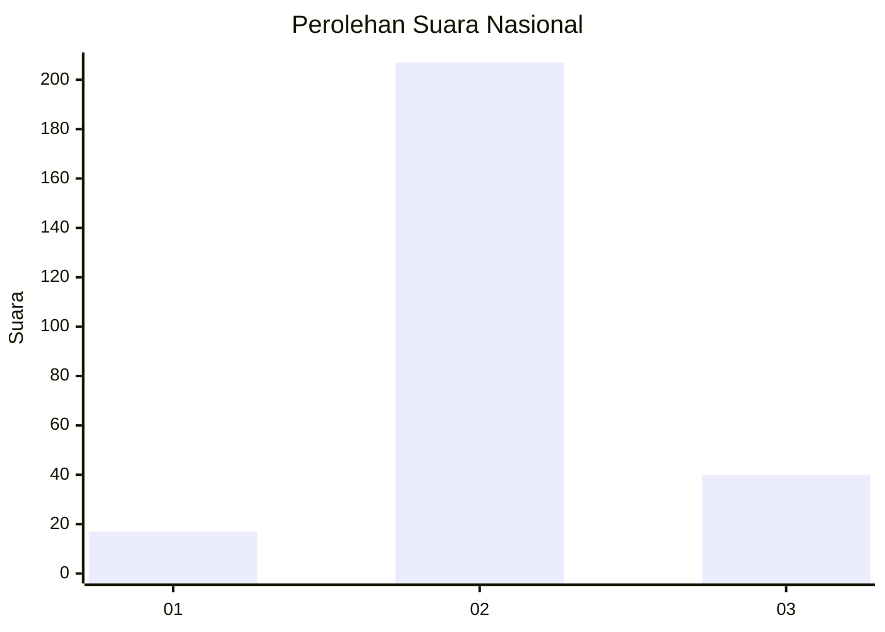

# Hasil

## Grafik

## Tabel

| No. | Nama Paslon    | Suara | Suara (raw) | Persentase |
|:--- |:-------------- | -----:| -----------:| ----------:|
| 1   | ANIES MUHAIMIN | 17    | [17][p-1]   | 6,44       |
| 2   | PRABOWO GIBRAN | 207   | [207][p-2]  | 78,41      |
| 3   | GANJAR MAHFUD  | 40    | [40][p-3]   | 15,15      |

[p-1]: https://github.com/gigit-pemilu/pemilu-2024/blob/main/pilpres/hitung-suara/sub/81-maluku/sub/04-buru/sub/11-lolong-guba/sub/2002-waegeren/sub/007-tps/sub/paslon-1.txt
[p-2]: https://github.com/gigit-pemilu/pemilu-2024/blob/main/pilpres/hitung-suara/sub/81-maluku/sub/04-buru/sub/11-lolong-guba/sub/2002-waegeren/sub/007-tps/sub/paslon-2.txt
[p-3]: https://github.com/gigit-pemilu/pemilu-2024/blob/main/pilpres/hitung-suara/sub/81-maluku/sub/04-buru/sub/11-lolong-guba/sub/2002-waegeren/sub/007-tps/sub/paslon-3.txt

## Foto C Plano

https://sirekap-obj-formc.kpu.go.id/3581/pemilu/ppwp/81/04/11/20/02/8104112002007-20240215-090459--d4398690-6d1c-4ed2-a788-f188fcfcc058.jpg

https://sirekap-obj-formc.kpu.go.id/3581/pemilu/ppwp/81/04/11/20/02/8104112002007-20240215-091828--9cc4863e-5982-4543-a6b9-bbde21e01e8d.jpg

https://sirekap-obj-formc.kpu.go.id/3581/pemilu/ppwp/81/04/11/20/02/8104112002007-20240215-092341--1941673c-c866-4e26-8565-157ab79cd77e.jpg

## Metadata

| Key        | Value               |
| ---------- | ------------------- |
| Time Stamp | 2024-02-17 13:37:34 |

